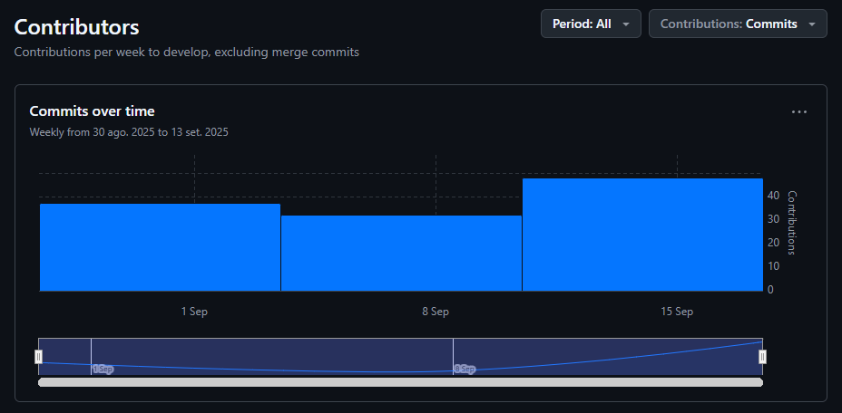
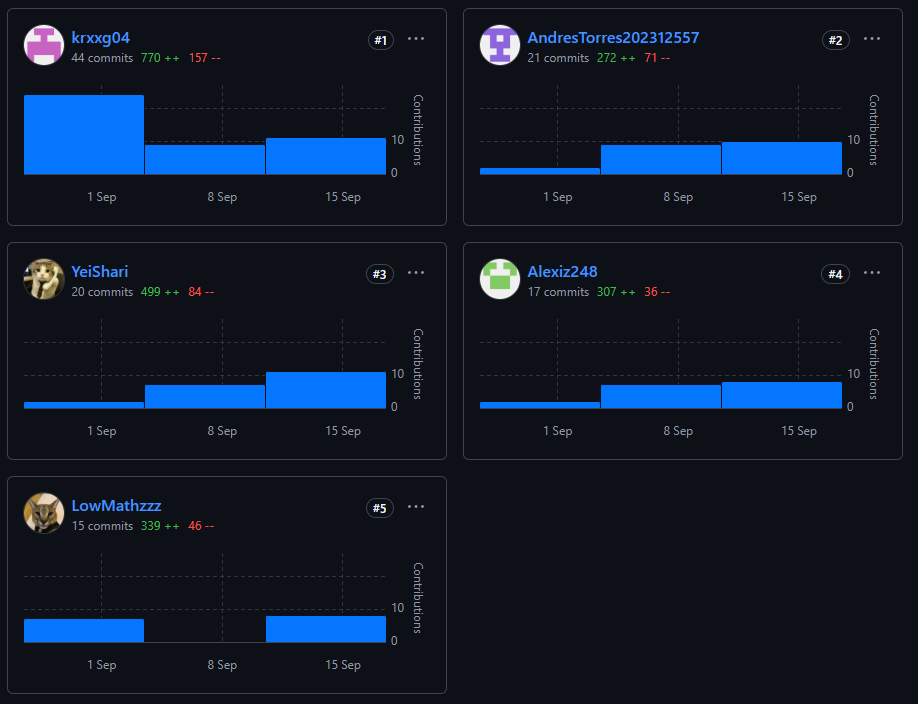
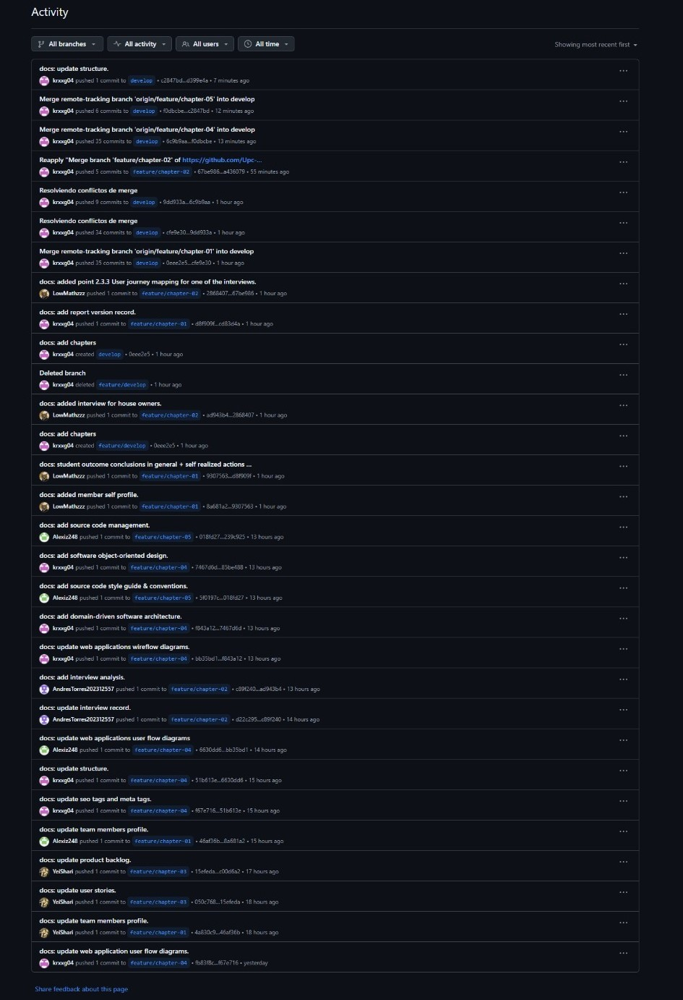

 

# UNIVERSIDAD PERUANA DE CIENCIAS APLICADAS

### Carrera: Ingeniería de Software
### Open Source - Presencial
### PROFESOR: Mori Paiva Hugo Allan
### NRC: 7401
## INFORME TB1
## STARTUP: Energix
## PRODUCTO: Smart Energy Management System (SEMS)

---

### INTEGRANTES:

<table style="text-align:center;">
  <thead>
    <tr>
      <th style="background-color: #333; color: #fff; padding: 8px;">Apellidos y Nombres</th>
      <th style="background-color: #333; color: #fff; padding: 8px;">Código de Alumno</th>
    </tr>
  </thead>
  <tbody>
    <tr>
      <td>Huaman Olivos, Yeira Shari</td>
      <td>u202210513</td>
    </tr>
    <tr>
      <td>Loechle Arias, Mateo Ítalo</td>
      <td>u202215004</td>
    </tr>
    <tr>
      <td>Barturen Panez, Iker Gabriel</td>
      <td>u202312629</td>
    </tr>
    <tr>
      <td>Encalada Salazar, Alexis</td>
      <td>u20211g491</td>
    </tr>
    <tr>
      <td>Torres Lavandera, Andrés Rodrigo</td>
      <td>u202312557</td>
    </tr>
  </tbody>
</table>

--- 

### Ciclo 2025-20

# Registro de versiones del informe

| Versión | Fecha      | Autor           | Descripción de modificación                                                                                                                |
|---------|------------|-----------------|--------------------------------------------------------------------------------------------------------------------------------------------|
| 0.0.1   | 28/08/2025 | Iker Barturen   | Creación del documento de trabajo en formato markdown y definición de los perfiles de los integrantes del equipo.                          |
| 0.0.2   | 28/08/2025 | Iker Barturen   | Creación de las ramas de trabajo en el repositorio y desarrollo de las asunciones del proceso Lean UX.                                     |
| 0.0.3   | 29/08/2025 | Andrés Torres   | Elaboración del perfil de la solución y las hipótesis para el proceso Lean UX.                                                             |
| 0.0.4   | 29/08/2025 | Yeira Huaman    | Desarrollo del perfil de la startup y el proceso Lean UX, definiendo los segmentos objetivo.                                               |
| 0.0.5   | 30/08/2025 | Mateo Loechle   | Creación de la descripción de la startup y los enunciados de problemas bajo la metodología Lean UX.                                        |
| 0.0.6   | 30/08/2025 | Alexis Encalada | Redacción de los antecedentes, la problemática y creación del Lean UX Canvas.                                                              |
| 0.0.7   | 01/09/2025 | Yeira Huaman    | Diseño de las entrevistas iniciales y elaboración de la matriz de tareas de usuario (User Task Matrix).                                    |
| 0.0.8   | 02/09/2025 | Mateo Loechle   | Análisis de competidores y registro detallado de las entrevistas realizadas.                                                               |
| 0.0.9   | 03/09/2025 | Iker Barturen   | Realización del análisis competitivo y de las entrevistas, además de la creación de los mapas de empatía.                                  |
| 0.1.0   | 04/09/2025 | Andrés Torres   | Definición de estrategias frente a competidores y desarrollo del proceso de Needfinding.                                                   |
| 0.1.1   | 05/09/2025 | Alexis Encalada | Estructuración de la sección de entrevistas y creación de los User Personas.                                                               |
| 0.1.2   | 06/09/2025 | Yeira Huaman    | Elaboración de las historias de usuario y las directrices de estilo para la web (Web Style Guidelines).                                    |
| 0.1.3   | 07/09/2025 | Mateo Loechle   | Creación del User Journey Mapping y el Impact Mapping para visualizar la interacción y el valor del producto.                              |
| 0.1.4   | 08/09/2025 | Iker Barturen   | Desarrollo del Product Backlog y los sistemas de organización para la arquitectura de la información.                                      |
| 0.1.5   | 09/09/2025 | Andrés Torres   | Creación del Big Picture Event Storming y las guías de estilo generales del producto.                                                      |
| 0.1.6   | 10/09/2025 | Alexis Encalada | Definición del Ubiquitous Language y las directrices de estilo generales.                                                                  |
| 0.1.7   | 11/09/2025 | Yeira Huaman    | Implementación de los sistemas de búsqueda y diseño UX/UI para las aplicaciones web.                                                       |
| 0.1.8   | 12/09/2025 | Mateo Loechle   | Desarrollo de la arquitectura de información y los sistemas de navegación.                                                                 |
| 0.1.9   | 13/09/2025 | Iker Barturen   | Diseño de la UI para la Landing Page y creación de los diagramas de Wireflow para las aplicaciones web.                                    |
| 0.2.0   | 14/09/2025 | Andrés Torres   | Creación de los sistemas de etiquetado (Labeling Systems) y el wireframe de la Landing Page.                                               |
| 0.2.1   | 15/09/2025 | Alexis Encalada | Desarrollo de los SEO Tags y Meta Tags, y el mock-up de la Landing Page.                                                                   |
| 0.2.2   | 15/09/2025 | Iker Barturen   | Preparo la primera versión de la landing page con archivos básicos html, css y js.                                                         |
| 0.2.3   | 15/09/2025 | Yeira Huaman    | Mejoro la primera verisión de la landing page con nuevos estilos para el css y  implemento más archivos js.                                |
| 0.2.4   | 16/09/2025 | Yeira Huaman    | Prototipado de la aplicación web y diseño de los diagramas de componentes de la arquitectura de software.                                  |
| 0.2.5   | 17/09/2025 | Mateo Loechle   | Creación de los wireframes de la aplicación web y la arquitectura de software orientada a dominio.                                         |
| 0.2.6   | 17/09/2025 | Iker Barturen   | Realización del Design-Level Event Storming y los diagramas de clases para el diseño orientado a objetos.                                  |
| 0.2.7   | 17/09/2025 | Andrés Torres   | Creación de los mock-ups de la aplicación web y el diagrama de contexto de la arquitectura de software.                                    |
| 0.2.8   | 17/09/2025 | Alexis Encalada | Creación del diagrama de base de datos y los diagramas Userflow.                                                                           |
| 0.2.9   | 18/09/2025 | Iker Barturen   | Creación de ramas en el repositorio de Energix-Landing-Page, para realizar el merge por secciones y posteriormente el deployment.          |
| 0.3.0   | 18/09/2025 | Iker Barturen   | Subió la primera y segunda sección de la landing page al repositorio de Energix-Landing-Page, con las creación de los archivos html y css. |
| 0.3.1   | 19/09/2025 | Andrés Torres   | Subió la tercera sección de la landing page.                                                                                               |
| 0.3.2   | 19/09/2025 | Alexis Encalada | Subió la cuarta sección de la landing page.                                                                                                |
| 0.3.3   | 19/09/2025 | Yeira Huaman    | Subió la quinta sección y los archivos js.                                                                                                 |
| 0.3.4   | 20/09/2025 | Mateo Loechle   | Subió el design responsive de la landing page.                                                                                             |
| 0.3.5   | 20/09/2025 | Iker Barturen   | Realizo el deployment en la rama release-1.0 como primera versión de la landing page.                                                      |
| 0.3.6   | 20/09/2025 | Iker Barturen   | Realizo el Sprint 1 del capitulo 5.                                                                                                        |
| 0.3.7   | 02/10/2025 | Iker Barturen   | Creación del repositorio Frontend-SEMS y organización del proyecto.                                                                        |
| 0.3.8   | 03/10/2025 | Iker Barturen   | Implementación de la pantalla de authentication.                                                                                           |
| 0.3.9   | 04/10/2025 | Iker Barturen   | Implementación de la pantalla de dashboard.                                                                                                |
| 0.4.0   | 05/10/2025 | Andrés Torres   | Implementación de la pantalla de reports.                                                                                                  |
| 0.4.1   | 05/10/2025 | Mateo Loechle   | Implementación de la pantalla de notification.                                                                                             |
| 0.4.2   | 06/10/2025 | Iker Barturen   | Implementación de la pantalla de devices.                                                                                                  |
| 0.4.3   | 07/10/2025 | Yeira Huaman    | Implementación de la pantalla de profiles.                                                                                                 |
| 0.4.4   | 07/10/2025 | Alexis Encalada | Implementación de la pantalla de settings.                                                                                                 |
| 0.4.5   | 09/10/2025 | Mateo Loechle   | Desplegar el fakeapi en la nube.                                                                                                           |
| 0.4.6   | 09/10/2025 | Iker Barturen   | Desplegar la aplicación en la nube.                                                                                                        |
| 0.4.7   | 09/10/2025 | Alexis Encalada | Realizó el Sprint 2 del capítulo 5.                                                                                                        |

# Project Report Collaboration Insights

#### Repositorio del informe del proyecto
El informe del proyecto se encuentra alojado en el siguiente repositorio de la organización de GitHub del equipo:

🔗 Enlace del repositorio: https://github.com/Upc-pre-1ASI0729-2520-7401-Energix/Proyect-Report

Entrega TB1:

A continuación, se detallan las actividades realizadas en cada entrega, la participación de los miembros del equipo, y las evidencias correspondientes.

Analíticos de colaboración:

Commits del equipo:

# Contenido

## Tabla de Contenidos

### [Registro de versiones del informe](#registro-de-versiones-del-informe)
### [Project Report Collaboration Insights](#project-report-collaboration-insights)
### [Contenido](#contenido)
### [Student Outcome](#student-outcome-1)
### [Capítulo I: Introducción](#capítulo-i-introducción-1)
- [1.1. Startup Profile](#11-startup-profile)
    - [1.1.1. Descripción de la Startup](#111-descripción-de-la-startup)
    - [1.1.2. Perfiles de integrantes del equipo](#112-perfiles-de-integrantes-del-equipo)
- [1.2. Solution Profile](#12-solution-profile)
    - [1.2.1 Antecedentes y problemática](#121-antecedentes-y-problemática)
    - [1.2.2 Lean UX Process](#122-lean-ux-process)
        - [1.2.2.1. Lean UX Problem Statements](#1221-lean-ux-problem-statements)
        - [1.2.2.2. Lean UX Assumptions](#1222-lean-ux-assumptions)
        - [1.2.2.3. Lean UX Hypothesis Statements](#1223-lean-ux-hypothesis-statements)
        - [1.2.2.4. Lean UX Canvas](#1224-lean-ux-canvas)
- [1.3. Segmentos objetivo](#13-segmentos-objetivo)

### [Capítulo II: Requirements Elicitation & Analysis](#capc3adtulo-ii-requirements-elicitation--analysis-1)
- [2.1. Competidores](#21-competidores)
    - [2.1.1. Análisis competitivo](#211-análisis-competitivo)
    - [2.1.2. Estrategias y tácticas frente a competidores](#212-estrategias-y-tácticas-frente-a-competidores)
- [2.2. Entrevistas](#22-entrevistas)
    - [2.2.1. Diseño de entrevistas](#221-diseño-de-entrevistas)
    - [2.2.2. Registro de entrevistas](#222-registro-de-entrevistas)
    - [2.2.3. Análisis de entrevistas](#223-análisis-de-entrevistas)
- [2.3. Needfinding](#23-needfinding)
    - [2.3.1. User Personas](#231-user-personas)
    - [2.3.2. User Task Matrix](#232-user-task-matrix)
    - [2.3.3. User Journey Mapping](#233-user-journey-mapping)
    - [2.3.4. Empathy Mapping](#234-empathy-mapping)
    - [2.3.5. As-is Scenario Mapping](#235-as-is-scenario-mapping)
    - [2.4. Ubiquitous Language](#24-Ubiquitous-language)
### [Capítulo III: Requirements Specification](#capc3adtulo-iii-requirements-specification-1)
- [3.1. To-Be Scenario Mapping](#31-to-be-scenario-mapping)
- [3.2. User Stories](#32-user-stories)
- [3.3. Impact Mapping](#33-impact-mapping)
- [3.4. Product Backlog](#34-product-backlog)

### [Capítulo IV: Product Design](#capc3adtulo-iv-product-design-1)
- [4.1. Style Guidelines](#41-style-guidelines)
    - [4.1.1. General Style Guidelines](#411-general-style-guidelines)
    - [4.1.2. Web Style Guidelines](#412-web-style-guidelines)
- [4.2. Information Architecture](#42-information-architecture)
    - [4.2.1. Organization Systems](#421-organization-systems)
    - [4.2.2. Labeling Systems](#422-labeling-systems)
    - [4.2.3. SEO Tags and Meta Tags](#423-seo-tags-and-meta-tags)
    - [4.2.4. Searching Systems](#424-searching-systems)
    - [4.2.5. Navigation Systems](#425-navigation-systems)
- [4.3. Landing Page UI Design](#43-landing-page-ui-design)
    - [4.3.1. Landing Page Wireframe](#431-landing-page-wireframe)
    - [4.3.2. Landing Page Mock-up](#432-landing-page-mock-up)
- [4.4. Web Applications UX/UI Design](#44-web-applications-uxui-design)
    - [4.4.1. Web Applications Wireframes](#441-web-applications-wireframes)
    - [4.4.2. Web Applications Wireflow Diagrams](#442-web-applications-wireflow-diagrams)
    - [4.4.3. Web Applications Mock-ups](#443-web-applications-mock-ups)
    - [4.4.4. Web Applications User Flow Diagrams](#444-web-applications-user-flow-diagrams)
- [4.5. Web Applications Prototyping](#45-web-applications-prototyping)
- [4.6. Domain-Driven Software Architecture](#46-domain-driven-software-architecture)
    - [4.6.1. Software Architecture Context Diagram](#461-software-architecture-context-diagram)
    - [4.6.2. Software Architecture Container Diagrams](#462-software-architecture-container-diagrams)
    - [4.6.3. Software Architecture Components Diagrams](#463-software-architecture-components-diagrams)
- [4.7. Software Object-Oriented Design](#47-software-object-oriented-design)
    - [4.7.1. Class Diagrams](#471-class-diagrams)
    - [4.7.2. Class Dictionary](#472-class-dictionary)
- [4.8. Database Design](#48-database-design)
    - [4.8.1. Database Diagram](#481-database-diagram)

### [Capítulo V: Product Implementation, Validation & Deployment](#capc3adtulo-v-product-implementation-validation--deployment-1)
- [5.1. Software Configuration Management](#51-software-configuration-management)
    - [5.1.1. Software Development Environment Configuration](#511-software-development-environment-configuration)
    - [5.1.2. Source Code Management](#512-source-code-management)
    - [5.1.3. Source Code Style Guide & Conventions](#513-source-code-style-guide--conventions)
    - [5.1.4. Software Deployment Configuration](#514-software-deployment-configuration)
- [5.2. Landing Page, Services & Applications Implementation](#52-landing-page-services--applications-implementation)
    - [5.2.1. Sprint 1](#521-sprint-1)
        - [5.2.1.1. Sprint Planning 1](#5211-sprint-planning-1)
        - [5.2.1.2. Sprint Backlog 1](#5212-sprint-backlog-1)
        - [5.2.1.3. Development Evidence for Sprint Review](#5213-development-evidence-for-sprint-review)
        - [5.2.1.4. Testing Suite Evidence for Sprint Review](#5214-testing-suite-evidence-for-sprint-review)
        - [5.2.1.5. Execution Evidence for Sprint Review](#5215-execution-evidence-for-sprint-review)
        - [5.2.1.6. Services Documentation Evidence for Sprint Review](#5216-services-documentation-evidence-for-sprint-review)
        - [5.2.1.7. Software Deployment Evidence for Sprint Review](#5217-software-deployment-evidence-for-sprint-review)
        - [5.2.1.8. Team Collaboration Insights during Sprint](#5218-team-collaboration-insights-during-sprint)

# Student Outcome

ABET – EAC - Student Outcome 3

Se refiere a la capacidad de comunicarse efectivamente con un rango de audiencias.
En el siguiente cuadro se describe las acciones realizadas y enunciados de
conclusiones por parte del grupo, que permiten sustentar el haber alcanzado el logro
del ABET – EAC - Student Outcome 3.

| Criterio específico                                                     | Acciones realizadas                                                                                                                                                                                                                                                                                                                                                                                                                                              | Conclusiones                                                                                                                                                                                                                                                                                                                                                                                                                                                                                                                                                                                                                             |
|-------------------------------------------------------------------------|------------------------------------------------------------------------------------------------------------------------------------------------------------------------------------------------------------------------------------------------------------------------------------------------------------------------------------------------------------------------------------------------------------------------------------------------------------------|------------------------------------------------------------------------------------------------------------------------------------------------------------------------------------------------------------------------------------------------------------------------------------------------------------------------------------------------------------------------------------------------------------------------------------------------------------------------------------------------------------------------------------------------------------------------------------------------------------------------------------------|
| Comunica oralmente con efectividad a diferentes rangos de audiencia.    | TB1: Mateo Loeche: Complementé la comunicación del equipo al participar en las reuniones virtuales, aportando sugerencias para optimizar la presentación de ideas y colaborando en la clarificación de conceptos técnicos durante las discusiones.                                                                                                                                                                                                               | Adaptamos nuestra forma de comunicarnos según el perfil de la audiencia, utilizando códigos y recursos adecuados para asegurar la correcta transmisión del mensaje. Empleamos medios audiovisuales pertinentes al contenido presentado, y verificamos constantemente que la comunicación haya sido clara y efectiva. Durante la presentación de resultados, orientamos nuestro discurso hacia los objetivos específicos, garantizando la comprensión del mensaje. Además, practicamos la escucha activa y objetiva antes de emitir juicios, promoviendo siempre el diálogo y la conciliación.                                            |
| Comunica por escrito con efectividad a diferentes rangos de audiencia.  | TB1: Mateo Loeche: Aporté en la redacción y revisión de los documentos finales, cuidando la claridad, cohesión y ortografía, además de verificar que la información transmitida se ajustara al público objetivo.                                                                                                                                                                                                                                                 | Elaboramos informes técnicos siguiendo los estándares establecidos para el desarrollo de proyectos de ingeniería, asegurando la calidad del contenido antes de su entrega. Nos esforzamos por transmitir ideas y conceptos clave de forma clara y empática, adaptando el nivel de detalle y el lenguaje escrito a las características del público, independientemente de su especialidad o jerarquía. Seleccionamos de manera cuidadosa los medios y formatos más adecuados para facilitar la comprensión del mensaje, y verificamos sistemáticamente que todos los atributos de calidad estén presentes antes de la presentación final. |
| Comunica oralmente con efectividad a diferentes rangos de audiencia.    | TB1: Iker Barturen: Lideré las reuniones de equipo facilitando la discusión sobre arquitectura del proyecto, creación de ramas de trabajo y procesos de despliegue. Durante las sesiones de análisis competitivo y entrevistas, coordiné la presentación de hallazgos y aseguré que todos los miembros comprendieran las decisiones técnicas tomadas para el desarrollo del Product Backlog y los sistemas de organización.                                      | Adaptamos nuestra forma de comunicarnos según el perfil de la audiencia, utilizando códigos y recursos adecuados para asegurar la correcta transmisión del mensaje. Empleamos medios audiovisuales pertinentes al contenido presentado, y verificamos constantemente que la comunicación haya sido clara y efectiva. Durante la presentación de resultados, orientamos nuestro discurso hacia los objetivos específicos, garantizando la comprensión del mensaje. Además, practicamos la escucha activa y objetiva antes de emitir juicios, promoviendo siempre el diálogo y la conciliación.                                            |
| Comunica por escrito con efectividad a diferentes rangos de audiencia.  | TB1: Iker Barturen: Redacté y estructuré secciones clave del informe, incluyendo la creación del documento inicial en formato markdown, el desarrollo del Product Backlog, los diagramas de Wireflow y el Design-Level Event Storming. Coordiné la documentación técnica del repositorio y las guías para el despliegue de la landing page, asegurando coherencia y calidad en toda la documentación del proyecto.                                               | Elaboramos informes técnicos siguiendo los estándares establecidos para el desarrollo de proyectos de ingeniería, asegurando la calidad del contenido antes de su entrega. Nos esforzamos por transmitir ideas y conceptos clave de forma clara y empática, adaptando el nivel de detalle y el lenguaje escrito a las características del público, independientemente de su especialidad o jerarquía. Seleccionamos de manera cuidadosa los medios y formatos más adecuados para facilitar la comprensión del mensaje, y verificamos sistemáticamente que todos los atributos de calidad estén presentes antes de la presentación final. |
| Comunica oralmente con efectividad a diferentes rangos de audiencia.    | TB1: Yeira Huaman: Contribuí en las reuniones explicando el diseño de entrevistas, elaboración de historias de usuario y desarrollo del perfil de la startup. Durante las sesiones de trabajo, facilité la comprensión de los segmentos objetivo y coordiné las presentaciones relacionadas con User Task Matrix y sistemas de búsqueda UX/UI.                                                                                                                   | Adaptamos nuestra forma de comunicarnos según el perfil de la audiencia, utilizando códigos y recursos adecuados para asegurar la correcta transmisión del mensaje. Empleamos medios audiovisuales pertinentes al contenido presentado, y verificamos constantemente que la comunicación haya sido clara y efectiva. Durante la presentación de resultados, orientamos nuestro discurso hacia los objetivos específicos, garantizando la comprensión del mensaje. Además, practicamos la escucha activa y objetiva antes de emitir juicios, promoviendo siempre el diálogo y la conciliación.                                            |
| Comunica por escrito con efectividad a diferentes rangos de audiencia   | TB1: Yeira Huaman: Colaboré en la redacción desarrollando el perfil de la startup, historias de usuario y directrices de estilo para la web. Documenté el proceso Lean UX con definición de segmentos objetivo, elaboré la matriz de tareas de usuario y contribuí en la implementación de archivos JS y la quinta sección de la landing page, enfocándome en claridad y correcta transmisión de conceptos.                                                      | Elaboramos informes técnicos siguiendo los estándares establecidos para el desarrollo de proyectos de ingeniería, asegurando la calidad del contenido antes de su entrega. Nos esforzamos por transmitir ideas y conceptos clave de forma clara y empática, adaptando el nivel de detalle y el lenguaje escrito a las características del público, independientemente de su especialidad o jerarquía. Seleccionamos de manera cuidadosa los medios y formatos más adecuados para facilitar la comprensión del mensaje, y verificamos sistemáticamente que todos los atributos de calidad estén presentes antes de la presentación final. |
| Comunica oralmente con efectividad a diferentes rangos de audiencia.    | TB1: Andrés Torres: Participé en discusiones presentando el perfil de la solución, estrategias frente a competidores y desarrollo del proceso de Needfinding. Durante las reuniones de trabajo, expliqué las hipótesis del proceso Lean UX, coordiné presentaciones sobre Big Picture Event Storming y facilité la comprensión de los sistemas de etiquetado y mock-ups de aplicaciones web.                                                                     | Adaptamos nuestra forma de comunicarnos según el perfil de la audiencia, utilizando códigos y recursos adecuados para asegurar la correcta transmisión del mensaje. Empleamos medios audiovisuales pertinentes al contenido presentado, y verificamos constantemente que la comunicación haya sido clara y efectiva. Durante la presentación de resultados, orientamos nuestro discurso hacia los objetivos específicos, garantizando la comprensión del mensaje. Además, practicamos la escucha activa y objetiva antes de emitir juicios, promoviendo siempre el diálogo y la conciliación.                                            |
| Comunica por escrito con efectividad a diferentes rangos de audiencia   | TB1: Andrés Torres: Aporté elaborando el perfil de la solución, análisis de competidores y guías de estilo generales del producto. Desarrollé las hipótesis para el proceso Lean UX, documenté estrategias frente a competidores, creé el Big Picture Event Storming y contribuí con los sistemas de etiquetado, wireframes y la tercera sección de la landing page, asegurando contenido comprensible y bien estructurado.                                      | Elaboramos informes técnicos siguiendo los estándares establecidos para el desarrollo de proyectos de ingeniería, asegurando la calidad del contenido antes de su entrega. Nos esforzamos por transmitir ideas y conceptos clave de forma clara y empática, adaptando el nivel de detalle y el lenguaje escrito a las características del público, independientemente de su especialidad o jerarquía. Seleccionamos de manera cuidadosa los medios y formatos más adecuados para facilitar la comprensión del mensaje, y verificamos sistemáticamente que todos los atributos de calidad estén presentes antes de la presentación final. |
| Comunica oralmente con efectividad a diferentes rangos de audiencia.    | TB1: Alexis Encalada: Participé activamente en las reuniones aportando ideas sobre la estructura de base de datos, creación de User Personas y definición del lenguaje ubicuo. Durante las sesiones de trabajo, expliqué la estructuración de entrevistas, facilité la comprensión de SEO Tags y Meta Tags, y coordiné presentaciones sobre diagramas de base de datos y Userflow, facilitando la alineación del equipo en conceptos clave.                      | Adaptamos nuestra forma de comunicarnos según el perfil de la audiencia, utilizando códigos y recursos adecuados para asegurar la correcta transmisión del mensaje. Empleamos medios audiovisuales pertinentes al contenido presentado, y verificamos constantemente que la comunicación haya sido clara y efectiva. Durante la presentación de resultados, orientamos nuestro discurso hacia los objetivos específicos, garantizando la comprensión del mensaje. Además, practicamos la escucha activa y objetiva antes de emitir juicios, promoviendo siempre el diálogo y la conciliación.                                            |
| Comunica por escrito con efectividad a diferentes rangos de audiencia   | TB1: Alexis Encalada: Contribuí a la documentación mediante la redacción de antecedentes, problemática y creación del Lean UX Canvas. Desarrollé la estructuración de la sección de entrevistas, creé User Personas, definí el Ubiquitous Language y directrices de estilo generales. Además, documenté SEO Tags y Meta Tags, elaboré el diagrama de base de datos y contribuí con la cuarta sección de la landing page, asegurando información clara y precisa. | Elaboramos informes técnicos siguiendo los estándares establecidos para el desarrollo de proyectos de ingeniería, asegurando la calidad del contenido antes de su entrega. Nos esforzamos por transmitir ideas y conceptos clave de forma clara y empática, adaptando el nivel de detalle y el lenguaje escrito a las características del público, independientemente de su especialidad o jerarquía. Seleccionamos de manera cuidadosa los medios y formatos más adecuados para facilitar la comprensión del mensaje, y verificamos sistemáticamente que todos los atributos de calidad estén presentes antes de la presentación final. |
| Comunica oralmente con efectividad a diferentes rangos de audiencia.    | TP: Mateo Loeche: Durante la fase final del proyecto, lideré las presentaciones técnicas del sistema completo, explicando la integración entre el frontend y backend a diferentes audiencias. Facilité las demostraciones del despliegue en la nube y coordiné la comunicación de los resultados obtenidos en el Sprint 2, adaptando el discurso técnico según el nivel de conocimiento de cada audiencia.                                                                     | En el proyecto final demostramos dominio completo de la comunicación oral, presentando de manera efectiva los resultados técnicos y funcionales del sistema desarrollado. Adaptamos nuestro lenguaje y enfoque comunicativo según la audiencia, desde stakeholders técnicos hasta usuarios finales. La presentación de evidencias de deployment y funcionamiento del sistema requirió precisión técnica y claridad conceptual, lo cual logramos mediante práctica constante y retroalimentación continua del equipo.                                                                                                                    |
| Comunica por escrito con efectividad a diferentes rangos de audiencia.  | TP: Mateo Loeche: Contribuí en la documentación técnica final del proyecto, elaborando reportes detallados sobre el proceso de despliegue del fake API en la nube, configuración del entorno de producción y análisis de rendimiento del sistema. Redacté la documentación del Sprint 2 asegurando que la información técnica fuera comprensible para diferentes niveles de expertise.                                                                                      | La documentación final del proyecto refleja nuestro dominio de la comunicación escrita técnica profesional. Cada documento fue estructurado considerando las necesidades específicas de la audiencia objetivo, desde documentación técnica para desarrolladores hasta reportes ejecutivos para stakeholders. La calidad de nuestra documentación técnica del deployment y las evidencias del Sprint 2 demuestran capacidad para transmitir información compleja de manera clara y organizada.                                                                                                                                                |
| Comunica oralmente con efectividad a diferentes rangos de audiencia.    | TP: Iker Barturen: Dirigí las sesiones de presentación del proyecto final, coordinando la demostración del sistema completo desde la autenticación hasta la gestión de dispositivos. Lideré la explicación de la arquitectura implementada y el proceso de despliegue, facilitando la comprensión de las decisiones técnicas tomadas durante el desarrollo y asegurando que todos los stakeholders comprendieran el valor del producto desarrollado.                         | En el proyecto final demostramos dominio completo de la comunicación oral, presentando de manera efectiva los resultados técnicos y funcionales del sistema desarrollado. Adaptamos nuestro lenguaje y enfoque comunicativo según la audiencia, desde stakeholders técnicos hasta usuarios finales. La presentación de evidencias de deployment y funcionamiento del sistema requirió precisión técnica y claridad conceptual, lo cual logramos mediante práctica constante y retroalimentación continua del equipo.                                                                                                                    |
| Comunica por escrito con efectividad a diferentes rangos de audiencia.  | TP: Iker Barturen: Elaboré la documentación técnica integral del proyecto, incluyendo guías de implementación, configuración del entorno de desarrollo, y reportes de despliegue. Coordiné la redacción del Sprint 2 y las evidencias de desarrollo, asegurando coherencia en toda la documentación técnica del sistema frontend y su integración con los servicios desplegados en la nube.                                                                              | La documentación final del proyecto refleja nuestro dominio de la comunicación escrita técnica profesional. Cada documento fue estructurado considerando las necesidades específicas de la audiencia objetivo, desde documentación técnica para desarrolladores hasta reportes ejecutivos para stakeholders. La calidad de nuestra documentación técnica del deployment y las evidencias del Sprint 2 demuestran capacidad para transmitir información compleja de manera clara y organizada.                                                                                                                                                |
| Comunica oralmente con efectividad a diferentes rangos de audiencia.    | TP: Yeira Huaman: Participé activamente en las presentaciones finales explicando la implementación de la pantalla de perfiles de usuario y su integración con el sistema de autenticación. Durante las demostraciones del proyecto, facilité la comprensión de las funcionalidades implementadas y coordiné la presentación de las mejoras en la experiencia de usuario, adaptando las explicaciones según el nivel técnico de cada audiencia.                             | En el proyecto final demostramos dominio completo de la comunicación oral, presentando de manera efectiva los resultados técnicos y funcionales del sistema desarrollado. Adaptamos nuestro lenguaje y enfoque comunicativo según la audiencia, desde stakeholders técnicos hasta usuarios finales. La presentación de evidencias de deployment y funcionamiento del sistema requirió precisión técnica y claridad conceptual, lo cual logramos mediante práctica constante y retroalimentación continua del equipo.                                                                                                                    |
| Comunica por escrito con efectividad a diferentes rangos de audiencia   | TP: Yeira Huaman: Contribuí en la documentación final desarrollando guías de usuario para las funcionalidades implementadas, manuales técnicos para la gestión de perfiles y reportes de testing de la interfaz de usuario. Elaboré documentación detallada sobre la implementación de las pantallas desarrolladas, enfocándome en claridad y precisión técnica para facilitar futuras mejoras del sistema.                                                                    | La documentación final del proyecto refleja nuestro dominio de la comunicación escrita técnica profesional. Cada documento fue estructurado considerando las necesidades específicas de la audiencia objetivo, desde documentación técnica para desarrolladores hasta reportes ejecutivos para stakeholders. La calidad de nuestra documentación técnica del deployment y las evidencias del Sprint 2 demuestran capacidad para transmitir información compleja de manera clara y organizada.                                                                                                                                                |
| Comunica oralmente con efectividad a diferentes rangos de audiencia.    | TP: Andrés Torres: Lideré las presentaciones relacionadas con la implementación de la pantalla de reportes y su funcionalidad avanzada. Durante las sesiones de demostración del proyecto final, expliqué las decisiones de diseño UX/UI implementadas y coordiné las presentaciones sobre la integración del sistema de reportes con la API desplegada, facilitando la comprensión técnica y funcional del módulo desarrollado.                                          | En el proyecto final demostramos dominio completo de la comunicación oral, presentando de manera efectiva los resultados técnicos y funcionales del sistema desarrollado. Adaptamos nuestro lenguaje y enfoque comunicativo según la audiencia, desde stakeholders técnicos hasta usuarios finales. La presentación de evidencias de deployment y funcionamiento del sistema requirió precisión técnica y claridad conceptual, lo cual logramos mediante práctica constante y retroalimentación continua del equipo.                                                                                                                    |
| Comunica por escrito con efectividad a diferentes rangos de audiencia   | TP: Andrés Torres: Aporté elaborando documentación técnica especializada en el módulo de reportes, incluyendo especificaciones funcionales, guías de implementación y análisis de integración con el backend. Desarrollé manuales de usuario para las funcionalidades de reportes y contribuí con la documentación del proceso de testing, asegurando contenido técnicamente preciso y comprensible para diferentes niveles de expertise.                                   | La documentación final del proyecto refleja nuestro dominio de la comunicación escrita técnica profesional. Cada documento fue estructurado considerando las necesidades específicas de la audiencia objetivo, desde documentación técnica para desarrolladores hasta reportes ejecutivos para stakeholders. La calidad de nuestra documentación técnica del deployment y las evidencias del Sprint 2 demuestran capacidad para transmitir información compleja de manera clara y organizada.                                                                                                                                                |
| Comunica oralmente con efectividad a diferentes rangos de audiencia.    | TP: Alexis Encalada: Participé en las presentaciones finales explicando la implementación de la pantalla de configuraciones y el Sprint 2 del capítulo 5. Durante las demostraciones del sistema completo, facilité la comprensión de las funcionalidades de configuración avanzada y coordiné presentaciones sobre la arquitectura final del sistema, asegurando que las explicaciones técnicas fueran accesibles para diferentes tipos de audiencia.                     | En el proyecto final demostramos dominio completo de la comunicación oral, presentando de manera efectiva los resultados técnicos y funcionales del sistema desarrollado. Adaptamos nuestro lenguaje y enfoque comunicativo según la audiencia, desde stakeholders técnicos hasta usuarios finales. La presentación de evidencias de deployment y funcionamiento del sistema requirió precisión técnica y claridad conceptual, lo cual logramos mediante práctica constante y retroalimentación continua del equipo.                                                                                                                    |
| Comunica por escrito con efectividad a diferentes rangos de audiencia   | TP: Alexis Encalada: Contribuí a la documentación final mediante la elaboración del Sprint 2 completo, documentación técnica de la pantalla de configuraciones y reportes de integración del sistema. Desarrollé manuales técnicos para las funcionalidades avanzadas implementadas y elaboré documentación de arquitectura final del proyecto, asegurando información técnicamente precisa y estructurada para facilitar el mantenimiento futuro del sistema.               | La documentación final del proyecto refleja nuestro dominio de la comunicación escrita técnica profesional. Cada documento fue estructurado considerando las necesidades específicas de la audiencia objetivo, desde documentación técnica para desarrolladores hasta reportes ejecutivos para stakeholders. La calidad de nuestra documentación técnica del deployment y las evidencias del Sprint 2 demuestran capacidad para transmitir información compleja de manera clara y organizada.                                                                                                                                                |

