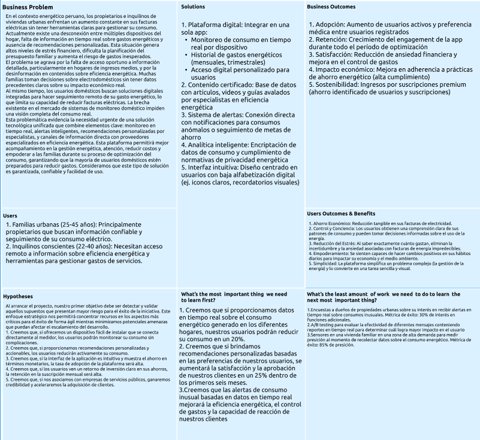

# Capítulo I: Introducción

## 1.1. Startup Profile
### 1.1.1. Descripción de la Startup
Somos Energix, un Startup conformado por estudiantes de la Universidad Peruana de Ciencias Aplicadas (UPC) con el objetivo de crear una plataforma que contribuya a la optimización del consumo energético y que genere un impacto positivo en la economía de hogares que utilizan múltiples artefactos electrónicos.
Nuestra misión es contribuir a la reducción de costos energéticos mediante el uso de Energix Manager. Para lograrlo, ofrecemos una solución integral que proporciona a los usuarios informes semanales detallados sobre el consumo de energía, alertas automatizadas cuando un dispositivo presenta un uso excesivo, y herramientas de monitoreo en tiempo real que les permiten supervisar el comportamiento energético de cada uno de sus electrodomésticos y equipos electrónicos.

- Misión: Nuestra misión es desarrollar una herramienta que ayude a las personas a monitorear, entender y optimizar su consumo energético, promoviendo hábitos responsables que beneficien a su economía.
- Visión: Nuestra visión es ser reconocidos como una plataforma líder en gestión energética para hogares, ofreciendo soluciones inteligentes que permitan a las personas tomar el control de su consumo energético y reducir sus gastos.

- Logo de la Startup:

### 1.1.2. Perfiles de integrantes del equipo

| Nombre                                                            | Descripción                                                                                                                                                                                                                                                                                                                                                                                                                                                                                                                                                                                                |
|-------------------------------------------------------------------|------------------------------------------------------------------------------------------------------------------------------------------------------------------------------------------------------------------------------------------------------------------------------------------------------------------------------------------------------------------------------------------------------------------------------------------------------------------------------------------------------------------------------------------------------------------------------------------------------------|
| Yeira Shari         | Mi nombre es Yeira Shari Huaman Olivos y tengo 20 años. Actualmente, curso el 5to ciclo de la carrera Ingeniería de Software en la Universidad Peruana de Ciencias Aplicadas, donde me he desarrollado como una persona responsable, participativa y con una gran pasión por el trabajo en equipo. En este proyecto, mi objetivo es contribuir con mis conocimientos y habilidades técnicas en lenguajes como C++, Python, CSS, HTML, SQL, así como en el uso de Figma, para alcanzar los objetivos del equipo.                                                                                            |
| Mateo Ítalo         | Mi nombre es Mateo , tengo 21 años , estoy cursando el 6to ciclo de la carrera de Ingenieria de Software en la UPC.Me considero una persona responsable ocasionalmente , dependiendo de cuantas cosas tenga por hacer . Tengo conocimientos bastante utiles para el desarrollo de este proyecto como tal , y espero llevarme bien con mi equipo y hacer un buen trabajo. Mis conocimientos y habilidades se centran en Java principalmente acompañado de diversos frameworks como angular y react , de la misma forma me llevo de mejor forma con lo que son dbs , mongodb, sql , sqlite, entre otros mas. |
| Iker Gabriel      | Mi nombre es Iker, tengo 19 años y actualmente estoy cursando el 6to ciclo de la carrera Ingeniería de Software en la Universidad Peruana de Ciencias Aplicadas. Considero que soy alguien responsable, cumple con los trabajos que se me encargan a tiempo y se tengo la posibilidad apoyo a mis compañeros con sus trabajos, trabajó bien en equipo y puedo aportar mis conocimientos con el lenguaje de programación C++, C# y conocimientos basicos de python, también sobre los frameworks de Javascript react, astro y angular.                                                                      |
| Alexis          | Soy Alexis Encalada Salazar, actualmente tengo 21 años, Curso el 5to ciclo de la carrera de ingeniería de software en la universidad peruana de ciencias aplicadas. Considero que soy alguien responsable, así cómo perseverante tanto en trabajos solitarios como en equipo. Pienso ayudar a mi equipo con mis conocimientos en los lenguajes de programación C++ y python y también en edición de videos                                                                                                                                                                                                 |
| Andrés Rodrigo | Mi nombre es Andrés Torres, actualmente tengo 19 años y estoy cursando el sexto ciclo de la carrera Ingeniería de Software en la Universidad Peruana de Ciencias Aplicadas. Considero que tengo buen nivel en el lenguaje de programación de C++ y un nivel básico en Python. Además, soy un alumno responsable y que aporta en los trabajos grupales. Estoy totalmente dispuesto a colaborar con mi grupo para realizar un muy buen trabajo de curso.                                                                                                                                                     |
| Jafeth Worren | Mi nombre es Jafeth, tengo 18 años y estoy en 6to ciclo de ing. de software en la UPC. Soy una persona con capacidad de trabajar en equipo y apoyo a mis compañeros. Tengo conocimientos en C++, HTML, CSS, Python, MySQL y MongoDB.                                                                                                                                                     |

## 1.2. Solution Profile

En este punto del informe, se presentará información detallada sobre nuestro producto de software, incluyendo su nombre, descripción y el modelo de monetización.

__Product Name__: Nuestro producto se llamará “SEMS”, un nombre compuesto por cuatro palabras en inglés: "Smart" (Inteligente) "Energy" (Energía) "Management" (Gestión) "System" (Sistema). Esta combinación refleja claramente el propósito principal de la plataforma: ofrecer un sistema eficiente y accesible para el monitoreo y control del consumo de energía en el hogar.

__Product Desciption__: SEMS es una plataforma que permite a los usuarios controlar y reducir su consumo energético de manera inteligente. A través de un medidor inteligente que se conecta a los dispositivos del hogar, SEMS realiza un seguimiento en tiempo real del consumo de energía, emite alertas cuando se detectan picos de consumo, proporciona recomendaciones personalizadas y permite apagar dispositivos que estén utilizando más energía de lo necesario.

__Monetización__:  
SEMS funciona mediante un modelo de suscripción mensual o anual. Se ofrecen tres planes diseñados para adaptarse a diferentes necesidades y niveles de control del consumo energético en el hogar:

- **Suscripción Básica**:  
  Dirigido a usuarios que desean comenzar a monitorear su consumo de energía sin funciones avanzadas.
    - Seguimiento básico del consumo energético en tiempo real
    - Alertas de consumo elevado en dispositivos conectados
    - Recomendaciones generales para optimizar el uso de energía
    - Acceso a un panel web básico para visualizar el desempeño energético del hogar

- **Suscripción Premium**:  
  Pensado para usuarios que desean tener un control más detallado y un enfoque proactivo para el ahorro energético. Incluye todo lo del Plan Básico, más:
    - Reportes detallados de consumo energético por dispositivo
    - Alertas avanzadas con recomendaciones personalizadas para cada dispositivo
    - Función para apagar dispositivos automáticamente si el consumo es excesivo
    - Acceso a un panel web con estadísticas avanzadas y tendencias del consumo
    - Soporte técnico prioritario

- **Suscripción Anual**:  
  Pensado para aquellos usuarios que desean comprometerse con un control energético constante durante todo el año, con todas las funciones premium más beneficios adicionales:
    - Todo lo del Plan Premium
    - Descuentos exclusivos en servicios adicionales de optimización energética
    - Asesoría personalizada para mejorar la eficiencia energética del hogar
    - Acceso anticipado a nuevas características y actualizaciones del sistema
    - Recordatorios periódicos sobre el rendimiento energético y recomendaciones de mejoras

### 1.2.1 Antecedentes y problemática
#### En las ultimas décadas, el crecimiento poblacional y el aumento de dispositivos electrónicos en los hogares han generado un incremento significativo en la demanda energética. Según el informe World Energy Outlook 2023 de la Agencia Internacional de Energía (IEA).
#### En Perú, el Ministerio de Energía y Minas indicó en su boletín estadístico 2022 que el consumo residencial alcanzó el 28.6% del total de electricidad nacional, siendo los electrodomésticos, sistemas de iluminación y aparatos conectados permanentemente a la red los principales responsables de dicho gasto, impactando negativamente al medio ambiente y a la economía familiar.
#### En los hogares, muchas veces no se cuentan con información clara sobre cuánta energía consume cada artefacto, lo que dificulta tomar desiciones para reducir el gasto. A esto se suma la falta de hábitos de consumo eficiente, como el uso de focos LED o la desconexión de equipos en reposo. Además, la mayoría de usuarios solo conoce su consumo mediante el recibo mensual.
#### Frente a esta problemática, surge Energix, una plataforma que brinda a los usuarios informes personalizados, alertas automáticas ante consumos inusuales y monitoreo en tiempo real, permitíendoles gestionar de manera efectiva el usuo energético de cada uno de sus dispositivos.

| Elemento | Descripción |
|----------|-------------|
| **Who (Quién)**   | Los principales afectados son los usuarios residenciales, entre ellos se encuentran amas de casa encargadas de la administración del hogar, propietarios con múltiples dispositivos electrónicos o inteligentes, y estudiantes que alquilan habitaciones y deben controlar sus gastos. Todos comparten la necesidad de tener mayor control y visibilidad sobre el uso de la energía.     |
| **What (Qué)**   | El problema del uso ineficiente de energía en los hogares, ocasionado por la falta de información específica sobre el consumo de cada dispositivo, hábitos pocos sostenibles y la carencia de herramientas que permitan un control inmediato, lo que se traduce en mayores gastos mensuales.     |
| **Where (Dónde)**   | La problemática se presenta principalmente en el Perú, donde muchos hogares no cuentan con herramientas para gestionar su consumo eléctrico. Esta situación es especialmente visible en zonas urbanas, donde el uso de dispositivos electrónicos es mayor.     |
| **When (Cuándo)**   | En un contexto actual de creciente demanda energética en el ámbito doméstico, impulsada por la digitalización del estilo de vida y la incorporación constante de nuevos dispositivos tecnológicos en el hogar.     |
| **Why (Por qué)**   | Muchos usuarios y familias no cuentan con medios para identificar qué aparatos generan mayor consumo, lo que dificulta la toma de decisiones informadas.     |
| **How (Cómo)**   | Mediante una plataforma digital que permite monitorear en tiempo real el uso energético de cada equipo, generar alertas ante consumos elevados y entregar reportes semanales que orientan al usuario hacia un uso más eficiente.     |
| **How Much (Cuánto)**   | El uso eficiente de la energía permite reducir entre un 20% y 30% el gasto mensual de electricidad. En zonas con mayor dependencia de dispositivos electrónicos, el impacto económico puede ser aún mayor, contribuyendo además a la reducción de emisiones y a una gestión más responsable de recursos.     |

### 1.2.2 Lean UX Process.

Nuestro proceso Lean UX está diseñado para optimizar la eficiencia en el desarrollo de productos, priorizando principios clave como la validación constante, el pensamiento analítico y la acción ágil. Siguiendo esta filosofía, hemos estructurado un enfoque propio de Lean UX compuesto por cuatro elementos fundamentales: identificación de problemas, formulación de suposiciones, creación de hipótesis y el desarrollo de un lienzo estratégico.

#### 1.2.2.1. Lean UX Problem Statements.

Nuestra página web está diseñada para ayudar a los usuarios a controlar y reducir el consumo de energía eléctrica en sus hogares, promoviendo así el ahorro y una mayor eficiencia energética. En un contexto donde el aumento de las tarifas eléctricas y la preocupación por el impacto ambiental son cada vez más relevantes, muchas personas enfrentan dificultades para monitorear su consumo de manera efectiva. Además, muchas veces no tienen acceso a herramientas intuitivas que les permitan tomar decisiones informadas sobre cómo optimizar el uso de energía.

Energix es una startup que ofrece una solución innovadora para monitorear el consumo energético del hogar en tiempo real. Nuestra plataforma incluye un medidor inteligente que realiza un seguimiento constante de los picos y caídas de energía, emitiendo alertas, proporcionando recomendaciones personalizadas y permitiendo a los usuarios apagar dispositivos que consumen demasiada energía. Además, los usuarios podrán acceder a un panel web donde podrán visualizar de manera clara y sencilla el desempeño energético de su hogar.

El desafío principal que enfrentamos es lograr que nuestros usuarios confíen en Energix como una solución eficaz y fácil de usar, integrando la tecnología en su vida diaria de forma que no sea percibida como complicada o intrusiva. Aunque nuestra solución es precisa y ofrece un gran potencial para reducir el consumo y los costos, muchos usuarios pueden sentirse desconectados de la tecnología o dudar de su utilidad en la práctica, especialmente al tratarse de un área tan sensible como el control de consumo energético en el hogar.

¿Cómo podríamos lograr que nuestros usuarios confíen en Energix como una herramienta intuitiva, accesible y efectiva para reducir el consumo de energía eléctrica, ayudándoles a ahorrar de forma constante?

#### 1.2.2.2. Lean UX Assumptions.

### Business Assumptions

- Creemos que nuestros usuarios tienen la necesidad de:
  obtener información y herramientas para reducir su consumo de energía eléctrica y, como resultado, disminuir el costo de sus facturas. Buscan una forma simple y efectiva de gestionar el uso de energía en su hogar.

- Estas necesidades se pueden satisfacer con:
  una plataforma digital que ofrezca monitoreo en tiempo real del consumo energético de los dispositivos del hogar, recomendaciones personalizadas para optimizar el gasto y alertas sobre consumos anómalos.

- Nuestros usuarios iniciales son (o serán):
  propietarios o inquilinos de viviendas (casas o apartamentos) con acceso a internet, que estén interesados en ser más sostenibles y, sobre todo, en ahorrar dinero en sus facturas de electricidad.

- El valor principal que un usuario quiere obtener de nuestro servicio es:
  tranquilidad y control financiero al tener la certeza de que están optimizando su consumo de energía y maximizando sus ahorros.

- Los usuarios también pueden obtener estos beneficios adicionales:
  mejor comprensión de sus hábitos de consumo, reducción de su huella de carbono, consejos para seleccionar electrodomésticos eficientes y mayor consciencia sobre el impacto de sus decisiones diarias.

- Adquiriremos a la mayoría de nuestros usuarios a través de:
  estrategias de marketing digital en redes sociales, colaboraciones con empresas de servicios públicos, blogs y comunidades online enfocadas en ahorro y sostenibilidad, y campañas de contenido educativo sobre ahorro energético.

- Ganaremos dinero mediante:
  un modelo de negocio de suscripción mensual o anual para el acceso a la plataforma de monitoreo y análisis, y la venta de dispositivos de hardware para la medición de consumo.

- Nuestra competencia principal en el mercado será:
  aplicaciones genéricas de seguimiento de gastos o dispositivos de automatización del hogar que no se centran exclusivamente en el ahorro energético.

- Les superaremos debido a:
  nuestra propuesta de valor enfocada en la solución integral del ahorro energético, que combina el monitoreo detallado, recomendaciones inteligentes y la visualización de los ahorros económicos en tiempo real.

- El mayor riesgo para nuestro producto es:
  la percepción inicial de que el ahorro no justifica el costo del servicio (baja tasa de conversión de la prueba gratuita) o la dificultad para convencer a los usuarios de que instalen el hardware necesario para la medición.

### User Assumptions

- ¿Quién es el usuario?
  propietarios e inquilinos de viviendas urbanas con facturas eléctricas elevadas, preocupados por el constante aumento de costos energéticos y que buscan reducir gastos domésticos de manera práctica y tecnológica.

- ¿Dónde encaja nuestro producto en su vida?
  se integra en su rutina doméstica diaria como una herramienta de control financiero que les permite monitorear en tiempo real el gasto eléctrico y tomar decisiones inmediatas sobre el uso de electrodomésticos para maximizar ahorros.

- ¿Qué problemas resuelve nuestro producto?
  facturas eléctricas sorpresivamente altas, desconocimiento sobre cuáles electrodomésticos gastan más, falta de control sobre el consumo energético del hogar y dificultad para establecer hábitos de ahorro efectivos.

- ¿Cuándo y cómo se utiliza nuestro producto?
  se utiliza diariamente para revisar consumos actuales, antes de usar electrodomésticos de alto consumo, al recibir alertas de gastos anómalos y mensualmente para evaluar ahorros logrados y planificar estrategias futuras.

- ¿Qué características son importantes?
  dashboard de consumo en tiempo real, alertas automáticas de gastos elevados, recomendaciones personalizadas de ahorro, histórico de consumo por dispositivo, cálculos de costo por uso y comparativas mensuales.

- ¿Cómo debería verse y comportarse nuestro producto?
  interfaz simple e intuitiva con gráficos claros de consumo, navegación rápida y notificaciones no intrusivas pero efectivas para promover el ahorro.

- El valor principal que un usuario quiere obtener es:
  reducción tangible en sus facturas de electricidad, con la seguridad de tener control total sobre sus gastos energéticos y la capacidad de optimizar el consumo sin afectar su calidad de vida.

- Los usuarios también pueden obtener estos beneficios adicionales:
  mayor educación sobre eficiencia energética, contribución al cuidado del medio ambiente, mejor presupuesto familiar mensual y empoderamiento tecnológico para gestionar recursos domésticos.

- El mayor riesgo para el usuario es:
  que el costo del sistema no se compense con los ahorros generados, que sea demasiado complicado de instalar o usar, o que las recomendaciones no sean efectivas para su estilo de vida específico.

### User Outcomes

- Ahorro económico tangible y predecible: Los usuarios podrán reducir sus facturas eléctricas de manera consistente, obteniendo un control financiero real sobre sus gastos energéticos desde su dispositivo móvil.

- Monitoreo inteligente y preventivo: Los propietarios podrán identificar patrones de consumo ineficientes antes de que impacten significativamente en sus facturas, evitando sorpresas económicas desagradables.

- Educación energética personalizada: Recibirán recomendaciones específicas adaptadas a sus hábitos de consumo y tipo de vivienda, facilitando la adopción de prácticas de ahorro más efectivas.

- Educación energética personalizada: Recibirán recomendaciones específicas adaptadas a sus hábitos de consumo y tipo de vivienda, facilitando la adopción de prácticas de ahorro más efectivas.

### Business Outcomes

- Conversión de prueba gratuita a planes pagos: Se espera que al menos un 25% de los usuarios que inicien la prueba gratuita se conviertan en suscriptores del plan premium tras 30 días de uso y evidenciar ahorros reales en sus facturas.

- Retención de usuarios a largo plazo: Mantener una tasa de retención del 70% de los suscriptores activos durante el primer trimestre, mediante la mejora continua de la plataforma y la incorporación de nuevas funcionalidades basadas en feedback.

- Posicionamiento como plataforma confiable de ahorro energético: Que el 85% de los usuarios activos afirmen que han reducido sus facturas eléctricas y recomendarían el servicio a otros propietarios preocupados por sus gastos energéticos.

- Alianzas con empresas de servicios públicos y retailers de electrodomésticos: Alcanzar al menos 8 alianzas estratégicas en los primeros seis meses, que permitan expandir el alcance y ofrecer descuentos en dispositivos eficientes a través de la plataforma.

### Features Assumptions

- Monitoreo en tiempo real del consumo energético
- Dashboard interactivo con gráficos de consumo por dispositivo
- Alertas automáticas cuando se detecten picos de consumo anómalos
- Seguimiento de costos por hora y proyecciones de factura mensual
- Recomendaciones inteligentes de ahorro
- Consejos personalizados basados en patrones de uso específicos
- Sugerencias de horarios óptimos para usar electrodomésticos de alto consumo
- Comparativas de eficiencia entre diferentes dispositivos del hogar
- Análisis y reportes detallados
- Histórico de consumo con tendencias mensuales y anuales
- Gráficos de ahorros logrados y potencial de optimización
- Reportes exportables para análisis personal o profesional
- Gestión inteligente de dispositivos
- Identificación automática de electrodomésticos conectados
- Control remoto básico de dispositivos compatibles
- Programación de encendido y apagado según tarifas eléctricas

#### 1.2.2.3. Lean UX Hypothesis Statements.

- Creemos que lograremos una mayor adopción inicial y retención de usuarios si ofrecemos una prueba gratuita de 30 días con acceso parcial a las funcionalidades del sistema de monitoreo. Al permitir que los propietarios exploren el valor del ahorro energético real sin compromiso, validando la efectividad antes de la suscripción, se aumentará la conversión a planes pagos al demostrar reducciones tangibles en sus facturas.

- Creemos que aumentaremos la satisfacción del usuario y reduciremos las cancelaciones si los planes están claramente diferenciados y alineados con las necesidades reales de cada tipo de hogar (apartamentos pequeños, casas familiares, viviendas con alto consumo, etc.). Mediante análisis del comportamiento de consumo y entrevistas, se podrán ajustar las funcionalidades y alertas de cada plan para maximizar su percepción de valor económico.

- Creemos que fortaleceremos la confianza de los usuarios y la credibilidad de la plataforma si se muestran claramente las certificaciones del sistema, datos de precisión del monitoreo y testimonios verificables de ahorros reales. Al mejorar la transparencia y accesibilidad de esta información técnica, se facilitará la toma de decisiones informadas y se reducirá la fricción en la adopción del servicio.

- Creemos que aumentaremos la fidelidad y el uso recurrente si personalizamos las recomendaciones de ahorro según los patrones específicos de consumo de cada hogar. A través de algoritmos de aprendizaje automático y alertas contextuales inteligentes, se puede generar una experiencia percibida como relevante y efectiva para cada usuario individual.

- Creemos que incrementaremos la conversión al plan premium si destacamos el beneficio del análisis avanzado y las proyecciones de ahorro a largo plazo como elementos diferenciales críticos para la optimización financiera. Esto se validará mediante pruebas A/B con mensajes de valor enfocados en control de gastos, tranquilidad financiera y maximización del ahorro energético.

- Creemos que lograremos una expansión sostenida de nuestra base de usuarios si se implementan campañas de marketing específicas dirigidas a comunidades residenciales, redes sociales de ahorro doméstico y colaboraciones con empresas de servicios públicos. Con estas acciones y medición de tasas de adquisición, se podrá ajustar la estrategia para optimizar el retorno por canal y mejorar la conversión entre usuarios conscientes del gasto energético.

#### 1.2.2.4. Lean UX Canvas.

## 1.3. Segmentos objetivos.

|                               | Segmento 1                                                                                                                                                                                                                                                                                                      | Segmento 2                                                                                                                                                                                                                                                   |
|-------------------------------|-----------------------------------------------------------------------------------------------------------------------------------------------------------------------------------------------------------------------------------------------------------------------------------------------------------------|--------------------------------------------------------------------------------------------------------------------------------------------------------------------------------------------------------------------------------------------------------------|
| **Variables**                 | **Propietarios de Vivienda**                                                                                                                                                                                                                                                                                    | **Estudiantes que alquilan**                                                                                                                                                                                                                                 |
| **Geográfica**                | Ubicación: Zonas urbanas y suburbanas con un alto índice de adopción de tecnología inteligente en el hogar. Tipo de residencia: Casas unifamiliares, condominios o departamentos de propiedad.                                                                                                                  | Ubicación: Cerca de sus centros de estudio. Tipo de residencia: Departamentos, estudios o casas compartidas en alquiler.                                                                                                                                     |
| **Demográfica**               | Edad: 28-65 años. Ingresos: Medios a altos. Tienen el capital disponible para invertir en dispositivos inteligentes y tecnologías sotenibles. Nivel educativo: Estudios universitarios o superiores. Estructura familiar: Familias con hijos o parejas que buscan optimizar los costos del hogar a largo plazo. | Edad: 18-25 años. Ingresos: Limitados o nulos, dependientes de becas, trabajos a tiempo parcial o el apoyo familiar. Nivel educativo: Actualmente cursando estudios superiores. Estructura familiar: Viven solos o comparten vivienda con otros estudiantes. |
| **Psicológica**               | Valoran el control, la sostenibilidad y la inversión a largo plazo. Buscan soluciones tecnológicas que aumenten el valor de su propiedad y les den un contrar total sobre sus finanzas y su impacto ambiental.                                                                                                  | Su principal motivación es el ahorro inmediato debido a un presupuesto limitado. Priorizan la practicidad y las soluciones que les ayuden a reducir sus gatos mensuales sin complicaciones.                                                                  |
| **Función de comportamiento** | Son usuarios proactivos y analíticos que utilizan la tecnología para obtener datos detallados, optimizar el uso de energía y tomar decisiones inteligentes. Su lealtad se basa en la eficacia y precisión del producto.                                                                                         | Son usuarios reactivos que buscan soluciones rápidas. Utilizan la información para hacer cambios sencillos y ver resultados director en sus facturas de luz. La lealtad que demuestren depende de lo fácil que sea la aplicación y el ahoro que perciban.    |

