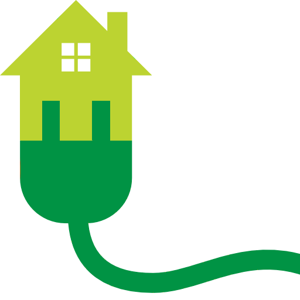
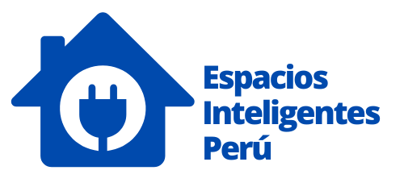
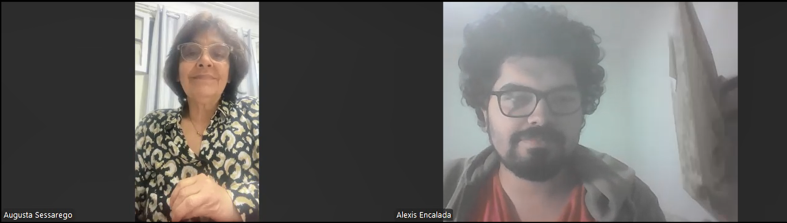
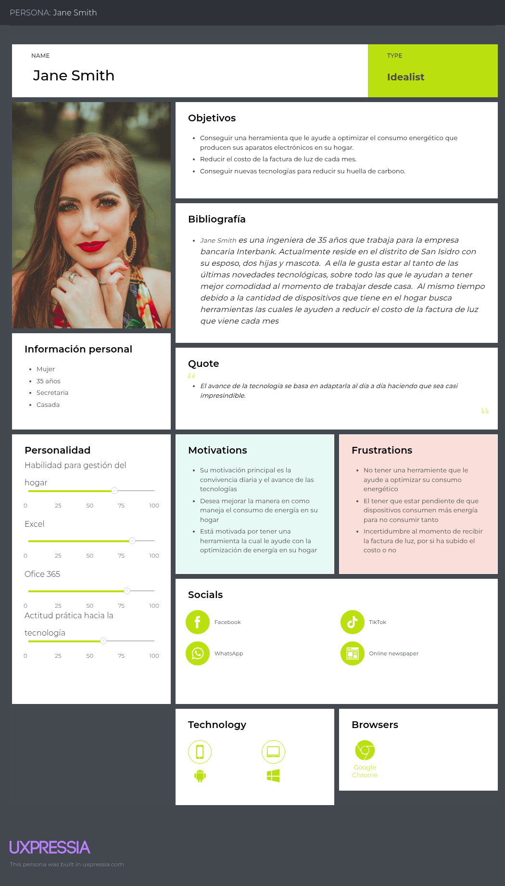
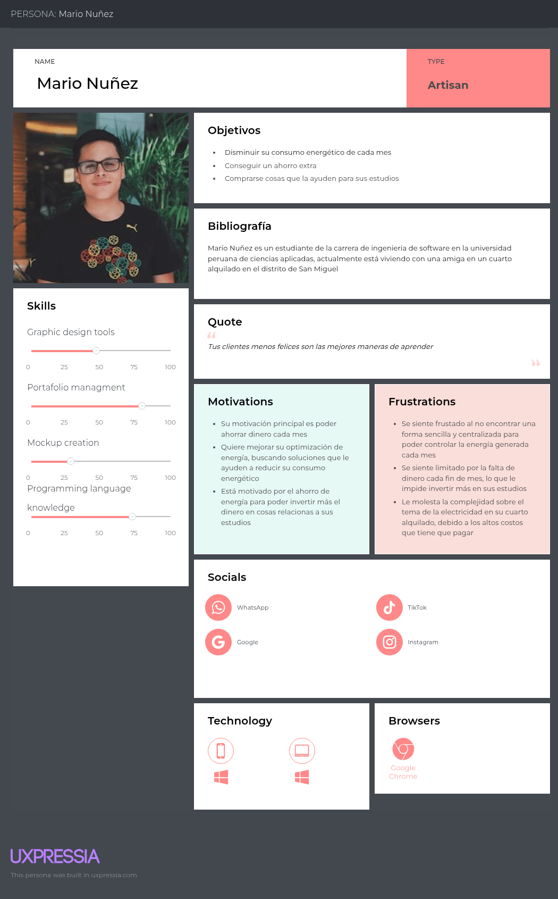
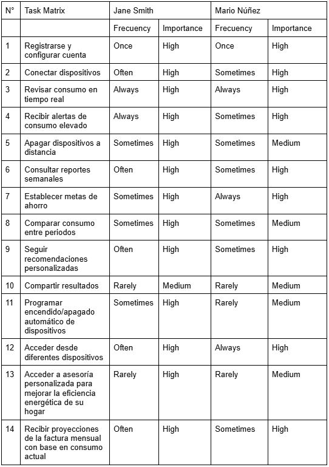
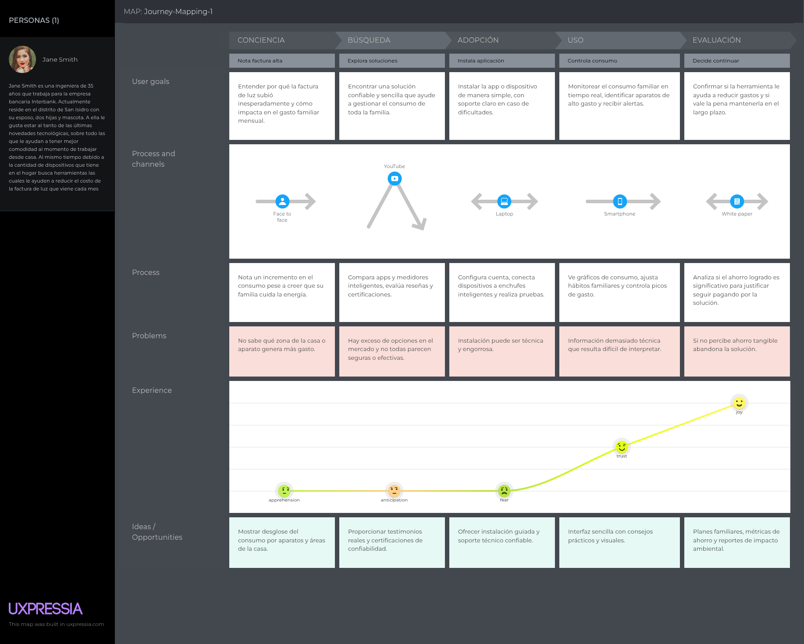
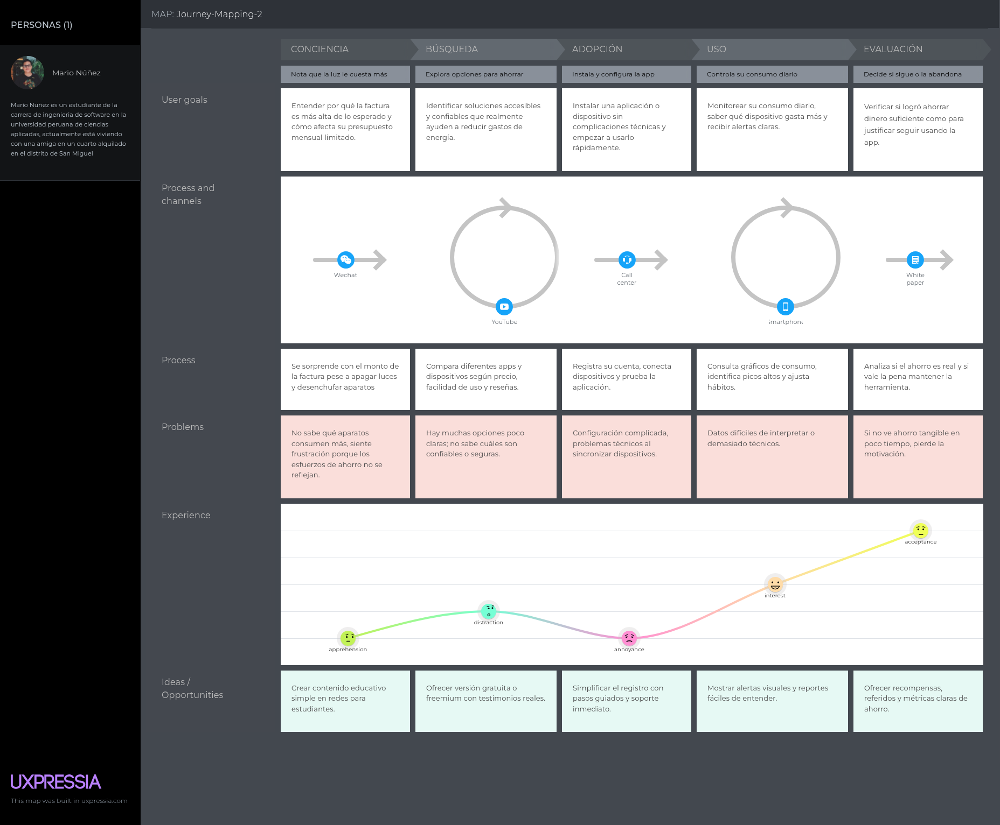

# Capítulo II: Requirements Elicitation & Analysis

## 2.1. Competidores

Llevaremos a cabo este analisis competitivo, para poder darnos cuenta de nuestras ventajas y desventajas dentro del mercado con competidores que cuentan con un modelo de negocio similiar o parecido al nuestro.

# Lupbak

LupBak es una plataforma que convierte hogares en entornos energéticamente inteligentes. Utiliza sensores conectados para monitorear el consumo de energía de los dispositivos del hogar en tiempo real. La plataforma ofrece recomendaciones personalizadas para optimizar el uso de energía y reducir costos.

---

# Refoss

Refoss ofrece dispositivos de monitoreo de energía para el hogar, como medidores inteligentes que permiten rastrear el uso de energía en tiempo real. La aplicación asociada proporciona análisis detallados y alertas sobre el consumo, ayudando a los usuarios a identificar áreas de mejora.

---

# Espacios Inteligentes Perú

Espacios Inteligentes Perú es una plataforma que se especializa en la implementación de soluciones de automatización del hogar, incluyendo el control de energía. Ofrecen servicios de instalación y configuración de dispositivos inteligentes que permiten a los usuarios controlar y monitorear el consumo energético de su hogar.

---
### 2.1.1. Análisis competitivo

**¿Por qué llevar a cabo este análisis?**
Identificar fortalezas, debilidades y oportunidades de diferenciación en el mercado de monitoreo energético doméstico, para posicionar estratégicamente Energix y maximizar su ventaja competitiva.

| Categoría | Subcategoría | Energix    | LupBak    | Refoss    | Espacios Inteligentes Perú    |
| :--- | :--- | :--- | :--- | :--- | :--- |
| **Perfil** | **Overview** | Startup peruana que ofrece monitoreo energético en tiempo real con medidor inteligente, alertas automáticas y control remoto de dispositivos | Plataforma que convierte hogares en entornos energéticamente inteligentes usando sensores conectados | Proveedor de medidores inteligentes con aplicación para análisis detallados del consumo energético | Empresa peruana especializada en automatización del hogar con servicios de instalación profesional |
| | **Ventaja competitiva** ¿Qué valor ofrece a los clientes? | • Enfoque en ahorro económico directo (20-30%) • Control remoto de dispositivos • Interfaz simple y amigable • Alertas predictivas | • Ecosistema completo de sensores • Automatización integral del hogar • Recomendaciones personalizadas avanzadas | • Análisis técnicos detallados • Precisión en mediciones • Enfoque en datos granulares | • Conocimiento del mercado local • Servicios profesionales de instalación • Soporte técnico presencial |
| **Perfil de Marketing** | **Mercado objetivo** | Amas de casa, propietarios con múltiples dispositivos, estudiantes que alquilan (usuarios conscientes del gasto) | Propietarios de viviendas interesados en hogar inteligente completo | Usuarios técnicos que buscan datos detallados de consumo | Propietarios de viviendas premium que buscan automatización completa |
| | **Estrategias de marketing** | • Enfoque en ahorro económico • Marketing digital dirigido • Demostraciones de ROI • Testimonios de usuarios | • Marketing de hogar inteligente • Enfoque en innovación tecnológica • Partnerships con fabricantes | • Marketing técnico especializado • Comunidades de usuarios tech • Contenido educativo técnico | • Marketing local B2B y B2C • Showrooms físicos • Referencias y recomendaciones |
| **Perfil de Producto** | **Productos & Servicios** | • Medidor inteligente • Plataforma web de monitoreo • Alertas automáticas • Control remoto de dispositivos • Reportes semanales | • Múltiples sensores conectados • Plataforma de automatización • Recomendaciones IA • Integración con otros dispositivos | • Medidores inteligentes • Aplicación móvil • Análisis detallados • Sistema de alertas | • Dispositivos de automatización • Servicios de instalación • Configuración personalizada • Soporte técnico |
| | **Precios & Costos** | Modelo freemium con suscripción mensual para funciones avanzadas (estimado: S/50-80/mes) | Inversión inicial alta por múltiples sensores + suscripción mensual | Costo del medidor + aplicación gratuita o premium | Costo de dispositivos + instalación profesional + mantenimiento |
| **Canal** | **Canales de distribución** (Web y/o Móvil) | • Plataforma web propia • App móvil • Tiendas online • Instalación autoguiada | • Plataforma web • App móvil • Retailers especializados • E-commerce | • Tiendas especializadas • E-commerce • Distribuidores técnicos | • Venta directa • Showrooms físicos • Instaladores certificados • Website corporativo |
| **Análisis SWOT** | **Fortalezas** | • Enfoque específico en ahorro económico • Interfaz simple y amigable • Control remoto de dispositivos • Enfoque Lean UX • Conocimiento del mercado peruano | • Ecosistema completo de sensores • Tecnología avanzada • Recomendaciones personalizadas • Marca establecida | • Precisión técnica • Análisis detallados • Experiencia en medidores • Base de usuarios técnicos | • Presencia local establecida • Servicios profesionales • Conocimiento del mercado peruano • Red de instaladores |
| | **Debilidades** | • Startup nueva sin track record • Recursos limitados • Dependencia de adopción tecnológica • Necesidad de validación en mercado | • Mayor complejidad de uso • Costo inicial alto • Puede ser percibido como complicado | • Enfoque muy técnico • Barrera de entrada para usuarios básicos • Menos enfoque en UX | • Costos altos de instalación • Dependencia de servicios presenciales • Menor escalabilidad |
| | **Oportunidades** | • Creciente conciencia sobre ahorro energético • Aumento de tarifas eléctricas • Digitalización acelerada • Mercado peruano sin líder claro • Segmento de usuarios conscientes del gasto | • Expansión a mercados emergentes • Integración con más dispositivos IoT • Partnerships estratégicos | • Simplificación de interfaz • Expansión a mercado residencial masivo • Reducción de costos | • Expansión nacional • Digitalización de servicios • Partnerships con constructoras |
| | **Amenazas** | • Competidores con mayor capital • Resistencia al cambio tecnológico • Regulaciones energéticas cambiantes • Entrada de grandes tech companies | • Competencia de gigantes tecnológicos • Commoditización de sensores IoT • Cambios en estándares de conectividad | • Nuevas tecnologías disruptivas • Competencia de soluciones más simples • Cambios regulatorios | • Digitalización del mercado • Competencia de soluciones DIY • Reducción de márgenes por competencia |

### 2.1.2. Estrategias y tácticas frente a competidores

## **Control remoto de dispositivos**
**• Estrategia:** Posicionar la capacidad de apagar dispositivos remotamente como diferenciador clave.  
**• Táctica:** Demostrar control inmediato desde cualquier ubicación.

## **Monitoreo en tiempo real con alertas**
**• Estrategia:** Usar el seguimiento constante de picos y caídas de energía para generar valor inmediato.  
**• Táctica:** Alertas automáticas ante consumos inusuales como ventaja sobre soluciones pasivas.

## **Simplicidad de instalación**
**• Estrategia:** Contrastar la facilidad de uso de un medidor inteligente vs. soluciones complejas del mercado.  
**• Táctica:** Instalación inmediata sin técnicos ni configuraciones complicadas.

## **Informes personalizados semanales**
**• Estrategia:** Diferenciarse con reportes orientados a decisiones vs. solo datos técnicos.  
**• Táctica:** Información procesada que guía hacia uso más eficiente.

## **Reducción comprobada del 20-30%**
**• Estrategia:** Usar el dato documentado de ahorro como promesa cuantificable.  
**• Táctica:** Comunicar porcentaje específico de reducción en gasto mensual vs. promesas vagas de la competencia.

## **Enfoque en el mercado peruano**
**• Estrategia:** Aprovechar conocimiento local del contexto de consumo residencial (28.6% del total nacional).  
**• Táctica:** Solución adaptada específicamente a patrones de uso en hogares peruanos.

## 2.2. Entrevistas

Las entrevistas estarán dirigidas a propietarios de vivienda y estudiantes que alquilan, con el objetivo de comprender sus necesidades específicas en el acceso a información sobre arrendamientos, condiciones de vivienda, mantenimiento y servicios, así como conocer más sobre sus gastos.

### 2.2.1. Diseño de entrevistas
En esta sección se define la información a recolectar de los segmentos objetivo. Para la información básica del entrevistado, se utilizará un formulario que se registrará a través del siguiente enlace:
https://docs.google.com/forms/d/e/1FAIpQLSf50lRgCkX84aNEuHV86LSFNVgvwaYceiN8OfUQ2O7-LL0Ddg/viewform?usp=dialog

#### Entrevista Segmento #1: Propietarios de Vivienda

1. ¿Podría contarnos acerca de su ocupación y su situación de vivienda?
2. ¿Qué tan importante es para usted la eficiencia energética en su hogar?
3. ¿Ha implementado alguna tecnología o sistema para monitorear el consumo eléctrico?
4. ¿Cuáles son los principales desafíos o frustraciones que enfrenta con la gestión de su gasto energético?
5. ¿Qué dispositivos o electrodomésticos considera que consumen más energía en su hogar?
6. ¿Qué marcas de dispositivos inteligentes prefiere y por qué?
7. ¿Con qué frecuencia revisa su factura de luz y qué decisiones toma a partir de ella?
8. Si existiera una solución para la gestión de energía, ¿qué funcionalidades serían indispensables para usted?
9. ¿Le resultaría valioso recibir alertas sobre un consumo inusual o elevado?
10. ¿Considera que una herramienta de monitoreo podría ayudarle a optimizar sus gastos a largo plazo?
11. ¿Cómo describiría su disposición a probar nuevas tecnologías para la gestión del hogar?
12. ¿Qué tipo de información le daría la confianza para invertir en una solución de este tipo?
13. ¿Qué lo motivaría a adoptar una nueva tecnología para el hogar, más allá del ahorro económico?
14. ¿De qué manera prefiere informarse sobre nuevas soluciones tecnológicas para el hogar?
15. ¿Estaría dispuesto a adquirir un servicio que le ofreciera este tipo de reportes y control sobre su consumo?

#### Entrevista Segmento #2: Estudiantes que alquilan

1. ¿Podría compartir su edad y la carrera que está estudiando?
2. ¿Cómo describe su situación actual en cuanto a vivienda?
3. ¿Cómo gestiona su presupuesto mensual, incluyendo los gastos de servicios?
4. ¿Qué tan consciente es del consumo de energía en su hogar?
5. ¿Ha intentado reducir su gasto de luz? Si es así, ¿qué métodos utilizó?
6. ¿Qué tipo de frustraciones o sorpresas ha tenido con la factura de electricidad?
7. ¿Qué marcas de dispositivos inteligentes prefiere y por qué?
8. Si tuviera una herramienta para ver su consumo, ¿qué tipo de información le gustaría que le mostrara?
9. ¿Cree que las alertas de consumo podrían ayudarle a controlar mejor sus gastos?
10. ¿Cómo podría una aplicación de gestión de energía encajar en su rutina diaria?
11. ¿Qué criterios son clave para usted al elegir una aplicación que lo ayude a monitorear y gestionar su ahorro energético en el hogar?
12. ¿Qué tan dispuesto estaría a cambiar sus hábitos para lograr un ahorro de luz?
13. ¿Estaría dispuesto a adquirir un servicio que le ofreciera este tipo de reportes y control sobre su consumo energético?
####

### 2.2.2. Registro de entrevistas

Esta sección se dedica a la documentación sistemática de cada entrevista con los segmentos objetivo. Se organiza la información para presentar el perfil de cada entrevistado, junto con sus respuestas directas y los hallazgos más significativos. Este registro es crucial para comprender la perspectiva del usuario y validar las hipótesis iniciales del proyecto.

Link del Video: https://shorturl.at/l63Qm

**ENTREVISTAS SEGMENTO OBJETIVO 1: PROPIETARIOS DE VIVIENDA**

**ENTREVISTA 1**

Inicia: 0 minutos y 0 segundos

Duración: 5 minutos y 24 segundos

Nombre: Yusnury Hilda Vivar Olivos

Edad: 28 años

Distrito: San Miguel

Resumen: Yusnury Vivar trabaja en el área receptivo de una agencia de viajes y vive en una casa propia con su familia. Considera muy importante la eficiencia energética y en su hogar aplican prácticas como apagar luces, usar focos LED y desconectar cargadores. Aunque solo revisa su recibo de luz a fin de mes, reconoce que electrodomésticos como la refrigeradora, lavadora/secadora y computadoras elevan su consumo. Le interesan marcas como Xiaomi, TP-Link y Amazon Alexa por su accesibilidad y compatibilidad. Le gustaría una solución que le ofrezca reportes claros por aparato y que sea fácil de usar, con soporte y garantía de ahorro, ya que estaría dispuesta a adoptar nuevas tecnologías que aporten comodidad, control y cuidado del medio ambiente.

Información extra:

* Dispositivos:
    + iPhone (uso constante).
    + Computadora y laptop (para trabajo).

* Personalidad:

    + Tiene alta disposición a innovar y probar nuevas tecnologías para el hogar.
    + Su motivación va más allá del ahorro económico: le interesa el cuidado del medio ambiente, la comodidad y la modernidad.

**ENTREVISTA 2**

Inicia:  5 minutos y 24 segundos

Duración:  3 minutos y 42 segundos

Nombre: Augusta Sessarego

Edad:  54

Distrito: Jesús María

Resumen: Augusta Sessarego(54) trabaja como secretaria en una agencia de salud, vive en su casa con su hijo y una mascota. Ella considera de suma importancia tener una eficiencia sobre el consumo energético en su vivienda, en estos últimos meses ha estado aplicando prátcias como desenchufar aparatos que no se usen y usar regularmentes dispositivos para que no consuman demasiada energía. Cada mes ella revisa su recibo de luz solo una vez que normalmente son los 30 o 31, según su experiencia los electrodomésticos como la terma, el microondas, y la refrigeradora son los que más consumo energía por día. Del mismo modo no es una persona que se fije en las marcas de dispositivos simplemente se deja llevar por el precio y calidad aunque si afirma haberse comprado un Amazon Alexa. Por último si le gustaria una solución que le ofrezca reportes díarios de su consumo energético para así poder optimizar por dispositivo la cantidad de energía generada en su vivienda.

Información extra:

* Dispositivos:
    + Android (uso constante).
    + Computadora y laptop (para trabajo).

* Personalidad:
    + Le gusta comprar nuevas cosas que le ayuden en el día a día en su hogar.
    + Su motivación para ahorrar va más alla de lo económico, si no le gustaría poder reducir su huella de carbono para contribuir al cuidado del medio ambiente.

**ENTREVISTA 3**

Inicia: 9 minutos y 17 segundos

Duración: 7 minutos y 5 segundos

Nombre: Moisés de la Cruz

Edad: 29

Distrito: Chorrillos

Resumen:El entrevistado señaló que en su empresa textil controlan el consumo de energia de forma manual, leyendo el medidor al inicio y fin de mes. Han tenido problemas con facturas excesivamente altas. , Considera que el uso eficiente de energia en su modelo de negocio es muy importante. Considera útil una app con alertas semanales y de fácil uso, especialmente para que sus padres también la puedan manejar.

Información extra:

* Dispositivos:
    + iPhone (uso constante).
    + MacBooks (para trabajo).
    + Navegador Chrome (uso constante).
* Personalidad:
    + Alta disposición a innovar y probar nuevas tecnologías para el hogar y para su familia.
    + Su motivación va más allá del ahorro económico: le interesa modernizar el ambiente en el cual convive con su familia.

**ENTREVISTAS SEGMENTO OBJETIVO 2: ESTUDIANTES QUE ALQUILAN**

**ENTREVISTA 1**

Inicia: 16 minutos y 23 segundos

Duración: 3 minutos y 32 segundos

Nombre: Johnny Ricardo Mallqui Cueva

Edad: 19

Distrito: Chorrillos

Resumen: Johnny Mallqui (19 años) estudia en la UPC y alquila un cuarto en Chorrillos, se relaciaona a menudo con la tecnología ya que estudia ingeniería de Sistemas. Nos comento que tiene un presupuesto mensual, incluyendo alquiler y servicios. Aunque ha intentado reducir su gasto de energía electrica apagando luces y desconectando dispositivos, a menudo se sorprende con facturas altas. Le gustaría una aplicación que le muestre su consumo en tiempo real con los picos altos y bajos, que le envíe alertas para evitar sorpresas y estaría dispuesto a cambiar sus hábitos para tratar ahorrar más.

Información extra:

* Dispositivos:
    + Samsung (uso constante).
    + Computadora (para estudios).
* Personalidad:
    + Carrera: Ingeniería de Sistemas.
    + Estresado por las facturas elevadas, quiere reducir ese gasto.
    + Prefiere una plataforma en la cual pueda monitorear el consumo de energía.

**ENTREVISTA 2**

Inicia: 19 minutos y 55 segundos

Duración: 4 minutos y 6 segundos

Nombre: Stephano José Espinoza Cueva

Edad: 20

Distrito: La Victoria

Resumen: Stephano Espinoza (20 años) estudia en la UPC y alquila un departamento en La Victoria con amigos, se encuentra cursando la carrera de ingenieria de Software con sus amigos, cuya carrera esta relaciona con un ambiente tecnólogico. Ellos se dividen los gastos, pero a veces se sorprenden con facturas elevadas. El nos comenta que, como medidas para reducir los gastos, desconectan dispositivos, no usan frecuentemente dispositivos de alto consumo y tratan de usar luces LED. A él gustaría una aplicación que le envíe alertas para estar prevenido si es un dispositivo esta consumiendo demasiada energía, que a traves del consumo genere un historial con un balance para darle un feedback con posibles sugerencias.

Información extra:

* Dispositivos:
    + iPhone (uso constante).
    + Computadora y laptop (para estudios).

* Personalidad:
    + Carrera: Ingeniería de Software.
    + Preocupado por el consumo excesivo de energía en su departamento.
    + Prefiere una aplicación que le alerte cuando hay un consumo excesivo y que le de consejos de mejora.

**ENTREVISTA 3**

Inicia: 24 minutos y 2 segundos

Duración: 2 minutos y 8 segundos

Nombre: Simón Gabriel Molina Chirinos

Edad: 19

Distrito: Pueblo Libre

Resumen: Simón Molina es un estudiante de 19 años que alquila un cuarto para estar más cerca de la universidad. Usualmente, calcula sus ingresos y gastos con el objetivo de no gastar de más. Él, considera que es muy consciente con respecto a su consumo energético. Además, que ha inentado reducir sus gastos energéticos mediante evitar dejar encendidas las luces o enchufados los electrodomésticos. Hay veces en las que su factura varía más a pesar de casi no cambiar su consumo. Prefiere dispositivos inteligentes que sean fáciles de utilizar y no sean tan caros. Le gustaría tener información sobre cuánto gasta diariamente y qué dispositivo consume más energía. Asimismo, considera que las alertas de consumo son muy útiles para el ahorro energético. También, menciona que está buscando una aplicación fácil de usar y que realmente ayude a ahorrar. Finalmente, menciona que está interesado en un producto que brinde confianza al momento de ahorrar energía y que sea accesible monetariamente.

Información extra:
* Dispositivos:
    + Samsung (uso constante).
    + Computadora y laptop (para estudios).

* Personalidad:
    + Carrera: Ingeniería de Sistemas.
    + Se preocupa por su consumo energético.
    + Busca una aplicación barata que resuelva su problema energético.

### 2.2.3. Análisis de entrevistas

| **Segmento**                 | **Características Objetivas Comunes** | **Características Subjetivas Comunes** |
|------------------------------|---------------------------------------|-----------------------------------------|
| **Propietarios de vivienda** | - Viven en casa propia y conviven con familia (hijos, padres o pareja). - Aplican prácticas básicas de ahorro energético (apagar luces, desenchufar, focos LED). - Revisan la factura de luz solo al final de mes. - Identifican electrodomésticos de alto consumo (refrigeradora, terma, lavadora, microondas, computadoras). - Interés en dispositivos inteligentes (Xiaomi, TP-Link, Amazon Alexa), aunque algunos priorizan precio/calidad. - Dispuestos a adoptar nuevas tecnologías que aporten comodidad, control y eficiencia. | - Valoran la eficiencia energética tanto para ahorrar dinero como para cuidar el ambiente. - Frustración por no contar con información clara en tiempo real (solo factura mensual). - Desean reportes detallados por aparato o con frecuencia diaria/semanal. - Prefieren soluciones fáciles de usar y accesibles para toda la familia. - Buscan herramientas confiables, con soporte técnico y garantía de ahorro. |
| **Estudiantes que alquilan** | - Jóvenes universitarios (19–20 años) que alquilan cuartos o departamentos, algunos con roomates. - Manejan un presupuesto limitado que incluye alquiler y servicios. - Intentan reducir el gasto eléctrico apagando luces, desenchufando dispositivos y usando focos LED. - Han tenido facturas elevadas o variables sin explicación clara. - Son usuarios frecuentes de tecnología y aplicaciones móviles. | - Quieren tener control real de su consumo energético para evitar sorpresas. - Valoran que las soluciones sean simples, claras y económicas. - Consideran útiles las alertas de consumo para prevenir excesos. - Buscan información detallada (reportes diarios, historial, picos de consumo). - Están dispuestos a cambiar hábitos si la herramienta demuestra un ahorro real. |

## 2.3. Needfinding

Utilizando la información recolectada, hemos realizado un análisis de las necesidades de los usuarios, que nos permitirá identificar y priorizar las funcionalidades que se incluirán en la plataforma. El resultado es la elaboración de los arquetipos User Persona, que representan a los usuarios finales de la plataforma, el User Task Matrix, User Journey Maps, Empathy Mapping y As-Is Scenario Mapping.

#### 2.3.1. User Personas
En esta sección del documento, se presentarán perfiles ficticios que representan a los grupos de interés intrevistados. La información proporcionada incluye datos demográficos, rasgos de personalidad, motivaciones, preferencias, metas, desafíos y comportamientos típicos. Estos detalles están basados en las entrevistas realizadas previamente. Se han utilizado herramientas de UXPressia para facilitar la elaboración de estos perfiles
#
- **User Persona para Propietarios**
La "User Person" de Jane Smith representa a propietarios de vivienda que desean tener una herramienta que les ayude a optimizar su consumo de energía en sus hogares. Jane es una secretaria de 35 años, motivado por las nuevas tecnologías y la rapidez de la evolución de estas mismas las cuales le ayudarán en su desempeño como secretaria. Las frustraciones que presenta son el elevado monto de la factura que recibe cada mes debido al alto consumo energético que genera día a día y el no tener una herramienta que le ayude a optimizar este consumo. 
    
#
- **User Persona para Estudiantes**

  La "User Person" de Marío Nuñez representa a los estudiantes que alquilan viviendas. Interesados en reducir su consumo energético para poder ahorrar dinero para sus demás necesidades. Marío Nuñez de 20 años es un estudiante de la carrera de ingenieria de software, utiliza herrameientas tecnológicas de modernas debido a que su carre lo demanda. Sus motivaciones son poder disminuir el consumo energético generado cada mes. Sus frustaciones son los elevados costos de la factura de luz lo que le obliga a gastar de más del preosupuesto que tenía para el mes.
    

### 2.3.2. User Task Matrix
Para el desarrollo del proyecto, se ha compilado un User Task Matrix, el cual resume las actividades esenciales de los dos grupos de personas investigados. Este recurso sirve para identificar las acciones principales de cada tipo de usuario, además de evaluar la periodicidad y la importancia que cada uno le atribuye. El conocimiento extraído de este análisis es crucial para definir las prioridades en el diseño de la herramienta digital, lo que asegura que su concepción esté alineada con las exigencias auténticas de los usuarios.

El análisis del User Task Matrix revela tareas que resultan altamente frecuentes y relevantes para cada segmento objetivo:

* Tareas con mayor frecuencia e importancia en ambos segmentos:

    + Para propietarios de vivienda (Jane Smith): revisar el consumo en tiempo real, recibir alertas de picos energéticos y consultar reportes semanales son acciones fundamentales, realizadas con alta frecuencia y consideradas de máxima importancia.

    + Para estudiantes que alquilan (Mario Núñez): revisar el consumo en tiempo real, recibir recordatorios de desconexión de cargadores y dividir el consumo con compañeros destacan como las más relevantes, ya que se alinean directamente con su necesidad de ahorro inmediato.

* Diferencias clave entre segmentos:

    + Los propietarios valoran tareas más estratégicas, como programar encendido/apagado automático, recibir proyecciones de la factura mensual y acceder a asesoría personalizada, pues buscan optimización detallada y control financiero a largo plazo.

    + Los estudiantes, en cambio, priorizan tareas prácticas y rápidas, como compartir resultados con compañeros, recibir recordatorios simples y comparar su consumo con otros usuarios similares, motivados principalmente por un presupuesto limitado y la simplicidad.

* Coincidencias entre segmentos:

    + Ambos grupos consideran de gran importancia la visualización del consumo en tiempo real y la recepción de alertas sobre gastos elevados.

    + También coinciden en el valor de las recomendaciones personalizadas, aunque los propietarios las aplican de manera más analítica, mientras que los estudiantes las usan de forma más básica.

Este análisis permite enfocar el diseño de la plataforma en torno a las tareas más críticas de cada grupo: control avanzado y planificación para propietarios, y ahorro inmediato y facilidad de uso para estudiantes, lo que facilita priorizar funcionalidades en el backlog y asegurar que cada segmento perciba un alto valor en el sistema.

### 2.3.3. User Journey Mapping

Con el propósito de profundizar en la comprensión de los perfiles de usuario y su relación con el consumo energético, se elaboraron Customer Journey Maps mediante la herramienta UXPressia. Esta dinámica permitió representar de forma clara el camino que recorren los usuarios desde que detectan una necesidad hasta la valoración final de la solución, identificando tanto sus motivaciones como los obstáculos que enfrentan.

El análisis se enfocó en dos perfiles representativos:

1. Jane Smith, ingeniera y propietaria de vivienda interesada en soluciones confiables que le permitan gestionar el consumo energético de toda su familia.

1. Mario Núñez, estudiante universitario que alquila un cuarto y busca herramientas simples y económicas para reducir el gasto en electricidad.

Cada Journey Map contempla:

- Las etapas principales del recorrido (conciencia, búsqueda, adopción, uso y evaluación).

- Los objetivos específicos en cada fase.

- Los procesos y canales empleados por los usuarios.

- Las emociones que experimentan, expresadas mediante un sistema visual de sentimientos.

- Los puntos de fricción y las oportunidades de mejora detectadas.

El uso de UXPressia facilitó plasmar de manera visual y ordenada estas experiencias, aportando una mirada empática que enriquece la toma de decisiones. Gracias a este ejercicio, se pudo comprender mejor las diferencias entre estudiantes y propietarios, y orientar el diseño de soluciones más útiles, accesibles y alineadas con sus necesidades reales.

Segmento objetivo #1: Propietarios de Vivienda

Segmento objetivo #2: Estudiantes que alquilan

## 2.4. Big Picture Event Storming.

## 2.5. Ubiquitous Language
- **SEMS**: Nombre del producto compuesto por cuatros palabras en inglés: "Smart" (Inteligente), "Energy"(Energía), "Management"(Gestión), "System"(Sistema).

- **Suscripción**: Un pago asociado a la funcionalidad de **SEMS** que ofrece tres planes diseñados para adaptarse a diferentes necesidades y niveles de consumo.

- **Monitoreo en tiempo real**: Información actualizda instantáneamente sobre los consumos energéticos de las diferentes viviendas.

- **Dashboard interactivo**: Herramienta visual de gestión de información que muestra gráficos del consumo de cada dispositivo.

- **Histórico de consumo**: Un registro del total de consumo generado por el usuario, que incluye detalles como fecha, hora, dispositivos registrados y total de consumo.

- **Control remoto básico**: Herramienta que permitirá al usuario poder controlar los dispositivos registrados en la base de datos.

- **Backend**: Infraestuctura que aloja y gestiona los datos de la apliacación, incluyendo la disponibilidad de espacios y la información de los usuarios.

- **Interfaz de usuario(UI)**: Parte visual de la aplicación con la que los usuarios interactúan para realizar monitoreos, recibir alertas y notifiaciones y controlar sus dispositivos.

- **Usuario**: Persona que utiliza la aplicación para monitoerar, gestionar su consumo y controlar sus dispositivos.

- **Alertas de consumo inusual**: Alertas enviadas,en tiempo real, al usuario para informarles sobre picos inusuales de consumo de energía detectados.

- **Recomendaciones inteligentes**: Notificaciones personalizadas hacia el usuario brindándoles consejos únicos para que optimizar sus consumos energéticos. 
