# Capítulo IV: Product Design

## 4.1. Style Guidelines

En esta seccion se establecen las bases con las que realizaremos y organizaremos la presentacion de nuestro proyecto. Se incluyen los General Style Guidelines y los Web Style Guidelines.

### 4.1.1. General Style Guidelines
- En esta sección se detallarán las desiciones fundamentales y las referencias visuales utilizadas para definir aspectos principales del proyecto como los siguiente: Branding, tipografía, colores, spacing y tonos de comunicación.
- - Branding
- - - El nombre completo de nuestro servicio es "Smart Energix Manager".
- - - Para el dominio web y la aplicación, así como para ser más memorables se utilizará el nombre corto "Energix".
- - - El logo representa de forma directa y moderna la combinación de un hogar familiar de color azul con la silueta de un foco ahorrador junto a una hoja, superpuesto en el centro del marcador. Esta combinación visual comunica de manera clara la idea de optimizar el consumo energético en los hogares y reducir el impacto ambiental.    
      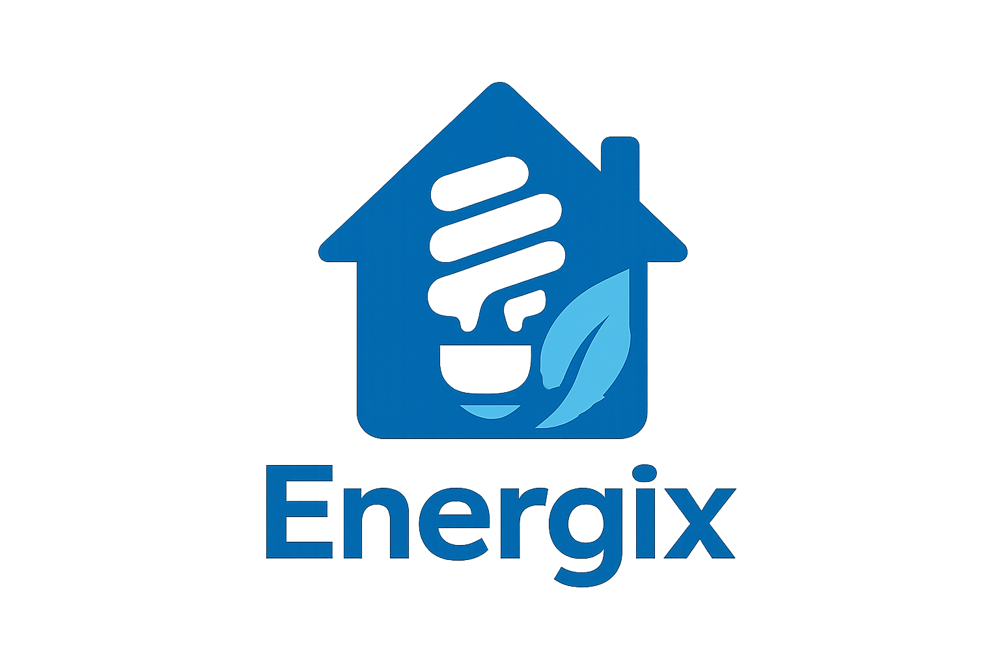
- - Tipografía
- - - La tipografía principal seleccionada es Lato. Esta fuente fue elegida por su clásiscas proporciones, sobretodo en las mayúsculas dando así harmonía y elegancia a las oraciones motrando contemporaneidad sin ser abrumador.
- - - Tamaños:
- - - - Móvil: Títulos 50px, cuerpo y sibtítulos 20px.
- - - - Web: Títulos 50px, cuerpo y subtítulos 50px.
- - Colores
- - - Utilizaremos la siguiente paleta de colores:
        
- - - - Este azul moderno, representa confianza y presición para la navegación, Se usará en la parte del encabezado guiando al usuario de forma clara. Evocando la fiabilidad de las herrameintas establecidad.  #0277BD
- - - - Este tono de azul más claro, llamado "Alice Blue", representa frecusra y tranquilidad. Se usará en la parte inferior de la página web, dandole una la sensación al usuario de paz y pureza. #E1F5FE
- - - - Este gris cálido simple simboliza el punto neutro e imparcial representando comodidad y claridad. Se usará tanto en los botones de acción como en los subtítulos del pié de página. #808080
- - - - Este blanco básico representa la simpliciad e igualdad. Se utilizará en el fondo principal de la página web. #FFFFFF
- - - - Este negro original manifiesta elegancia a la vez que autorizad y sobresalta entre los demás. Será utilizado en los títulos de la parte de suscripciones y de la app móvil. #000000
- - Spacing
- - - El espacio en el diseño de Energix se enfocará en proporcionar una experiencia visual clara y accesible para el usuario, reflejando así los principios de claridad y orden. Del mismo modo se utilizrán márgenes amplios para resaltar elementos claves, como botones, imágenes y títulos, permitiendo una navegación fluida y amigable.
- - - Los títulos y subtítulos contarán con un espaciado vertical generoso, haciendo fácil la lectura y la jerarquización de la información. Los botones e íconos tendrán márgenes precisos para asegurar la consistencia.
- - Tonos de comunicación
- - - El tono de comunicación de Energix será amigable, cercano y orientado al usuario. Buscamos establecer una genuina conexión, utilizando un lenguaje claro y conciso, utilizando un lenaguaje claro y accesible, evitando así técnicismos innecesarios. Nuestra comunicación será positiva y alentadora, enfocándose en resaltar los beneficios que ofrecemos. Por último se priorizará la empatía y la comprensión de las necesidades del Usuario, ofreciendo ayuda y soporte de manera oportuna y efectiva. Queremos que el usuario se sienta valorado y escuchado en cada interacción

### 4.1.2. Web Style Guidelines

Esta sección detalla los lineamientos visuales para los componentes de la landing page de Energix, con el objetivo de garantizar una identidad visual coherente, moderna y centrada en la eficiencia energética y la tecnología.

**Botones:**
- **Botones Principales:**
    - **Color de fondo:** Azul oscuro corporativo (#0D47A1).
    - **Color de texto:** Blanco puro (#FFFFFF) para un contraste óptimo.
    -  **Tipografía:** Sans-serif, peso medio, centrado.
    -  **Forma:** Rectangular con esquinas ligeramente redondeadas.

**Tono comunicacional:**
- Directo, profesional y decisivo. Invita al usuario a realizar acciones clave como "Suscribirse".

**Botones Secundarios:**
- **Color de fondo:** Blanco (#FFFFFF) o rojo para acciones específicas (#DC3545).
- **Color de texto:** Negro (#000000) o blanco, según el fondo.
- **Forma:** Esquinas redondeadas, estilo cápsula o rectangular.
- **Tono comunicacional:** Ofrece acciones alternativas de forma clara y visible, sin competir con el CTA principal.

**Header**
- **Texto:** Texto blanco (#FFFFFF) sobre un fondo azul (#02A9F4). Los botones de "EN" e "Inicia Sesión" utilizan texto azul sobre fondo blanco (#FFFFFF) para crear un llamado a la acción claro.
- **Tipografía:** Sans-serif, con un tamaño de 16px para los enlaces del menú de navegación.
- **Estilo:** Enlaces sin subrayado, con una alineación limpia y espaciado generoso entre elementos para una fácil navegación.
- **Tono:** Moderno, profesional y claro, transmitiendo confianza y facilidad de uso.

**Footer:**
- **Fondo:** Se utiliza un fondo blanco (#FFFFFF) para delimitar claramente el final de la página.
- **Texto:**
    - Sobre fondo blanco: Texto en negro (#000000) y gris (#555555).
- **Estructura:** Organizado en columnas para agrupar enlaces de interés, información de contacto y redes sociales.
- **Íconos:** Estilo lineal y simple, en color negro o blanco.
- **Tono:** Informativo, ordenado y profesional. Proporciona un cierre limpio y funcional a la experiencia de navegación.

**Secciones**
- **Fondo:** Predominan los fondos blancos (#FFFFFF) y azules claros (#E1F5FE) para las tarjetas y el contenido principal, creando un diseño limpio y espacioso. Se utilizan azules más oscuros (#0D47A1, #02A9F4) para cabeceras, pies de página y secciones destacadas, generando contraste.
- **Bordes:** Bordes consistentemente redondeados en tarjetas, botones y elementos de la interfaz para una apariencia suave y moderna.
- **Tono:** Profesional, tecnológico y limpio, con un uso generoso del espacio en blanco para facilitar la lectura.

**Iconografía**
- **Estilo:** Lineal y minimalista. Los iconos son simples, claros y fácilmente reconocibles (p. ej., redes sociales, signos de suma, marcas de verificación).
- **Colores:** Principalmente monocromáticos en negro (#000000) o blanco (#FFFFFF) para una máxima legibilidad. En secciones específicas, se utiliza el azul principal (#1A73E8) para dar énfasis.
- **Tono:** Funcional y coherente, asegurando que los iconos apoyen el contenido sin distraer.

**Paleta de Colores Principal**
- **Azules:**
    - **#0D47A1 (Azul oscuro):** Usado en CTAs y elementos de énfasis. Transmite confianza y seriedad.
    - **#02A9F4 (Azul cian):** Utilizado en fondos de tarjetas y secciones destacadas. Aporta un toque tecnológico y fresco.
    - **#E1F5FE (Azul claro):** Para fondos sutiles y estados hover.
- **Neutros:**
    - **#FFFFFF (Blanco):** Color principal para fondos y texto sobre fondos oscuros. Aporta limpieza y espacio.
    - **#000000 (Negro):** Para textos principales, fondos de footer y elementos de alto contraste.
    - **#555555 (Gris oscuro):** Para textos secundarios y detalles.
- **Acentos:**
    - **#DC3545 (Rojo):** Reservado para acciones de cancelación o advertencia.

**Tono Comunicacional General**
- **Profesional y Tecnológico:** El lenguaje y el diseño reflejan una marca experta en soluciones de energía.
- **Claro y Directo:** La comunicación es concisa, facilitando al usuario la comprensión de los beneficios y el uso del sistema.
- **Confiable y Eficiente:** Transmite seguridad y resalta el ahorro y la sostenibilidad como valores clave.

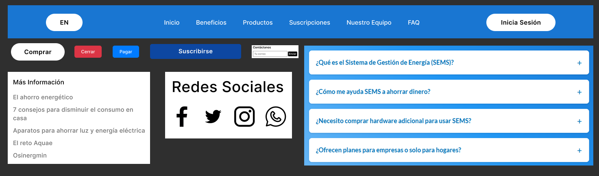
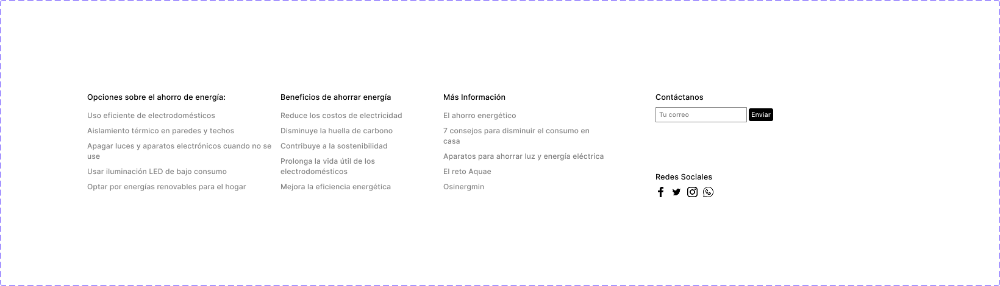
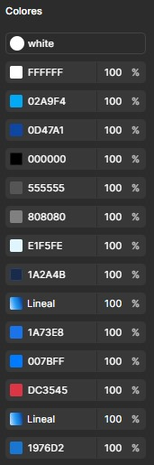

## 4.2. Information Architecture

En esta seccion mostramos las decisiones de Arquitectura de Informacion para organizar el contenido de nuestra aplicacion de tal manera que los usuarios puedan tener una experiencia eficiente. Se incluyen las secciones de Organization Systems, Labeling Systems, Navigation Systems y Searching Systems.

### 4.2.1. Organization Systems

Aplicación web:
Dentro de la app, el sistema de organización se basa en un menú lateral que agrupa las funciones principales (Dashboard, Reportes, Consumo, Configuración, Perfil). Esto permite que el usuario mantenga un control claro de su progreso y pueda acceder rápidamente a las herramientas según sus metas.

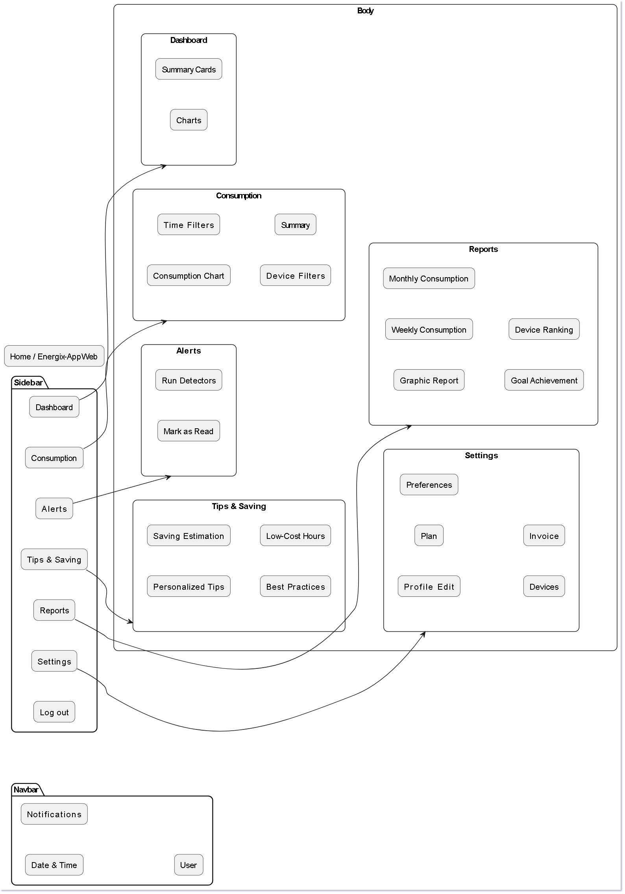

### 4.2.2. Labeling Systems

Al acceder a la plataforma web de Energix, los usuarios pueden explorar los servicios, productos y planes de suscripción. La página está diseñada para informar sobre los beneficios de la gestión energética inteligente y convertir visitantes en clientes.

**Navbar (Menú Principal):**

- **"Inicio"**: Redirige a la sección principal de bienvenida de la página.
- **"Beneficios"**: Muestra las ventajas clave del sistema, como el ahorro y el monitoreo.
- **"Productos"**: Presenta el hardware disponible, como el "Enchufe Inteligente".
- **"Suscripciones"**: Detalla los diferentes planes de pago (Básico, Premium, Anual).
- **"Nuestro Equipo"**: Presenta a los miembros del equipo detrás de Energix.
- **"FAQ"**: Lleva a la sección de preguntas frecuentes.
- **"EN/ES":** Botón para alternar el idioma de la página entre inglés y español.
- **"Iniciar Sesión"**: Botón para que los usuarios registrados accedan a la plataforma SEMS.

**Secciones Principales:**

- **"¡Energix tiene la solución!"**: Encabezado principal de bienvenida que capta la atención del usuario.
- **"¿Por qué Elegir Energix?"**: Sección que detalla las características principales: "Ahorro Energético", "Monitoreo en Tiempo Real", "Cuidado del Medio Ambiente", "Soporte Técnico", "Alertas Personalizadas" y "Acceso a SEMS".
- **"Productos"**: Presentación de 5 prodcutos que pueden ayudarte en la tarea de ahorrar y de alientan a la acción de "Comprar".
- **"Suscripciones"**: Tabla comparativa de los planes "Básico", "Premium" y "Anual", cada uno con un botón de "Suscribirse".
- **"About The Team"**: Describe la "Misión", "Visión" y "Valores" de la Startup.
- **"Nuestro Equipo"**: Muestra los perfiles de los integrantes del proyecto.
- **"Preguntas Frecuentes"**: Área interactiva para resolver las dudas más comunes de los usuarios.

**Formulario de Suscripción (Footer):**

- **"Tu correo"**: Campo para que el usuario ingrese su dirección de email.
- **"Enviar"**: Botón para suscribirse al boletín o solicitar información.

**Pie de Página:**

- **"Opciones sobre el ahorro de energía"**: Enlaces a artículos o guías sobre eficiencia energética.
- **"Beneficios de ahorrar energía"**: Acceso rápido a información sobre las ventajas económicas y ecológicas.
- **"Más información"**: Enlaces a recursos externos y temas de interés relacionados.
- **"Contáctanos"**: Sección con el formulario de suscripción por correo.
- **"Redes Sociales"**: Iconos que enlazan a los perfiles sociales de la empresa.

### 4.2.3. SEO Tags and Meta Tags

- Los SEO Tag y Meta Tags ayudarán a que la página estática y la aplicación web sea posible de analizar fácilmente y se pueda gestionar de manera eficiente y optima.

- **Charset:** Define la codificación de caracteres del documento:
- ```html 
  <meta charset="UTF-8" />

- **Compatibilidad IE: Asegura compatibilidad con versiones de Internet Explorer:**
- ```html 
  <meta http-equiv="X-UA-Compatible" content="IE=edge" />

- **Viewport:** Controla cómo se muestra la página en dispositivos móviles:
- ```html 
  <meta name="viewport" content="width=device-width, initial-scale=1.0" />

- **Título:** El título actual de la página:
- ```html 
  <title>Energix</title>

### 4.2.4. Searching Systems

El sistema de búsqueda en Energix se centra en evitar la sobrecarga de información y en ayudar al usuario a localizar rápidamente los datos que necesita.

Opciones de búsqueda ofrecidas

Barra de búsqueda global: disponible en la Navbar para encontrar dispositivos, reportes o alertas de forma directa.

Filtros específicos por módulo:

Consumo: filtros por tiempo (diario, semanal, mensual) y por dispositivo.

Reportes: filtros por tipo de reporte (semanal, mensual, cumplimiento de metas, ranking de dispositivos).

Alertas: filtros por estado (leídas/no leídas, activas/inactivas).

Consejos & Ahorro: filtros por categoría (buenas prácticas, estimación de ahorro, horarios de menor costo).

Visualización de los resultados de búsqueda

Los resultados se mostrarán en listas o gráficos, dependiendo del contexto:

En Consumo: los gráficos se actualizan dinámicamente según los filtros aplicados.

En Reportes: los reportes filtrados aparecen en lista y pueden abrirse individualmente.

En Alertas: las alertas se muestran en un listado reducido según los criterios de búsqueda.

Resaltado de coincidencias: las palabras clave buscadas se destacan para facilitar la identificación de información relevante.

### 4.2.5. Navigation Systems

El sistema de navegación en Energix está diseñado para guiar al usuario de forma intuitiva tanto en la Landing Page como en la Aplicación Web, asegurando que logre sus objetivos de manera eficiente.

#### Navegación en la Landing Page

Una barra de navegación superior con secciones principales: Inicio, Características, Planes, Contacto.

Botones de llamada a la acción (CTA) ubicados estratégicamente para llevar al usuario hacia el registro, inicio de sesión o exploración de funciones.

Estructura de desplazamiento (scrolling) con enlaces ancla para moverse entre secciones (ejemplo: beneficios, precios, testimonios).

#### Navegación en la Aplicación Web

Un sidebar fijo con los módulos clave: Dashboard, Consumo, Alertas, Consejos & Ahorro, Reportes, Configuración, Cerrar sesión.

Enlaces contextuales dentro de cada módulo para profundizar en funciones (ejemplo: en Consumo → filtros por dispositivo o por tiempo).

Una barra superior (Navbar) con accesos rápidos a Notificaciones, Fecha y Hora, Perfil de Usuario.

Estructura jerárquica clara: Sidebar (categorías principales) → Body (contenido detallado).

## 4.3. Landing Page UI Design

El diseño de la landing page de Energix se ha concebido para ofrecer una experiencia visual atractiva y funcional, alineada con los objetivos de la plataforma. La estructura de la página está organizada en secciones claras que guían al usuario a través de la propuesta de valor, los productos y las opciones de suscripción. Cada sección ha sido diseñada con un enfoque en la usabilidad y la estética, utilizando una paleta de colores coherente y una tipografía legible que refuerza la identidad de la marca.

### 4.3.1. Landing Page Wireframe
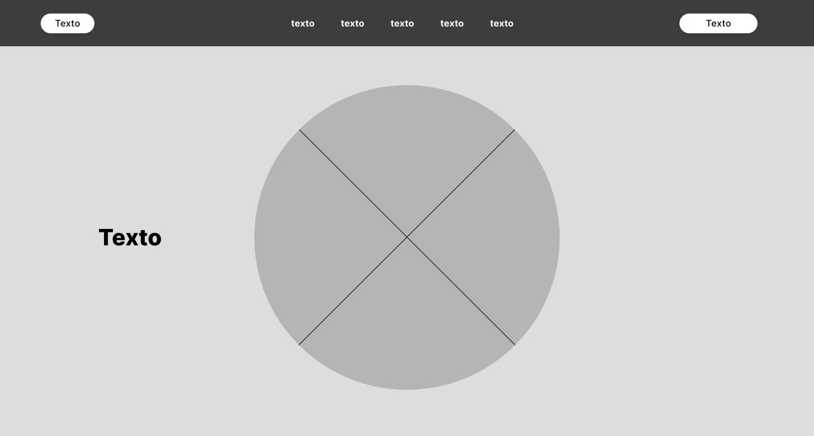
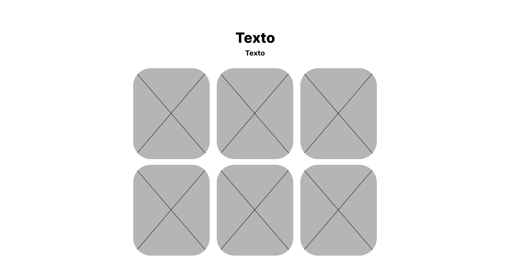
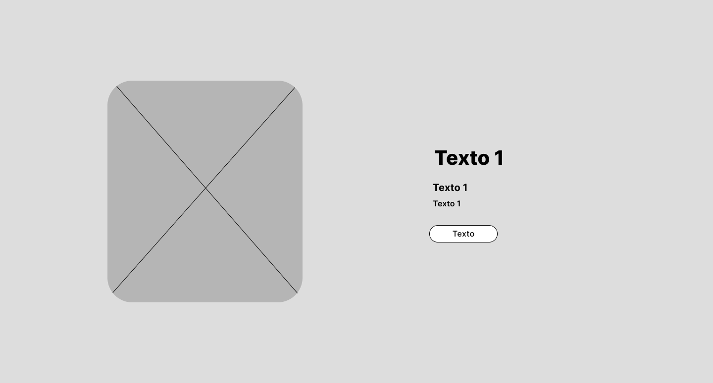
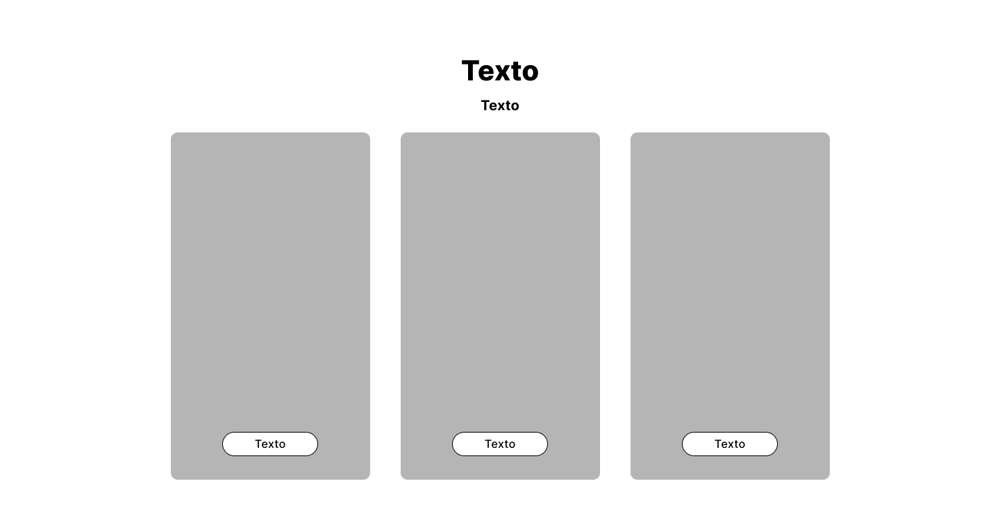
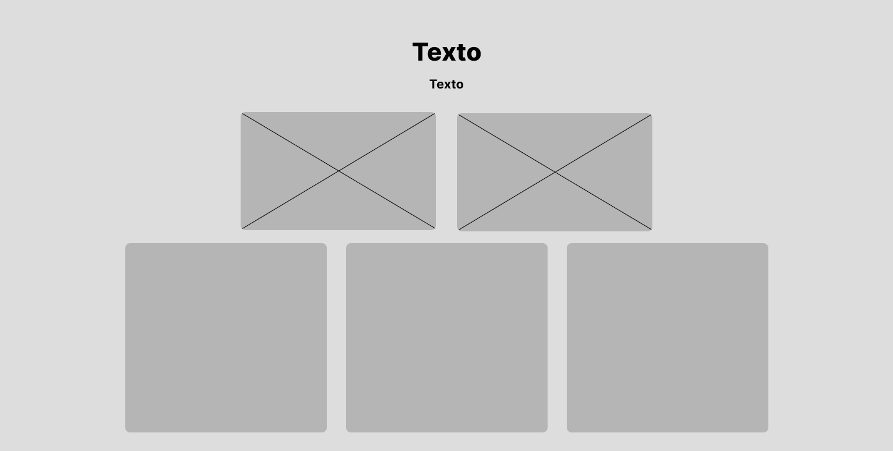
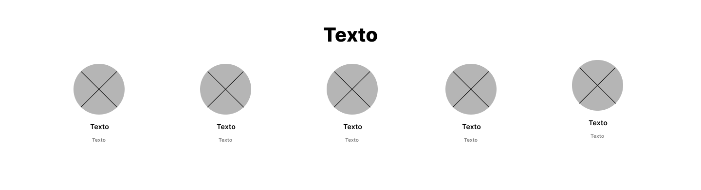
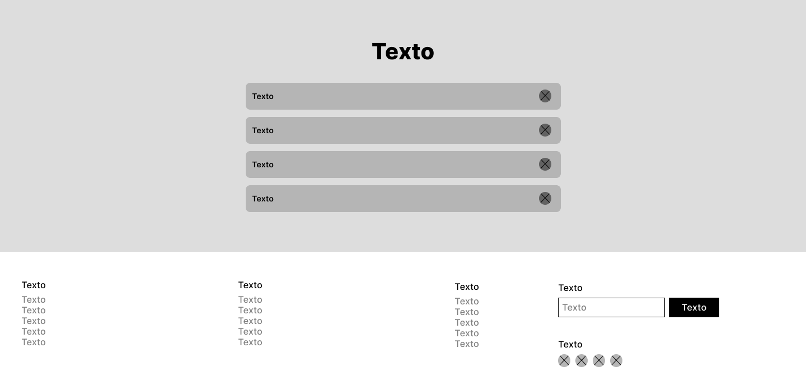

### 4.3.2. Landing Page Mock-up


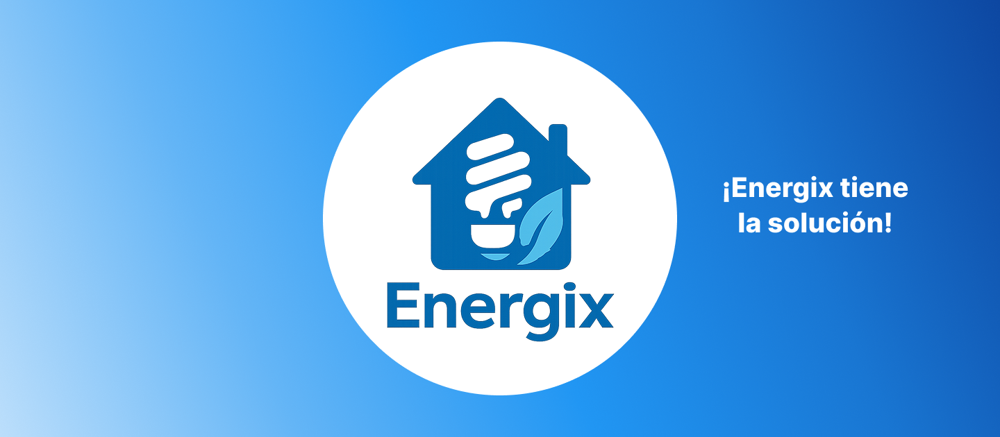
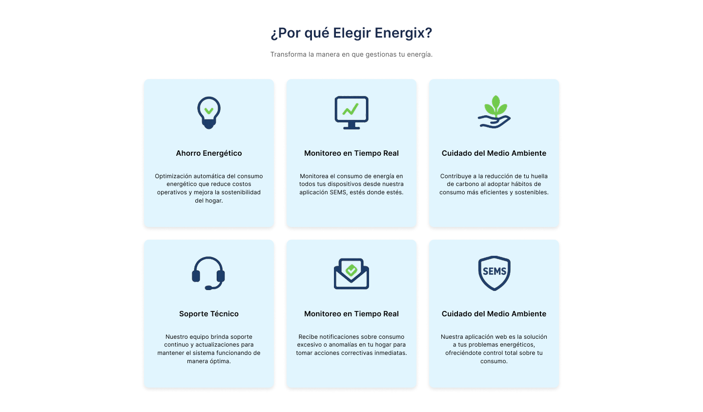
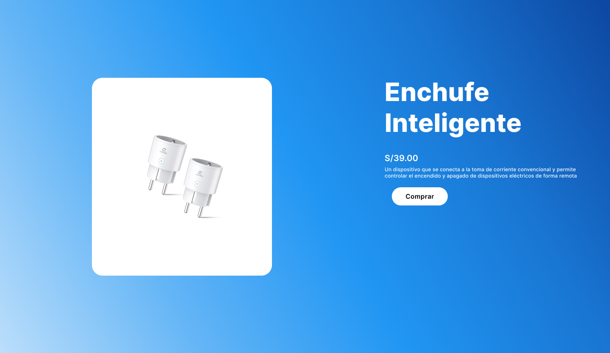
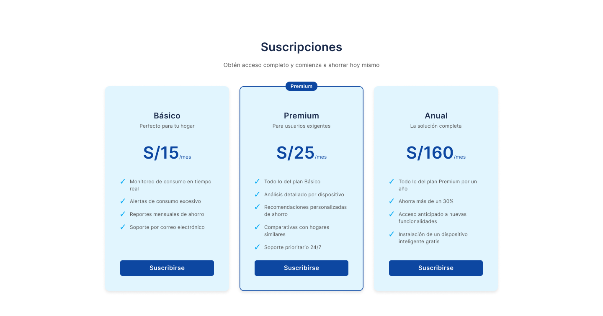
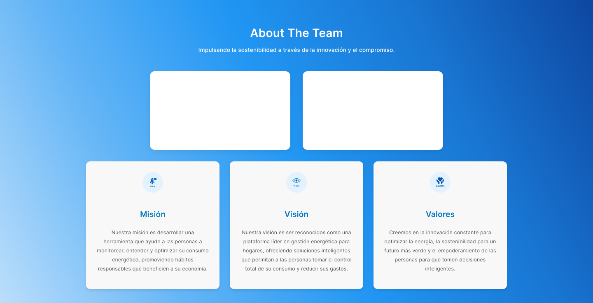
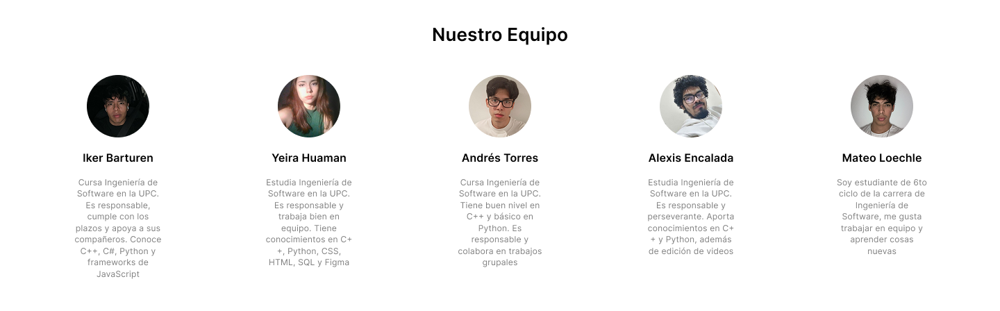
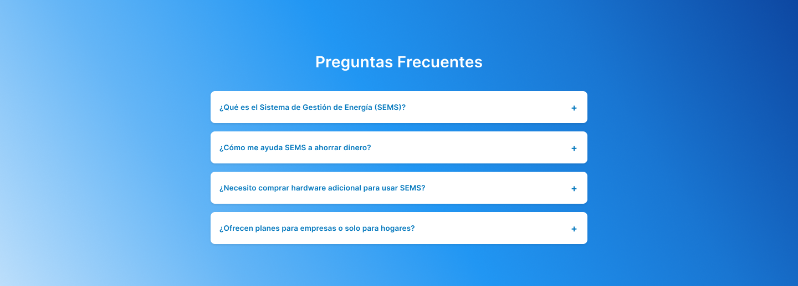
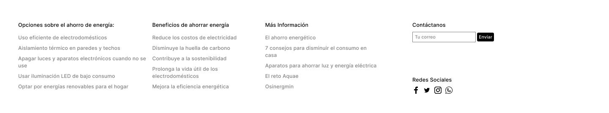

## 4.4. Web Applications UX/UI Design

La sección de Diseño UX/UI se centra en la arquitectura de la información, el diseño de la interfaz y la experiencia de usuario para las aplicaciones web de la solución Energix. Esta etapa abarca la creación de vistas funcionales y flujos de interacción completos, asegurando una experiencia intuitiva y centrada en el usuario.

Se elaboraron wireframes detallados para la versión de escritorio, definiendo la disposición de elementos en pantallas clave como el Dashboard principal, los Reportes de Consumo, la Gestión de Dispositivos y la Configuración de Preferencias. A partir de estos esquemas de baja fidelidad, se diseñaron los mockups de alta fidelidad, alineados con un sistema visual consistente que respeta los principios de simplicidad y claridad.

Los componentes y la navegación fueron organizados siguiendo flujos de usuario validados para garantizar que cada acción tenga un propósito claro dentro del recorrido del usuario. La estructura y las interacciones fueron pensadas para ofrecer una experiencia inclusiva, aplicando criterios de accesibilidad (a11y) y soporte para la visualización de datos en diferentes formatos. En los próximos sprints, se desarrollarán de manera progresiva las vistas, integrando las funcionalidades de monitoreo de energía en tiempo real y permitiendo la validación de las interacciones más importantes del sistema.

### 4.4.1. Web Applications Wireframes

La fase de diseño de wireframes se ha enfocado en la creación meticulosa de la arquitectura visual y la experiencia de usuario para la solución digital de gestión de energía. Cada una de las vistas ha sido concebida como un componente fundamental que, al unirse, forma los flujos de interacción del usuario de manera fluida y lógica. Estos esquemas de baja fidelidad no solo definen la disposición de los elementos, sino que también establecen la jerarquía de la información, asegurando que cada acción y dato tengan un propósito claro. Son la estructura del producto, validando la funcionalidad y la navegación antes de proceder al diseño de alta fidelidad.


- Login: La puerta de entrada a la plataforma se presenta con un diseño minimalista y enfocado. La vista se centra en los campos de Username/Email y Password, que permiten al usuario autenticarse de forma segura. La progresión en este flujo es lineal y clara, guiando al usuario del ingreso de credenciales al botón principal de "Log in", con una opción secundaria para acceder a través de "Log in with Google".


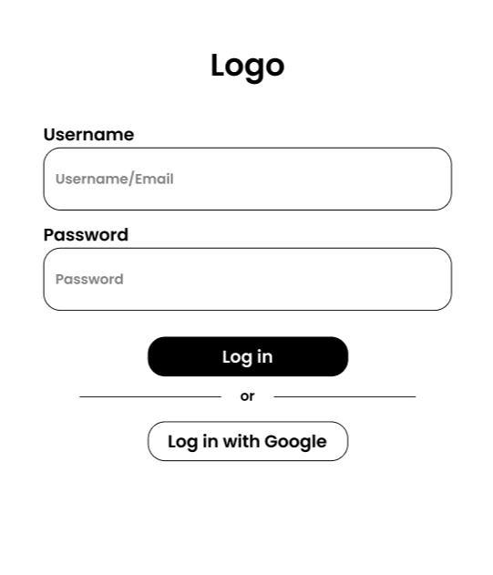


- Dashboard: Esta es la vista central de la aplicación y la primera que el usuario ve después de iniciar sesión. Se estructura como un panel de control con múltiples tarjetas que ofrecen un resumen del consumo de energía y las alertas clave. La información se presenta de forma progresiva, desde un resumen general hasta visualizaciones más detalladas como gráficos de línea, que muestran el consumo en diferentes períodos y por categoría. La sección de alertas y una lista de dispositivos ofrecen una vista de alto nivel y un acceso rápido a la información más importante.


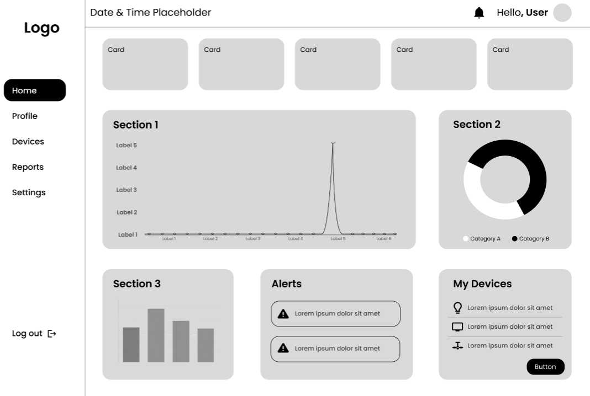

- Notifications (Pop-up): Este elemento es una ventana emergente que se superpone a la pantalla principal. Muestra una lista de mensajes y alertas importantes para el usuario, como alertas de alto consumo o recordatorios, asegurando que la información crítica sea visible de inmediato sin tener que navegar a otra sección.


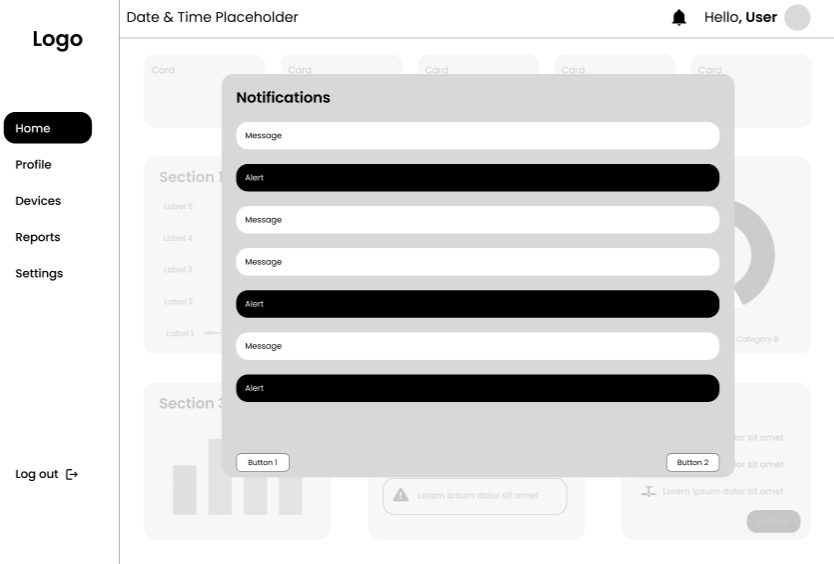


- Profile: Diseñada para la gestión de datos personales, esta pantalla presenta una estructura clara y organizada. Los campos para First Name, Last Name, Email, Linked Adress y Number permiten al usuario mantener su información actualizada. El flujo de interacción es directo, centrado en el ingreso y la edición de datos. Se utiliza una progresión visual para la foto de perfil, mostrando un espacio para la imagen y un botón para cargarla, asegurando que el usuario pueda personalizar su cuenta.


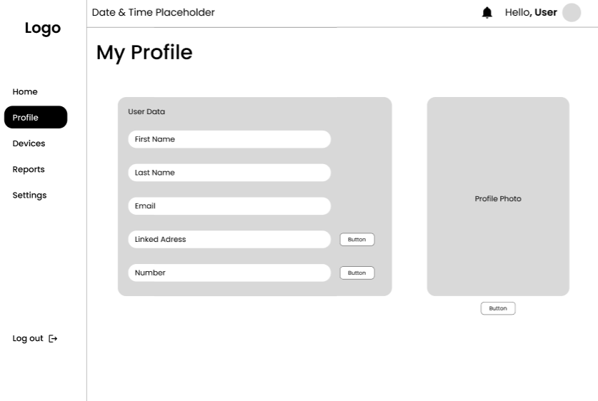


- Devices: La visualización se presenta como una tabla lineal y detallada, donde cada dispositivo conectado al sistema ocupa su propia fila. Se utiliza una estructura consistente que permite al usuario explorar el estado de cada dispositivo de un vistazo. Las columnas desglosan información clave como el nombre y categoría del dispositivo, su estado en tiempo real (indicando si está encendido o apagado), la última vez que registró actividad, un historial de alertas y el consumo de energía acumulado.


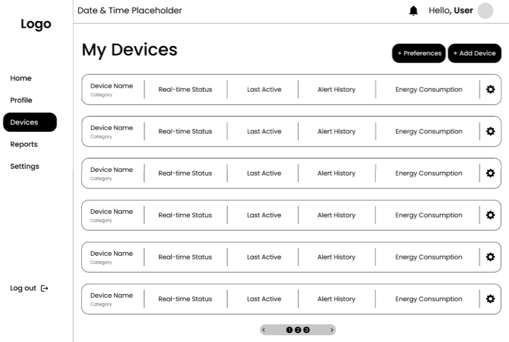


- Preferences: Esta vista está diseñada para que el usuario personalice su experiencia de monitoreo. Se estructura como una matriz de opciones de "checkbox" donde cada una corresponde a una categoría o función de seguimiento. El diseño fomenta la selección múltiple, permitiendo al usuario decidir de forma granular qué datos desea que la aplicación recolecte y muestre. Los botones en la parte inferior de la pantalla actúan como controles para aplicar o descartar los cambios realizados en las preferencias, cerrando un ciclo de interacción claro y seguro.


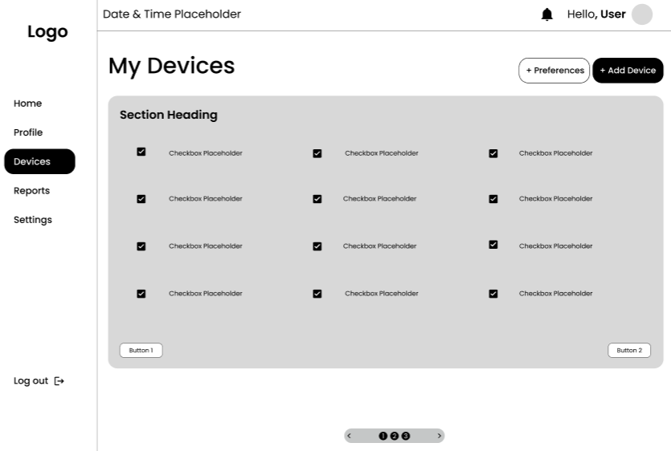


- Reports: La pantalla de reportes es el centro de análisis de la aplicación. Incluye un gráfico de barras para el ranking de dispositivos que consumen más energía, mostrando el consumo total en kilovatios-hora (kWh). También presenta un gráfico de tendencias de consumo semanal, un resumen con datos clave y una sección para exportar o descargar reportes.


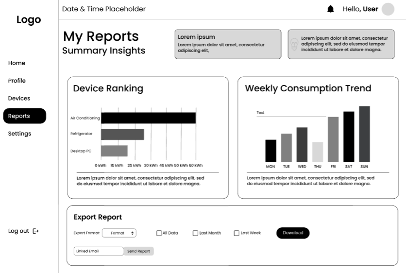


- Settings: Esta vista consolida diversas opciones de configuración en secciones claras y modulares. Se presenta un flujo de interacción centrado en el usuario, permitiéndole gestionar desde las automatizaciones de ahorro (Automatic Saving Mode) con interruptores de encendido y apagado (toggles), hasta las notificaciones y reportes personalizados. También ofrece acceso directo a secciones de ayuda y soporte (Support and Help) y opciones para gestionar la seguridad y la privacidad de la cuenta (Security and Privacy). El diseño organiza la información de manera lógica y progresiva para que el usuario pueda encontrar y ajustar fácilmente cualquier configuración.


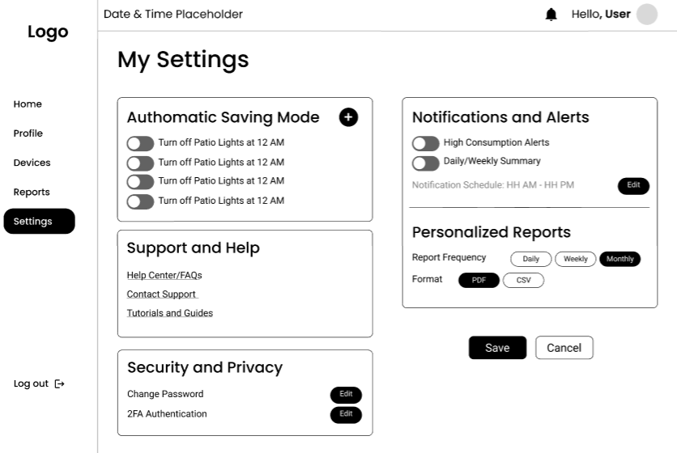

### 4.4.2. Web Applications Wireflow Diagrams

- User goal 1: Iniciar sesión para poder obversar el dashboard informativo

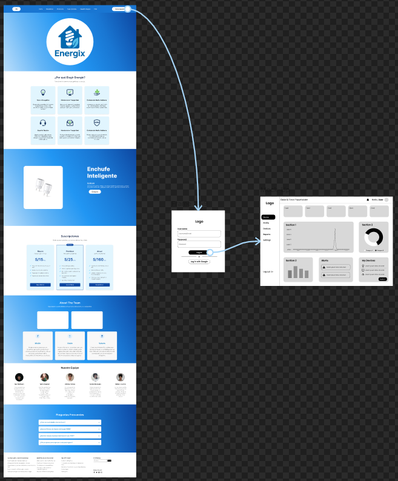

- User goal 2: Entrar al dashboard informativo para luego entrar en la opción de Reportes y descargar mi reporte generado a lo largo del mes


- User goal 3: Estabelcer preferencias para todos los dispositivos que tengo configurados en la aplicación y guargar configuraciones predeterminadas

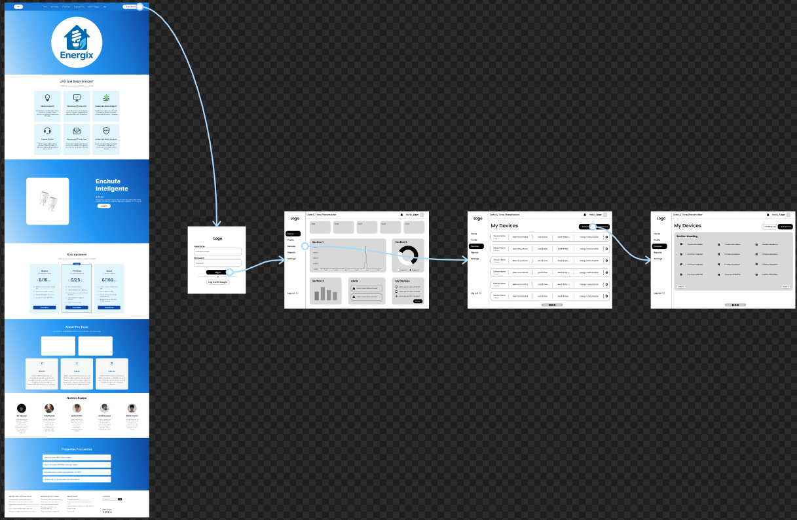

- User goal 4: Entrar al dashboard interactivo para luego ir a la opción de perfil y poder modificar sus datos

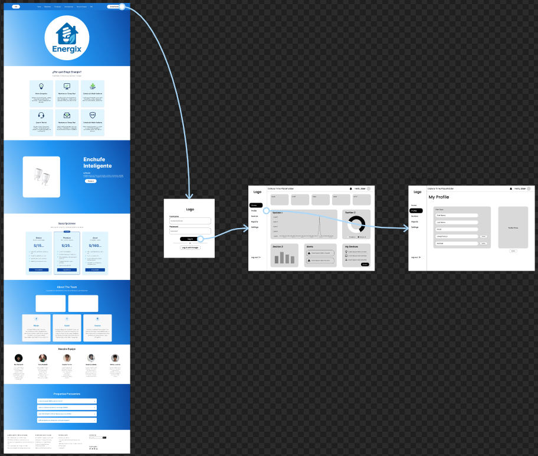

- Happy y Unhappy paths de cada User goal:
- **User goal 1**:
- - (Happy path) El usuario entra a la landing page y encuentra el botón de Iniciar sesión, como ya tiene una cuenta ingresa sus credenciales y son validadas por el sistema, una vez todo correcto es redirigido al dashboard informativo donde podrá interactuar con las diferentes herrameintas disponibles.
- - (Unhappy path) El usuario entra a la landing page y presiona el botón de Inicar sesión, ingresa sus credenciales pero son incorrectas por lo que el sistema le manda un mensaje de error que dice "Correo o contraseña incorrectos", por lo que no será redirigido al dashboard informativo.
- **User goal 2**:
- - (Happy path) El usuario accede al landing page y hace click en Iniciar Sesión, ingresa con sus credenciales y tras una validación es redirigido al dashboard informativo. Navega por el menú lateral y hace click en la opción de Reportes donde visualiza el panel con la información de su consumo de mes, cumplimiento de metas, ranking de dispositivos y ahorro acumulado, entonces el usuario presiona el botón para descarga la información en formato PDF y Excel, luego aparece un mensaje diciendo "Reporte descargado exito" con la opción de visualizar el reporte.
- - (Unhappy path) El usuario accede al landing page y hace click en Iniciar Sesión, ingresa con sus credenciales y tras una validación es redirigido al dashboard informativo. Navega por el menú lateral y hace click en la opción de Reportes, al momento de entrar no le aparecerá ninguna información disponible por lo que el sistema le dará un mensaje diciendo "Error al momento de cargar la información", del mismo modo si presiona el botón de descargar el sistema le dirá "Error al momento de descargar intente más tarde", por lo que el usuario no podrá visualizar su información ni descargarla.
- **User goal 3**:
- - (Happy path) El usuario accede al landing page y hace click en Iniciar Sesión. Desde el dashboard selecciona la opción Device que está disponible, en esta pantalla luego accede a la opción "Preference" donde puede establecer límites de consumo energético y horarios de funcionamiento. Una vez que completa la configuración y hace clic en "Save Preference", el sistema valida los parámetros y se guarda los cambios aplicados al dispositivo.
- - (Unhappy path) El usuario accede al landing page y hace click en Iniciar Sesión. Desde el dashboard selecciona la opción Device que está disponible, en esta pantalla luego accede a la opción "Preference" y accede a su configuración para establecer límites de consumo energético. Después de completar todos los campos necesarios y hacer clic en "Save Preference", ocurre un error interno en el sistema de gestión de dispositivos. No se muestra ningún mensaje de confirmación y la configuración no se aplica correctamente, impidiendo que el usuario personalice las reglas de automatización para optimizar el consumo energético del dispositivo.
- **User goal 4**:
- - (Happy path) El usuario navega por la landing page, entra al dashboard informativo mediante el botón Iniciar Sesión, luego de la validación entra al dashboard y hace click en la opción de Profile, donde puede visualizar correctamente sus datos personales, información de contacto y configuraciones de la cuenta.- - (Unhappy path) El usuario navega por la landing page, entra al dashboard informativo mediante el botón Iniciar Sesión, luego de la validación entra al dashboard y hace click en la opción de Consumo, al momemto de entar el usuario no podrá visualizar los datos completos, estarán imcompletos o desactualizados en los indicadores principales, por lo que no podrá visualizar la información detallada.
- - (Unhappy path) El usuario navega por la landing page, entra al dashboard informativo mediante el botón Iniciar Sesión, luego de la validación entra al dashboard y hace click en la opción de Profile. Al momento de ingresar, el usuario no podrá visualizar sus datos completos; la información estará incompleta o desactualizada, por lo que no podrá revisar correctamente sus datos personales ni realizar ajustes en su perfil.

### 4.4.2. Web Applications Mock-ups

El diseño de mockups representa la fase de alta fidelidad de la solución, donde la interfaz se concibe con elementos visuales, tipografía y colores definitivos. Esta etapa transforma los wireframes en una experiencia de usuario tangible y estilizada.

Se ha priorizado una estética limpia y moderna para cada vista, utilizando una paleta de colores que guía la atención del usuario hacia las métricas y acciones más importantes. Desde el Dashboard con sus gráficos informativos, pasando por la visualización tabular de "Mis Dispositivos", hasta los ajustes detallados de "Preferencias", cada pantalla ha sido diseñada para ser funcionalmente intuitiva y visualmente atractiva.

La coherencia visual entre todos los mockups asegura un sistema de diseño unificado, facilitando la navegación y reforzando la marca de la solución. El resultado es una interfaz que no solo muestra datos, sino que cuenta una historia de consumo y ahorro de energía de manera clara y directa.

- Login: Esta vista propone una interfaz minimalista y funcional diseñada para la autenticación del usuario. Se presenta con campos de entrada estilizados para el correo electrónico y la contraseña, centrando la atención en el proceso de acceso. Se prioriza la usabilidad al incluir un botón de “Log in with Google” como alternativa, agilizando el flujo de autenticación para quienes prefieren esta opción.

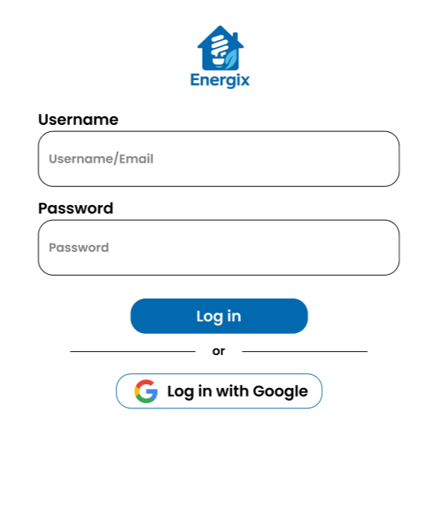

- Dashboard: El dashboard se concibe como el centro de mando de la plataforma, proporcionando un resumen visual y detallado del consumo energético. En la parte superior, se muestra un conjunto de tarjetas de indicadores clave (KPIs) con métricas esenciales como el consumo de energía, los ahorros estimados y la factura estimada. El espacio principal es dominado por gráficos que desglosan el consumo diario y por categorías, facilitando una rápida comprensión de los patrones de uso. Las notificaciones de alertas se integran de manera prominente, asegurando que la información crítica no pase desapercibida.


- Notifications (Pop-up): Este componente es un elemento de notificación de alta prioridad que se superpone a la pantalla principal, diseñado para alertar al usuario de forma inmediata. Se utiliza una jerarquía visual para distinguir entre mensajes de logros, como “Goal Achievement”, y alertas de consumo elevado. Se prioriza la inmediatez y la claridad de la información, asegurando que el usuario pueda tomar acciones rápidas cuando sea necesario.


- Profile: La sección de perfil presenta una arquitectura clara y editable para la gestión de datos personales. Se muestra una estructura con campos prellenados para la información del usuario, cada uno acompañado de un botón de “Edit”, lo que otorga al usuario el control para actualizar su información. Un espacio dedicado a la foto de perfil refuerza la personalización de la cuenta, priorizando la capacidad de adaptación y el control del usuario sobre sus propios datos.


- Devices: Esta pantalla está diseñada para el monitoreo detallado y estructurado de los dispositivos conectados. Se utiliza un formato de tabla para presentar de forma organizada el estado en tiempo real, la última actividad registrada, el historial de alertas y el consumo de energía. La interfaz prioriza la transparencia y la accesibilidad de los datos, permitiendo al usuario obtener una visión completa del rendimiento de cada dispositivo.


- Preferences: Este mockup profundiza en el control granular que el usuario tiene sobre el sistema de monitoreo. La interfaz se presenta como una matriz de opciones de "checkbox" que permiten al usuario activar o desactivar el seguimiento para diversas categorías de dispositivos y tipos de alertas. Esta vista prioriza la personalización, invitando al usuario a definir exactamente qué datos desea que la aplicación recolecte y qué notificaciones desea recibir.


- Reports: La sección de reportes se enfoca en la visualización y análisis de datos históricos. Dos gráficos de barras de alta fidelidad, "Device Ranking" y "Weekly Consumption Trend", dominan la vista, facilitando la identificación de los mayores consumidores y la comparación de patrones de uso semanales. La funcionalidad de "Export Report" permite al usuario descargar sus datos en formatos PDF o CSV, lo cual es fundamental para el análisis externo y el registro personal.


- Settings: Este mockup de configuraciones presenta una arquitectura modular que consolida todas las opciones de personalización del sistema. Se muestra de manera clara la sección “Automatic Saving Mode”, que permite la creación de reglas de automatización, y “Notifications and Alerts”, donde el usuario puede definir qué notificaciones desea recibir. El diseño de la interfaz prioriza la organización y el acceso intuitivo, garantizando que el usuario pueda ajustar cada aspecto de la plataforma de manera eficiente.


### 4.4.3. Web Applications User Flow Diagrams

- User goal 1: Iniciar sesión para poder obversar el dashboard informativo

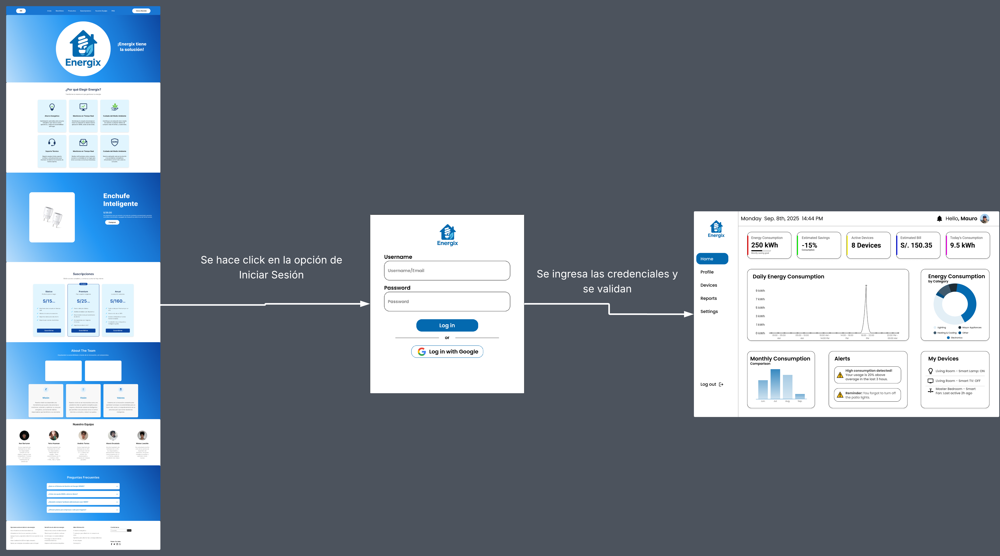

- User goal 2: Entrar al dashboard informativo para luego entrar en la opción de Reportes y descargar mi reporte generado a lo largo del mes

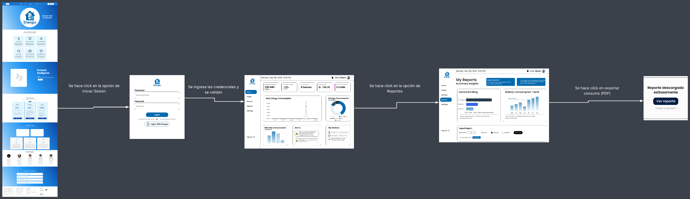

- User goal 3: Comprar un producto desde la página principal rellenando información del medio de pago elegido.

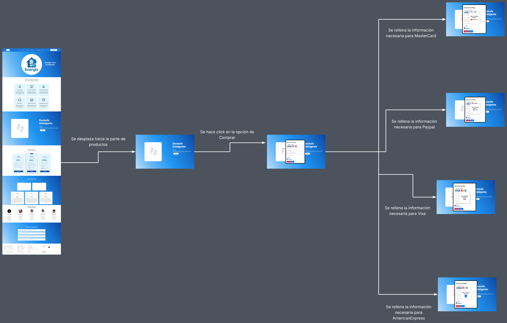

- User goal 4: Entrar al dashboard interactivo para luego ir a la opción de perfil y poder modificar sus datos.

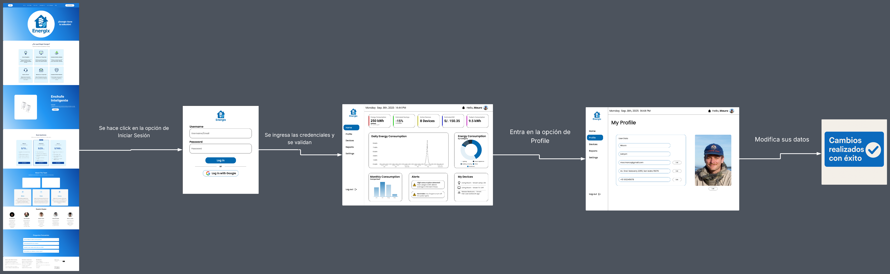

- Happy y Unhappy paths de cada User goal:
- **User goal 1**:
- - (Happy path) El usuario entra a la landing page y encuentra el botón de Iniciar sesión, como ya tiene una cuenta ingresa sus credenciales y son validadas por el sistema, una vez todo correcto es redirigido al dashboard informativo donde podrá interactuar con las diferentes herrameintas disponibles.
- - (Unhappy path) El usuario entra a la landing page y presiona el botón de Inicar sesión, ingresa sus credenciales pero son incorrectas por lo que el sistema le manda un mensaje de error que dice "Correo o contraseña incorrectos", por lo que no será redirigido al dashboard informativo.
- **User goal 2**:
- - (Happy path) El usuario accede al landing page y hace click en Iniciar Sesión, ingresa con sus credenciales y tras una validación es redirigido al dashboard informativo. Navega por el menú lateral y hace click en la opción de Reportes donde visualiza el panel con la información de su consumo de mes, cumplimiento de metas, ranking de dispositivos y ahorro acumulado, entonces el usuario presiona el botón para descarga la información en formato PDF y Excel, luego aparece un mensaje diciendo "Reporte descargado exito" con la opción de visualizar el reporte.
- - (Unhappy path) El usuario accede al landing page y hace click en Iniciar Sesión, ingresa con sus credenciales y tras una validación es redirigido al dashboard informativo. Navega por el menú lateral y hace click en la opción de Reportes, al momento de entrar no le aparecerá ninguna información disponible por lo que el sistema le dará un mensaje diciendo "Error al momento de cargar la información", del mismo modo si presiona el botón de descargar el sistema le dirá "Error al momento de descargar intente más tarde", por lo que el usuario no podrá visualizar su información ni descargarla.
- **User goal 3**:
- - (Happy path) El usuario ingresa a la landing page y se desplaza hacia la parte de productos, selecciona uno de los productos que están disponibles, luego se le habilitará una ventana para que eliga el método de pago preferido, una vez que rellene la información necesaria el sistema validará los datos y le dará un mensaje diciendo "Pago realizado, gracias" junto al logo con el método seleccionado.
- - (Unhappy path) El usuario ingresa a la landing page y se desplaza hacia la parte de productos, selecciona uno de los productos que están disponibles, luego se le habilitará una ventana para que eliga el método de pago preferido, una vez que el usuario rellene toda la información necesaría le dará click al botón de "pagar", pero no pasará nada, no le aparecerá otra ventana diciendo "Pago realizado, gracias", debido a un error interno con los métodos de pago por lo que no se puede continuar con la transacción, por consiguiente el usuario no podrá comprar ningún producto.
- **User goal 4**:
- - (Happy path) El usuario navega por la landing page, entra al dashboard informativo mediante el botón Iniciar Sesión, luego de la validación entra al dashboard y hace click en la opción de Profile, donde puede visualizar correctamente sus datos personales, información de contacto y configuraciones de la cuenta.- - (Unhappy path) El usuario navega por la landing page, entra al dashboard informativo mediante el botón Iniciar Sesión, luego de la validación entra al dashboard y hace click en la opción de Consumo, al momemto de entar el usuario no podrá visualizar los datos completos, estarán imcompletos o desactualizados en los indicadores principales, por lo que no podrá visualizar la información detallada.
- - (Unhappy path) El usuario navega por la landing page, entra al dashboard informativo mediante el botón Iniciar Sesión, luego de la validación entra al dashboard y hace click en la opción de Profile. Al momento de ingresar, el usuario no podrá visualizar sus datos completos; la información estará incompleta o desactualizada, por lo que no podrá revisar correctamente sus datos personales ni realizar ajustes en su perfil.

4.5. Web Applications Prototyping
Esta sección explora el diseño de interfaz de usuario (UI) para la aplicación web de Energix, con un enfoque primordial en la experiencia de escritorio. Al priorizar las pantallas de mayor tamaño, el diseño se centra en presentar la información de manera clara y en ofrecer controles precisos para la gestión energética. La creación de estos prototipos no solo se alinea con los flujos de usuario definidos, sino que también sirve como una validación visual de la arquitectura de la información del sistema.

Las decisiones de interacción se han tomado para que la aplicación sea tanto analítica para el usuario proactivo como intuitiva para el usuario reactivo. Estos son los criterios clave que han guiado el diseño:

Navegación Intuitiva y Persistente

Para asegurar una navegación fluida, la aplicación cuenta con una barra lateral izquierda fija. Esta estructura pone las secciones principales—Dashboard, Dispositivos, Reportes, y Configuración—siempre al alcance del usuario, eliminando la necesidad de memorizar rutas de navegación. Esta elección de diseño refleja una jerarquía de información lógica y facilita la transición entre la revisión de datos y la acción de control.

Diseño Orientado al Análisis y la Toma de Decisiones

La sección de Reportes es un claro ejemplo de cómo la interfaz empodera al usuario para analizar sus datos de consumo. Mediante gráficos interactivos y una vista tabular detallada, el usuario puede identificar rápidamente tendencias y picos de consumo. El sistema de interacción es directo y familiar, permitiendo al usuario exportar sus datos en formatos estándar como CSV o PDF, lo que convierte la información en una herramienta práctica y tangible.

Retroalimentación Visual Clara

La aplicación proporciona retroalimentación visual efectiva sobre el estado del consumo. El Dashboard actualiza sus gráficos y métricas para reflejar los cambios significativos, mientras que las notificaciones emergentes informan al usuario sobre eventos críticos, como un alto consumo detectado o el cumplimiento de un objetivo de ahorro. Esta claridad en la retroalimentación es esencial, ya que permite a los usuarios reaccionar con agilidad ante un problema o sentirse motivados por un logro.

Validación de Flujos de Navegación

A través de estos prototipos, se simula el recorrido del usuario a través de la aplicación. Se demuestra cómo se puede pasar sin problemas de una notificación a la pantalla de Dispositivos para tomar una acción correctiva, o de la Dashboard a los Reportes para un análisis más profundo. Estas interacciones validan la coherencia de los flujos de usuario y garantizan una experiencia de navegación lógica y sin fricciones.

Link del video: https://upcedupe-my.sharepoint.com/:v:/g/personal/u202210513_upc_edu_pe/EbK0zgZImC5Nm6USAh19_aoBa9UNerHtDBz4iBQn80qlnQ?e=U92QIh

## 4.6. Domain-Driven Software Architecture

Los diagramas de arquitectura de software son herramientas clave para diseñar y comprender la estructura de un sistema. Al aplicar el enfoque de Domain Driven Design (DDD), estos diagramas nos permiten representar visualmente los distintos elementos del dominio, sus límites y las relaciones entre ellos, lo que facilita una mejor planificación y comunicación del diseño

### 4.6.1. Design-Level Event Storming
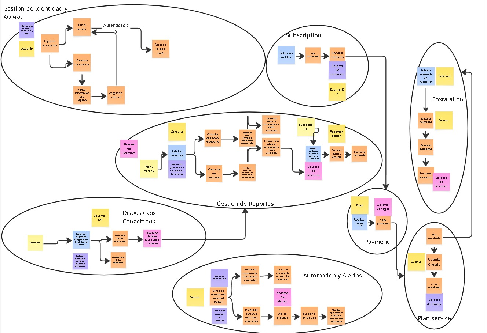

### 4.6.2. Software Architecture Context Diagram

El diagrama de contexto de SEMS (Smart Energy Management System) muestra la visión más externa de la plataforma y posiciona a sus actores principales junto con los sistemas con los que se conecta. En este nivel se identifican tres roles clave: el propietario de vivienda, que busca monitorear y optimizar el consumo energético de su hogar; el estudiante que alquila, interesado en reducir gastos y simplificar el control compartido de la energía; y el soporte técnico, encargado de acompañar a los usuarios en la resolución de problemas y la adopción de la herramienta.

SEMS se apoya además en tres sistemas externos que amplían sus capacidades sin comprometer el núcleo de la solución: el medidor inteligente, que provee datos de consumo en tiempo real; los dispositivos del hogar, que pueden ser encendidos o apagados de forma remota para optimizar el uso energético; y el proveedor de servicios eléctricos, que ofrece información sobre tarifas, consumo histórico y posibles incidencias en el suministro.

Esta integración permite que SEMS funcione como un ecosistema completo para el control y la gestión energética doméstica. Al reunir usuarios, dispositivos y datos bajo una infraestructura digital modular, la plataforma fortalece su propuesta de valor: ofrecer a las personas un sistema confiable, accesible y proactivo que contribuya tanto al ahorro económico como a la sostenibilidad ambiental.

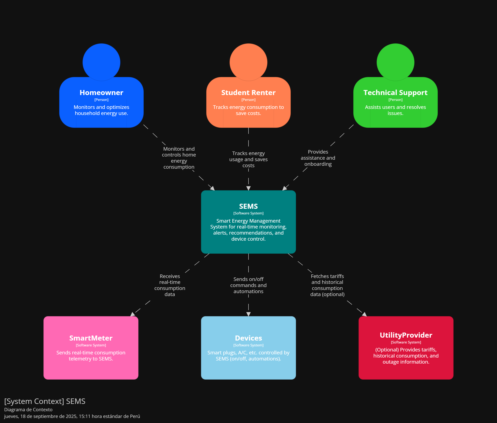

### 4.6.3. Software Architecture Container Diagrams

- Este diagrama de contenedores ilustra los componentes clave de la plataforma ENERGIX y cómo interactúan entre sí y con sistemas externos. Se destacan la **Aplicación web**, **la API Backend**, **la Base de Datos** y **servicios externos** como xxx xxx y xxx xxx. Cada contenedor cumple una función específica para asegurar el funcionamiento integral del sistema.

- 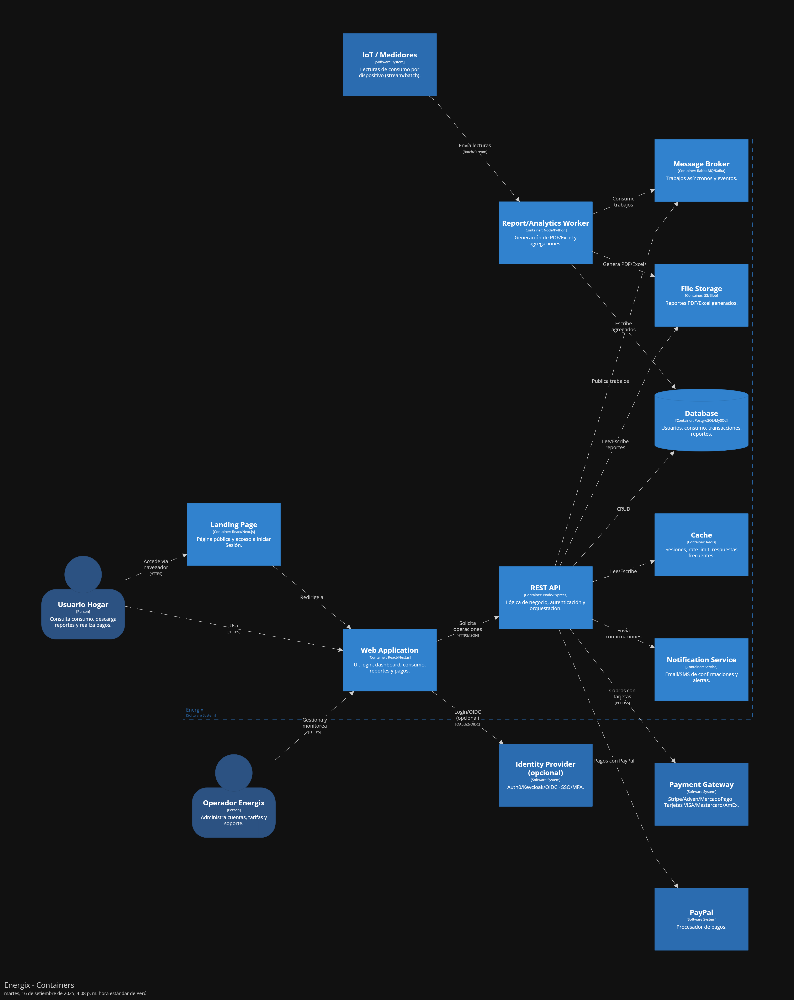

### 4.6.4. Software Architecture Components Diagrams

El diagrama de componentes profundiza en la arquitectura interna de la plataforma Energix, enfocándose en la estructura del contenedor REST API. Este diagrama ilustra cómo las responsabilidades de la lógica de negocios se dividen en capas distintas: Controladores, Servicios y Repositorios, lo que garantiza una clara separación de preocupaciones y un código más mantenible.

**Capas del Diagrama**

- **Controladores**: Los controladores (AuthController, DeviceController, AutomationController, ReportController, AlertController) actúan como el punto de entrada principal desde el Frontend Web SPA. Procesan las solicitudes de los usuarios y las dirigen a los servicios correspondientes para su procesamiento.
- **Servicios**: Los servicios (AuthService, DeviceService, AutomationService, ReportService, AlertService) encapsulan la lógica de negocio de la plataforma. Cada servicio maneja un contexto funcional específico: AuthService gestiona la autenticación, DeviceService se encarga de los dispositivos, AutomationService administra las reglas de automatización, ReportService genera informes y AlertService maneja las notificaciones.
- **Repositorios**: Los repositorios (UserRepository, DeviceRepository, AutomationRepository, ReportRepository, AlertRepository) son la capa de acceso a datos. Gestionan la persistencia y la recuperación de información desde la base de datos externa (Database) para sus respectivos servicios.

**Integración de Componentes Externos**

La plataforma se comunica con otros sistemas y contenedores para ofrecer su funcionalidad completa.  La capa de servicios interactúa con contenedores externos clave: DeviceService y AlertService utilizan el Message Broker para la comunicación asíncrona y la gestión de eventos en tiempo real.

- ReportService y AlertService se conectan con el File Storage para almacenar informes generados y archivos adjuntos de notificaciones, respectivamente.
- Por último, todos los repositorios se comunican con la Database para almacenar y recuperar la información esencial del sistema, como datos de usuarios, dispositivos, automatizaciones, reportes y alertas.

Esta estructura modular y desacoplada facilita el desarrollo, las pruebas y el mantenimiento del sistema, permitiendo que cada componente se evolucione de forma independiente sin afectar a los demás.

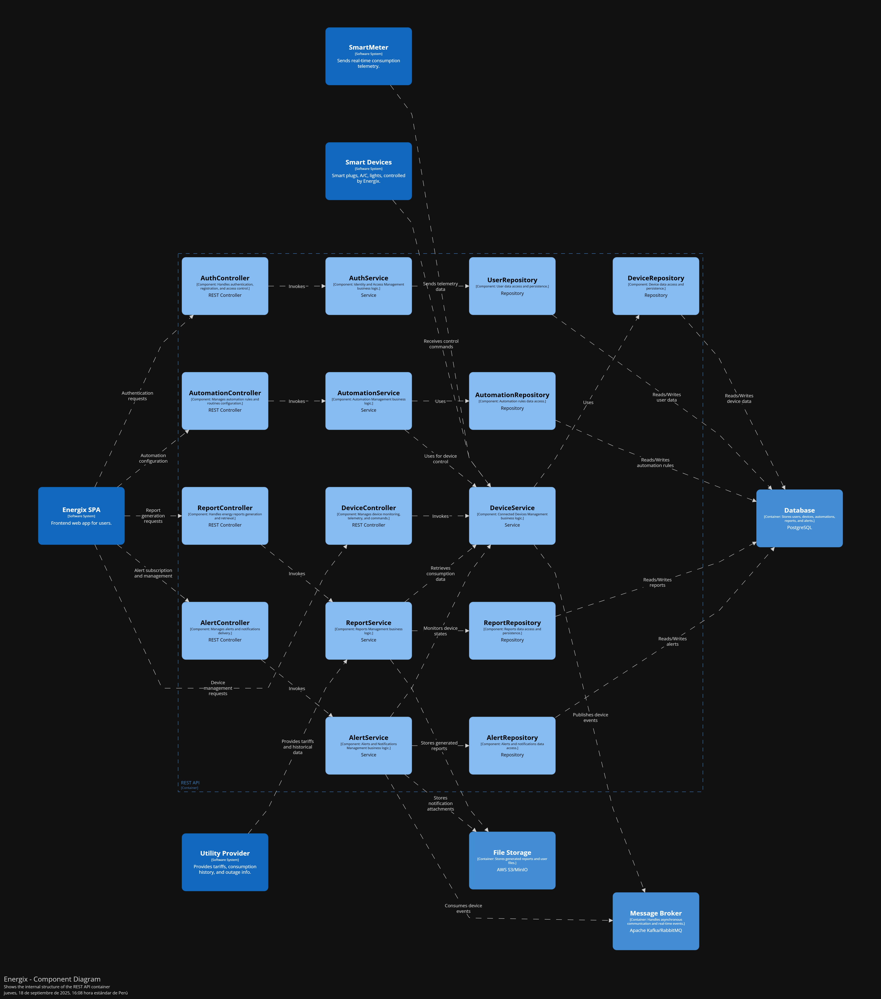

## 4.7. Software Object-Oriented Design

Esta sección presenta el diseño orientado a objetos del sistema, definiendo las clases principales, sus atributos y relaciones.

### 4.7.1. Class Diagrams

**Identity and Access Management**

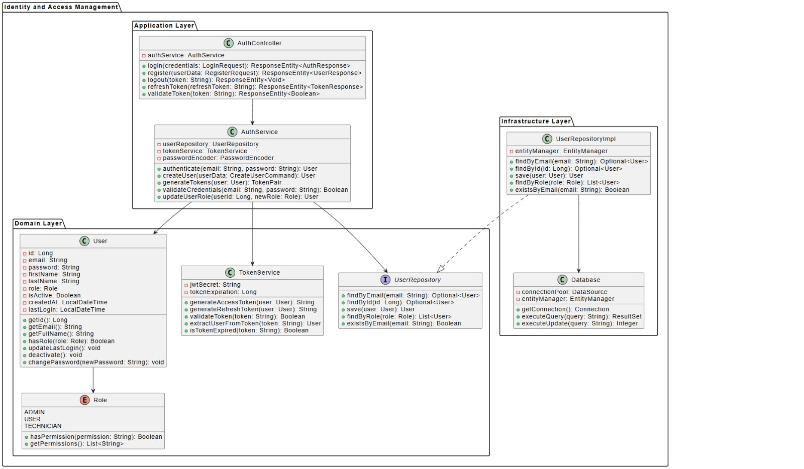

Este diagrama muestra la arquitectura en capas (Aplicación, Dominio, Infraestructura) para el Bounded Context de Identidad y Gestión de Acceso. La capa de Aplicación (AuthController y AuthService) se encarga de recibir las peticiones de autenticación y registro. El núcleo es la capa de Dominio, que se centra en las entidades User y Role, que definen las reglas de negocio, y las interfaces UserRepository y TokenService, que establecen los contratos para la persistencia y la gestión de tokens. La capa de Infraestructura (UserRepositoryImpl y Database) implementa estas interfaces, gestionando la conexión y las operaciones de persistencia con la base de datos. La dependencia del sistema siempre apunta hacia la capa de Dominio, lo que asegura que la lógica central no dependa de los detalles de la implementación.

**Connected Device Management**

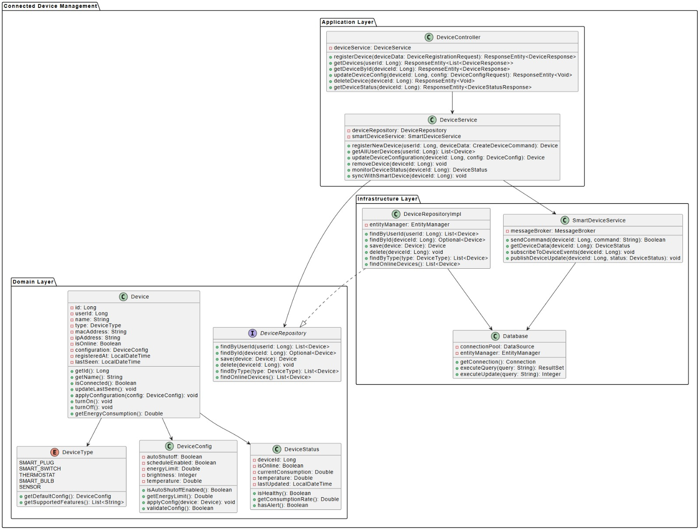

Este diagrama detalla la arquitectura en capas (Aplicación, Dominio, Infraestructura) para el Bounded Context de Gestión de Dispositivos Conectados. La capa de Aplicación (DeviceController y DeviceService) gestiona las peticiones para el registro, monitoreo y configuración de los dispositivos. El corazón del sistema es la capa de Dominio, que se centra en el agregado Device, y las entidades relacionadas como DeviceConfig, DeviceStatus y DeviceType, que encapsulan la lógica de negocio de los dispositivos inteligentes. El Dominio también define la interfaz DeviceRepository. La capa de Infraestructura (DeviceRepositoryImpl y SmartDeviceService) implementa la persistencia a través de la base de datos y se comunica con los dispositivos reales, garantizando que la lógica de negocio esté desacoplada de los detalles técnicos de la comunicación.

**Report Management**

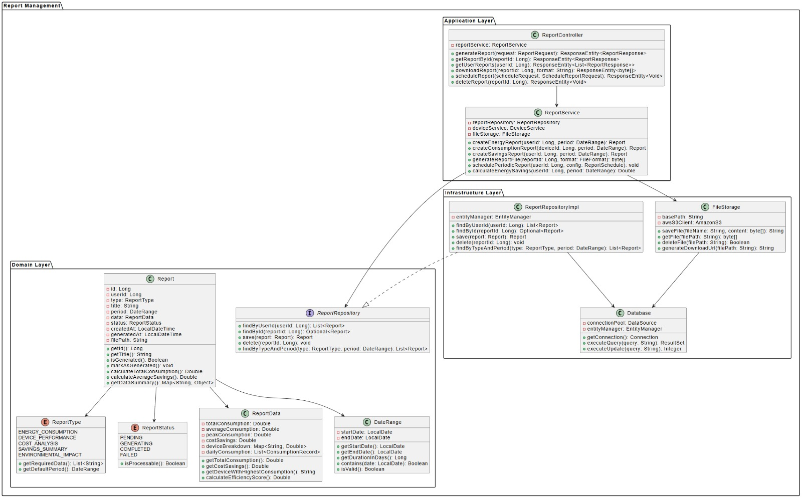

Este diagrama ilustra la arquitectura en capas (Aplicación, Dominio, Infraestructura) del Bounded Context de Gestión de Reportes. La capa de Aplicación (ReportController y ReportService) se encarga de coordinar la generación y consulta de reportes, recibiendo las peticiones de los usuarios. El centro de la arquitectura es la capa de Dominio, centrada en el agregado Report y sus componentes internos como ReportData y ReportType, que definen la estructura y las reglas de negocio de los reportes. El Dominio también establece la interfaz ReportRepository. La capa de Infraestructura (ReportRepositoryImpl y FileStorage) implementa la lógica de persistencia, con ReportRepositoryImpl gestionando la base de datos y FileStorage almacenando los archivos de reportes en un sistema externo, manteniendo así la lógica de negocio independiente de la forma de almacenamiento.

**Alert and Notification Management**

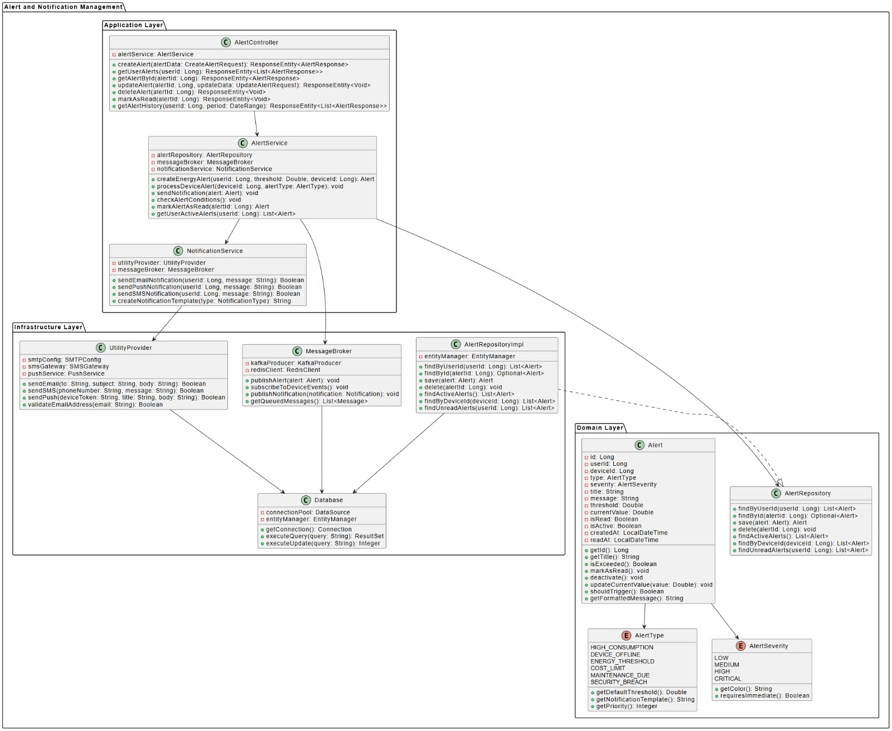

Este diagrama presenta la arquitectura en capas (Aplicación, Dominio, Infraestructura) del Bounded Context de Gestión de Alertas y Notificaciones. La capa de Aplicación (AlertController y AlertService) gestiona la creación, actualización y eliminación de alertas. El núcleo es la capa de Dominio, centrada en la entidad Alert y sus subtipos AlertType y AlertSeverity, que encapsulan las reglas de negocio para los distintos tipos de alertas y su severidad. Las interfaces AlertRepository y NotificationService definen los contratos para la persistencia y el envío de notificaciones. La capa de Infraestructura (AlertRepositoryImpl y MessageBroker) implementa estos contratos, con AlertRepositoryImpl gestionando la base de datos y MessageBroker interactuando con un sistema externo para el envío de mensajes, asegurando que la lógica de negocio principal sea agnóstica a la tecnología de mensajería.

**Automation Management**

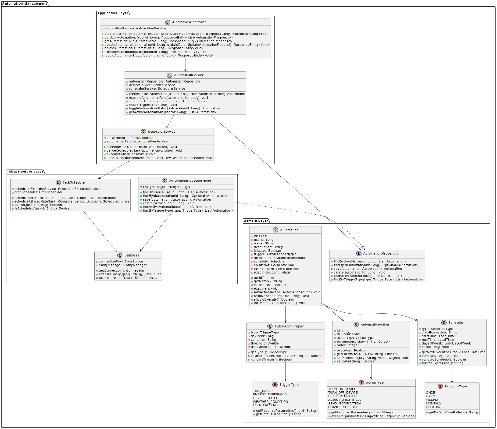

Este diagrama muestra la arquitectura en capas (Aplicación, Dominio, Infraestructura) del Bounded Context de Gestión de Automatizaciones. La capa de Aplicación (AutomationController y AutomationService) coordina la lógica para la creación y gestión de las reglas de automatización. El corazón del sistema es la capa de Dominio, que se centra en el agregado Automation y sus objetos internos AutomationTrigger, AutomationAction y Schedule, que definen las reglas de negocio y el comportamiento de las automatizaciones. El Dominio también especifica la interfaz AutomationRepository. La capa de Infraestructura (AutomationRepositoryImpl y TaskScheduler) implementa la persistencia y la ejecución de las tareas programadas, desacoplando la lógica de negocio del mecanismo específico de programación, lo que permite una mayor flexibilidad y escalabilidad.

## 4.8. Database Design

El diseño lógico de la base de datos es la columna vertebral de la arquitectura funcional del sistema. Cada Bounded Context (BC) cuenta con sus propias entidades y relaciones específicas, las cuales están alineadas con las responsabilidades y reglas de negocio de su dominio correspondiente.

La estructura de la base de datos se basa en los principios de separación de responsabilidades y un enfoque orientado a microservicios. Esto permite escalar, mantener y modificar cada parte del sistema de forma independiente. La implementación se adhiere al Domain-Driven Design (DDD), lo que permite a cada contexto manejar sus propias entidades y relaciones sin depender directamente de otros, salvo a través de integraciones o referencias controladas. Este enfoque asegura que la base de datos es robusta, escalable y fácil de manejar a medida que la solución evoluciona.

### 4.8.1. Database Diagrams

Para el diseño de la base de datos, se ha optado por un enfoque de Modelado de Entidad-Relación (ER), representando cada uno de los Bounded Contexts mediante diagramas creados con PlantUML. Estos diagramas no solo ilustran las tablas principales, sino que también detallan las claves primarias y foráneas, junto con las relaciones que definen la estructura interna de cada contexto. Este método permite una comprensión clara de la arquitectura de la información y las interconexiones entre las entidades.

A continuación, se presenta una descripción detallada del diseño de la base de datos para cada uno de los cinco bounded context que conforman la arquitectura de la solución:

**Identity and Access Management**

En este contexto se modela la gestión de usuarios y sus permisos dentro de la plataforma. El modelo de datos se centra en la entidad principal "users", que representa a los usuarios con atributos como nombre, correo electrónico y una contraseña encriptada. Se relaciona con la entidad "roles" para definir los distintos niveles de acceso, los cuales a su vez se asocian con permisos específicos "permissions" a través de una tabla intermedia "role_permissions". Este diseño permite un control granular sobre las acciones que cada usuario puede realizar en el sistema, asegurando la seguridad y la correcta asignación de responsabilidades. Además, la entidad "user_sessions" se encarga de gestionar las sesiones activas, permitiendo la persistencia y la autenticación continua del usuario.

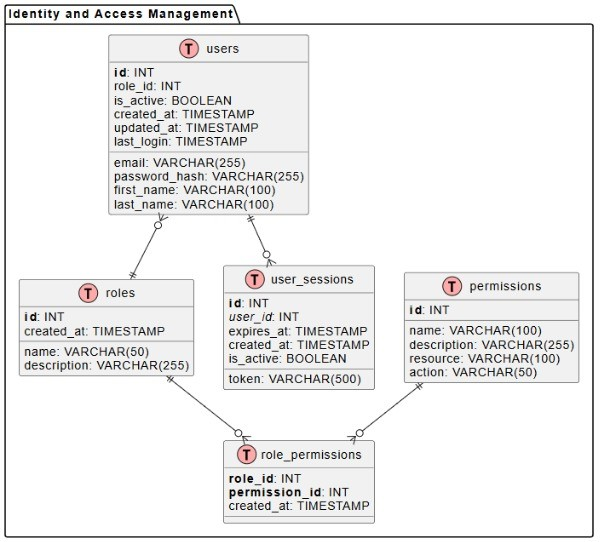

**Connected Device Management**

El contexto define la arquitectura de datos para la administración de los dispositivos inteligentes del hogar. La entidad central es "devices", que representa cada dispositivo físico vinculado al sistema. Se relaciona directamente con "device_types" para clasificar los dispositivos, y con "device_configurations" para almacenar ajustes personalizados de cada equipo, como límites de consumo o programaciones de autoapagado. La tabla "device_status" registra el estado actual del dispositivo en tiempo real, incluyendo si está activo, su consumo de energía, etc. Este diseño permite una supervisión integral y centralizada de todos los aparatos del hogar.

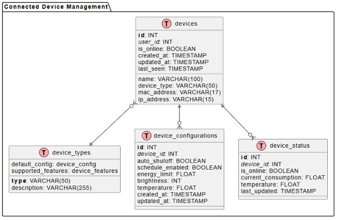

**Report Management**

En este contexto se define la arquitectura de datos para la generación y almacenamiento de reportes de consumo. La entidad principal es "reports", que almacena cada informe generado con metadatos como el periodo de tiempo y el formato de archivo. La entidad "report_data" contiene las métricas detalladas del reporte, como el consumo total, el consumo promedio y los costos. La tabla "report_types" define los distintos tipos de informes que la plataforma puede generar. Finalmente, "scheduled_reports" permite a los usuarios programar la generación automática y periódica de sus reportes, optimizando la gestión de la información.

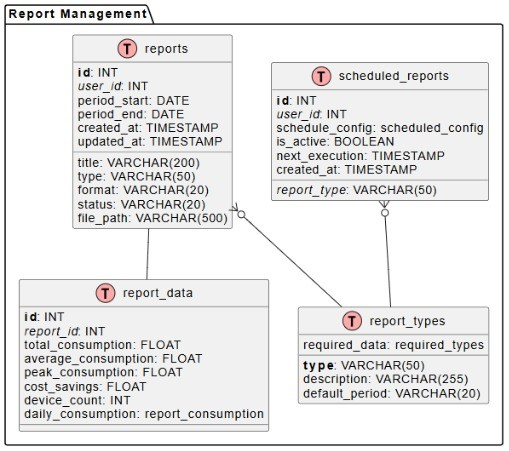

**Alert and Notification Management**

En este contexto se establece el modelo para el sistema de alertas y su configuración. La entidad principal "alerts" que registra cada alerta generada, conteniendo información como el umbral que se ha superado. Esta entidad se relaciona con "notifications", que almacena los mensajes específicos enviados al usuario. El modelo se complementa con la entidad "notification_preferences", que permite al usuario definir sus preferencias de notificación (por ejemplo, si desea recibir correos o notificaciones push), y "alert_types", que define los tipos de alertas predeterminados.

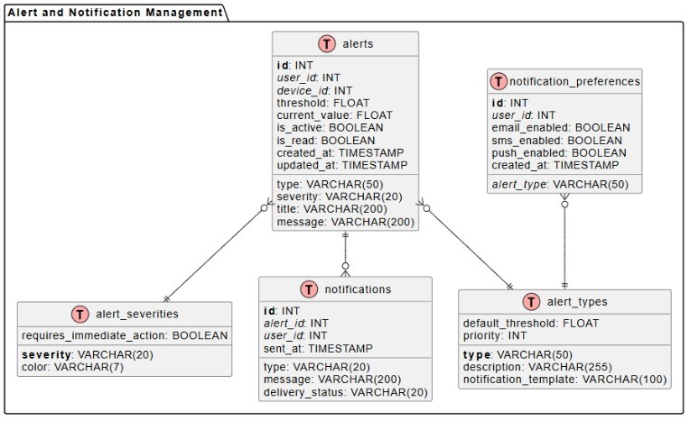

**Automation Management**

Este contexto se enfoca en la creación y ejecución de reglas de automatización personalizadas para los dispositivos. La entidad principal es "automations", que representa una regla o rutina de automatización definida por el usuario. Se vincula con "automation_triggers" para definir las condiciones que inician la automatización (por ejemplo, un umbral de consumo o una hora específica), y con "automation_actions" para especificar la acción a ejecutar (por ejemplo, apagar un dispositivo). La entidad "automation_schedules" gestiona la recurrencia de las automatizaciones. Este modelo de datos permite a los usuarios configurar reglas complejas para optimizar su consumo energético de manera autónoma.

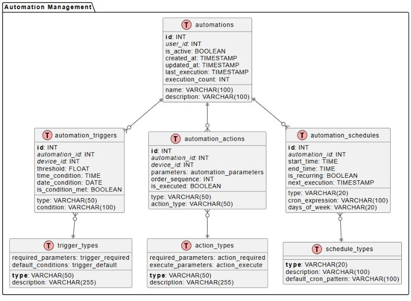