# Capítulo V: Product Implementation, Validation & Deployment

## 5.1. Software Configuration Management

En esta sección, nuestro equipo establece las decisiones y convenciones para mantener una consistencia durante todo el desarrollo del proyecto. Estas convenciones son cruciales para asegurar que todos los miembros del equipo estén alineados en términos de uso de herramientas, buenas prácticas y procesos de despliegue.

### 5.1.1. Software Development Environment Configuration

En este apartado se mencionan los distintos productos de software empleados por el equipo para llevar a cabo las actividades relacionadas con la elaboración del proyecto.

**Product UX/UI Desing**

1. **UXPressia:** https://uxpressia.com/Se utilizó para la creación de User Personas, Empathy Maps, Journey Maps e Impact Maps, proporcionando una visión centrada en el usuario.

2. **Figma**: https://www.figma.com/Herramienta de diseño colaborativo utilizada para la creación de wireframes, mock-ups y prototipos de aplicaciones móviles y de escritorio.

**Software Development**

3. **Visual Studio Code**: https://code.visualstudio.com/Entorno de desarrollo ligero empleado para la creación del landing page y las aplicaciones web, utilizando HTML5, CSS3, JavaScript y TypeScript.

4. **WebStorm**: Entorno de desarrollo utilizado para trabajar con HTML, CSS, JavaScript y frameworks como Vue y Angular.

5. **Spring Boot Framework**:Framework utilizado para desarrollar servicios web RESTful en Java, proporcionando una base escalable y robusta.

6. **GitHub**: https://github.com/Plataforma de control de versiones utilizada para la gestión del código fuente, aplicando el flujo de trabajo GitFlow para garantizar un desarrollo ordenado.

**Project Management and Collaboration**

7. **WhatsApp**: https://web.whatsapp.com/Aplicación de mensajería utilizada para la coordinación y discusión de temas relacionados con el proyecto en tiempo real.

8. **Discord**: https://discord.com/ Aplicación de mensajería utilizada para la coordinación y discusión de temas relacionados con el proyecto en tiempo real

**Software Documentation**

9. **LucidChart**: https://lucid.app/Plataforma utilizada para la creación de diagramas UML, wireflows y user flows, facilitando la visualización y planificación del sistema.

10. **Structurizr**: https://www.structurizr.com/ Herramienta utilizada para modelar la arquitectura de software mediante diagramas C4, permitiendo un modelado claro de la estructura del proyecto.

**Software Testiong**

11. **Markdown**: Lenguaje de marcado ligero utilizado para documentar el proyecto y en los archivos README del repositorio de la organización.

### 5.1.2. Source Code Management

La gestión del código fuente es parte fundamental del desarrollo de cualquier proyecto de software, ya que nos permitirá rastrear cambios, revertir versionas y coordinar a los diferentes integrantes del equipo a la misma vez. En ENERGIX, utilizaremos **GitHub** como plataforma para alojar nuestros repositorios.

**URL de los Repositorios**

- **Organization:** https://github.com/Upc-pre-1ASI0729-2520-7401-Energix
- **Reporte:** https://github.com/Upc-pre-1ASI0729-2520-7401-Energix/Energix-Proyect-Report
- **Landing Page:** https://energixlp.netlify.app

**Commits Convencionales**

Para los mensajes de commit en el proyecto ENERGIX, se sigue la convención **Coventional Commits**. Estos mensajes deben seguir el formato estándar para facilitar la lectura y entendimiento del historial del proyecto:

``` githubexpressionlanguage
<type>[optional scope]:<decription>

[optional body]

[optional footer(s)]
```

- **Type**
-  -  ```feat```: Se usa cuando se añade una nueva catacterística.
-  -  ```fix```: Para la correción de errores.
-  -  ```docs```: Modificaciones en la documentación.
-  -  ```style```: Cambios que no afectan la lógica del código, como los formatos o estilos.
-  -  ```refactor```: Modificaciones que no añaden características ni corrigen errores.
-  -  ```test```: Addicón o modificación de pruebas.

- **Scope:** Proporciona información adicional sobre el área del código afectada.

**Ejemplos de commits**

- ```feat(login): add user authentication module```
- ```fix(payment): resolve payment gateway issue```
- ```docs(README): update setup instructions```

Con estas estructuras, ENERGIX se puede gestionar eficientemente el flujo de trabajo del desarrollo, asegurándonos una integración continua y una organización clara del código.

### 5.1.3. Source Code Style Guide & Conventions
En el proyecto ENERGIX, hemos implementaado una serie de guías de estilo y convenciones para asegurar que todo el equipo de desarrollo siga una estructura consistente y clara en todo el desarrollo del proyecto. Facilitando la legibidad del código, mejorando la colaboración entre los integrantes asegurando que el código sea mantenible a largo plazo.

**Nomenclatura General**

Para asegurar la coherencia en todo el código, seguiremos las siguientes directrices:

- Los nombres de variables, funciones y métodos deben utilizar **camelCase**.
- Los nombres de clases y componentes seguirán la convención **PascalCase**.
- Para los archivos y carpetas, se empleará la convención **kebab-Case**.

El uso de **ingles** para todos los nombres es obligatorio, con el fin de asegurar la comprensión entre los miembros del equipo y seguir las buenas prácticas.

**Ejemplo**

- **Variables:** ``` home```,```userLocation```
- **Clases:** ``` HomeOwner```,```user```
- **Archivos:** ```home-owner.service.js```,```user.controller.js```

**Espacios y Sangrías**

La sangría de código en ENERGIX seguirá las siguientes reglas para asegurar la claridad y el orden del código:

- Se utilizarán **2 espacios** para la sangría en archivos HTML, CSS, JavaScript, y TypeScript.
- En archivos **Java**, se utilizarán **4 espacios** para la sangría.

Esta convención ayuda a mantener la consistencia en todos los lenguajes empleados en el proyecto, facilitando la colaboración entre los diferentes miembros del equipo.

``` html
<!DOCTYPE html>
<html>
  <head>
    <title>Energix</title>
  </head>
  <body>
    <h1>Registros Disponible</h1>
    <p>Registra tus dispositivos fácilmente</p>
  </body>
</html>
```

**Convenciones por Lenguaje**

1. HTML/CSS/JavaScript:

- - Se utilizará la Google HTML/CSS Style Guide (https://google.github.io/styleguide/htmlcssguide.html) para asegurar la consistencia en la estructura y la presentación de los archivos HTML y CSS.
- - Para JavaScript, adoptamos la Airbnb JavaScript Style Guide (https://google.github.io/styleguide/htmlcssguide.html), ampliamente conocida y utilizada en la industria.

2. TypeScript:

- - Angular es el framework elegido para el frontend de PARKINGNOW, por lo que seguimos la Angular Style Guide (https://v17.angular.io/guide/styleguide), que dicta cómo deben estructurarse los módulos, servicios y componentes.
- - También seguimos la Google TypeScript Style Guide (https://google.github.io/styleguide/tsguide.html) para garantizar la correcta tipificación y legibilidad del código.

3. Java:

- - En el backend, utilizamos Spring Boot para crear APIs y servicios web. Seguimos la Google Java Style Guide (https://google.github.io/styleguide/javaguide.html) para mantener consistencia en la estructura de las clases y los métodos.
- - Los nombres de clases serán descriptivos, utilizando sustantivos para clases y verbos para métodos.

**Ejemplo de una clase Java**

``` javascript 
public class HomeOwner {
  private int totalDevices;

  public HomeOwner(int spaces) {
    this.availableSpaces = spaces;
  }

  public void devicesRegistered() {
    if (availableSpaces > 0) {
      availableSpaces--;
    }
  }
}
```

4. **Gherkin**
- - Para escribir los tests automatizados, seguimos la convención de Gherkin Syntax. (https://cucumber.io/docs/gherkin/) Esto permite una descripción clara y precisa de los escenarios de prueba en los archivos .feature.
- - Utilizamos Given-When-Then para describir el comportamiento esperado en cada escenario.

**Ejemplo de Gherkin**

``` gherkin
Feature: Registro de dispositivo 

  Scenario: Registro exitosa
    Given el usuario ha iniciado sesión
    When selecciona la opción de dispositivos
    Then el usuario debe configurar el dispositivo a registrar
    Then el sistema debe confirmar el registro
    
```

**Espacios y Comillas**

- **Espacios:** Siempre se debe colocar un espacio alrededor de los operadores y entre los parámetros en las funciones.

**Ejemplo:**

``` typescript

let totalDevices = 50;
let devicesRegistered = 10;
let availableSpace = totalDevices - devicesRegistered;
 
```
- **Commillas:** En **JavaScript** y **TypeScript**, se utilizan comillas simples ```(')``` para cadenas, mientras que en **HTML** se prefieren las comillas dobles ```(")```.

**Limite de Longitud de Línea**

El código no debe exceder las 80 columnas por líneas. En caso de necesitar más espacios, se recomienda dividir la línea de código para mejorar la legibilidad.
### 5.1.4. Software Deployment Configuration
- En esta sección se detalla la configuración necesaria para el despliegue de la solución ENERGIX, incluyendo los pasos claves para lograr la publicación satisfactoria de la Landing Page, Servicios Web y Aplicaciones Web Frontend utilizando Netlify para visualizar cada commit del Landing Page.

- A continuación, se describen los pasos para realizar el despliegue de la Landing Page del proyecto ENERGIX.- 1- **Actualización de Ramas**: Asegúrate de que todas las ramas del repositorio estén actualizadas. Luego, ingresa a Github y dirígete al repositorio del proyecto ENERGIX.
1. **Actualización de Ramas**: Asegúrate de que todas las ramas del repositorio estén actualizadas. Luego, ingresa a Netlify y dirígete al repositorio del proyecto ENERGIX.
2. **Acceso a las configuraciones**: Una vez dentro de Netifly, haz click en la pestaña Get Started en el centro de la pantalla, te loqueas con Git Hub, buscas la organización y el repositorio de tu landign page y la selecciones.
3. **Selección de la Configuración**: Selecciona la configuración y carga los archivos del repositorio. Esta opción permite generar el link de la landing page, con el nombre Energix.
4. **Acceso a la página**: Finalmente, podrás acceder a la Landing Page desde el enlace que se generó al finalizar el deploy. Aquí está el enlace para el proyecto ENERGIX: https://energixlp.netlify.app

### 5.2.1. Sprint 1

#### 5.2.1.1. Sprint Planning 1

Para este primer sprint nos enfocaremos en los tasks para la
elaboración de la Landing Page. Nos dividiremos entre nosotros cada
una de las tareas identificadas para el sprint.

<table>
<tr>
    <th colspan="5">Sprint 1</th>
    <th colspan="9">Sprint 1</th>
  </tr>
      <tr>
    <td colspan="13">Sprint Planning Background</td>
  </tr>
  <tr>
    <td colspan="5">Date</td>
    <td colspan="8">2025-09-15</td>
</tr>
  <tr>
    <td colspan="5">Time</td>
    <td colspan="8">4:30 PM</td>
  </tr>
  <tr>
    <td colspan="5">Location</td>
    <td colspan="8">Via Discord</td>
<tr>
    <td colspan="5">Prepared By</td>
    <td colspan="8">Iker Gabriel Barturen Panez</td>
</tr>
<tr>
    <td colspan="5">Attendees (to planning meeting)</td>
    <td colspan="8">Alexis Encalada Salazar, Yeira Shari Huaman Olivos, Andrés Rodrigo Torres Lavandera, Iker Gabriel Barturen Panez, Mateo Italo Loechle Arias</td>
</tr>
<tr>
    <td colspan="5">Sprint  1 Review Summary</td>
    <td colspan="8">En esta primera sección se planteo el desarrollo de la Landing Page y planeación de aplicación para el proyecto de Energix.</td>
</tr>
<tr>
    <td colspan="5">Sprint 1 Retrospective Summary</td>
    <td colspan="8">En esta sección todos los integrantes mencionaron tener aciertos en partes del codigo y en otras partes poder mejorar sus habilidades realizando la Landing Page</td>
</tr>
<tr>
    <td colspan="13">Sprint Goal & User Stories</td>
</tr>
<tr>
    <td colspan="5">Sprint 1 Goal</td>
    <td colspan="8">Desarrollar y desplegar una landing page que presente información a los usuarios a través de imágenes y texto. La página debe ser completamente adaptable a cualquier tipo de dispositivo que utilicen los usuarios, garantizando una experiencia de usuario fluida y responsiva.</td>
</tr>
<tr>
    <td colspan="5">Sprint 1 Velocity</td>
    <td colspan="8">5 story points</td>
</tr>
<tr>
    <td colspan="5">Sum of Story Points</td>
    <td colspan="8">5 Story Points</td>
</tr>
</table>

#### 5.2.1.2. Aspect Leaders and Collaborators

Con la finalidad de mejorar la colaboración en equipo a cada integrante se asignó un rol de líder por cada aspecto. Los aspectos están relacionados con los entregables.

| Team member (LastName, First Name) | GitHub UserName       | Aspect 1: Landing Page Leader (L) / Collaborator (C) | Aspect 2: Diseños Figma: Leader (L) / Collaborator (C) | Aspect 3: Reporte (L) / Collaborator (C) |
|------------------------------------|-----------------------|------------------------------------------------------|--------------------------------------------------------|------------------------------------------|
| Alexis Encalada                    | Alexiz248             | C                                                    | C                                                      | L                                        |
| Yeira Sharia                       | YeiShari              | L                                                    | L                                                      | L                                        |
| Andrés Torres                      | AndresTorres202312557 | C                                                    | L                                                      | L                                        |
| Iker Barturen                      | krxxg04               | L                                                    | L                                                      | L                                        |
| Mateo Loechle                      | LowMathzzz            | C                                                    | C                                                      | L                                        |

#### 5.2.1.3. Sprint Backlog 1

<table border="1">
  <tr>
    <th colspan="3">Sprint 1</th>
    <th colspan="10">Sprint 1</th>
  </tr>
  <tr>
    <td colspan="3">User Story</td>
    <td colspan="10">Work-Item/Task</td>
  </tr>
  <tr>
    <td>ID</td>
    <td colspan="2">Title</td>
    <td>ID</td>
    <td colspan="2">Title</td>
    <td colspan="3">Description</td>
    <td>Estimation</td>
    <td colspan="2">Assigned to</td>
    <td>Status</td>
  </tr>
  <tr>
    <td>US31</td>
    <td colspan="2">Consultar la propuesta de valor</td>
    <td>UT01</td>
    <td colspan="2">Redactar contenido de propuesta de valor</td>
    <td colspan="3">Crear el texto que explique los beneficios y el valor de la plataforma.</td>
    <td>2h</td>
    <td colspan="2">Iker Barturen</td>
    <td>Done</td>
  </tr>
  <tr>
    <td></td>
    <td colspan="2"></td>
    <td>UT02</td>
    <td colspan="2">Diseñar sección de propuesta de valor</td>
    <td colspan="3">Implementar la sección en la landing page con diseño atractivo y responsivo.</td>
    <td>2h</td>
    <td colspan="2">Iker Barturen</td>
    <td>Done</td>
  </tr>
  <tr>
    <td>US32</td>
    <td colspan="2">Acceder a preguntas frecuentes (FAQ)</td>
    <td>UT03</td>
    <td colspan="2">Redactar preguntas y respuestas frecuentes</td>
    <td colspan="3">Crear listado de dudas comunes y sus respuestas.</td>
    <td>2h</td>
    <td colspan="2">Yeira Huaman</td>
    <td>Done</td>
  </tr>
  <tr>
    <td></td>
    <td colspan="2"></td>
    <td>UT04</td>
    <td colspan="2">Implementar sección FAQ</td>
    <td colspan="3">Desarrollar componente visual (acordeón/collapsible) para mostrar las preguntas frecuentes.</td>
    <td>2h</td>
    <td colspan="2">Yeira Huaman</td>
    <td>Done</td>
  </tr>
  <tr>
    <td>US33</td>
    <td colspan="2">Revisar planes de suscripción</td>
    <td>UT05</td>
    <td colspan="2">Redactar información de planes</td>
    <td colspan="3">Crear contenido sobre los distintos planes, precios y beneficios.</td>
    <td>3h</td>
    <td colspan="2">Andrés Torres</td>
    <td>Done</td>
  </tr>
  <tr>
    <td></td>
    <td colspan="2"></td>
    <td>UT06</td>
    <td colspan="2">Implementar sección de comparación de planes</td>
    <td colspan="3">Diseñar tabla o cards para comparar los planes en la landing page.</td>
    <td>3h</td>
    <td colspan="2">Andrés Torres</td>
    <td>Done</td>
  </tr>
  <tr>
    <td>US34</td>
    <td colspan="2">Consultar información del equipo</td>
    <td>UT07</td>
    <td colspan="2">Redactar información del equipo</td>
    <td colspan="3">Crear contenido sobre la misión, visión y miembros del equipo.</td>
    <td>2h</td>
    <td colspan="2">Alexis Encalada</td>
    <td>Done</td>
  </tr>
  <tr>
    <td></td>
    <td colspan="2"></td>
    <td>UT08</td>
    <td colspan="2">Implementar sección del equipo</td>
    <td colspan="3">Diseñar e integrar la sección del equipo en la landing page.</td>
    <td>2h</td>
    <td colspan="2">Alexis Encalada</td>
    <td>Done</td>
  </tr>
  <tr>
    <td>US35</td>
    <td colspan="2">Cambiar idioma</td>
    <td>UT09</td>
    <td colspan="2">Implementar selector de idioma</td>
    <td colspan="3">Desarrollar funcionalidad para cambiar entre español e inglés en la landing page.</td>
    <td>4h</td>
    <td colspan="2">Mateo Italo</td>
    <td>Done</td>
  </tr>
</table>

#### 5.2.1.4. Development Evidence for Sprint Review

En esta sección se demuestran los commits relacionados con los principales avances en la implementación.
Estos commits provienen del repositorio del Landing Page de la organización de GitHub.

Enlace al repositorio de la Landing Page: https://github.com/Upc-pre-1ASI0729-2520-7401-Energix/Energix-Landing-Page# 

| Repository                                              | Branch                | Commit Id                                  | Commit Message            | Commit Message Body | Commited on (Date) |
|---------------------------------------------------------|-----------------------|--------------------------------------------|---------------------------|---------------------|--------------------|
| Upc-pre-1ASI0729-2520-7401-Energix/Energix-Landing-Page | feature/start         | 692024b93d68e539d1cc5cbb6de3cd176d562b7c   | feat: add start.          |                     | 19/09/2025         |
| Upc-pre-1ASI0729-2520-7401-Energix/Energix-Landing-Page | feature/products      | 1eeb09c177966f93ac491cbd9b80a6e4ba81bc90   | feat: add products.       |                     | 19/09/2025         |
| Upc-pre-1ASI0729-2520-7401-Energix/Energix-Landing-Page | feature/subscriptions | 45f25028afb713b93cb8673a1ee5abdc9fe53594   | feat: add subscriptions.  |                     | 19/09/2025         |
| Upc-pre-1ASI0729-2520-7401-Energix/Energix-Landing-Page | feature/our-team      | d29df95ef29cdf224c966d07c8e8a15704647854   | feat: add our-team.       |                     | 19/09/2025         |
| Upc-pre-1ASI0729-2520-7401-Energix/Energix-Landing-Page | feature/Faqs          | 37f3b8c28d521878663c72a6ae046432deea790e   | feat: add Faqs.           |                     | 19/09/2025         |
| Upc-pre-1ASI0729-2520-7401-Energix/Energix-Landing-Page | feature/footer        | d09da40ecc996d11a3d84e31c003e4fa9d7bcf75   | feat: add footer.         |                     | 19/09/2025         |
| Upc-pre-1ASI0729-2520-7401-Energix/Energix-Landing-Page | feature/payment       | ff27629a30c625d174ef98b16b47b0a8ce97370a   | feat: add payment.        |                     | 19/09/2025         |
| Upc-pre-1ASI0729-2520-7401-Energix/Energix-Landing-Page | feature/js            | f83045d6a61811aab992b009689c67e2a3ed24e6   | feat: add files js.       |                     | 19/09/2025         |
| Upc-pre-1ASI0729-2520-7401-Energix/Energix-Landing-Page | feature/image         | f6cf2c1f36b63ab62729127683830a22fa1be8ba   | feat: add image.          |                     | 19/09/2025         |
| Upc-pre-1ASI0729-2520-7401-Energix/Energix-Landing-Page | feature/responsive    | 5d38b6997ae8e5326d8a96f618a460612610a6af   | feat: add responsive.     |                     | 20/09/2025         |

#### 5.2.1.5. Execution Evidence for Sprint Review

Durante el desarrollo del sprint se lograron completar todos los puntos planteados. A continuación se muestran evidencias del landing page logrado.


#### 5.2.1.6. Services Documentation Evidence for Sprint Review

Como se mencionó previamente, Este sprint solo tuvo como objetivo el desarrollo de Landing Page. Aún no se han implementado ni documentado Endpoints con OpenAPI, ya que el desarrollo de los servicios web está planificado para los siguientes Sprints, conforme al roadmap del proyecto.

#### 5.2.1.7. Software Deployment Evidence for Sprint Review

Durante este Sprint, se completó el desarrollo de la Landing Page y se realizó su despliegue utilizando GitHub Pages como plataforma de publicación gratuita. El objetivo fue contar con una primera versión accesible en línea del producto digital para revisión y retroalimentación.

Actividades realizadas: Se creó el repositorio en GitHub: https://github.com/Upc-pre-1ASI0729-2520-7401-Energix/Energix-Landing-Page#

Se subió el código fuente de la Landing Page, incluyendo los archivos HTML, CSS necesarios.

Se configuró GitHub Pages desde la pestaña Settings > Pages, seleccionando la rama principal y la carpeta raíz.

Se verificó la correcta publicación de la Landing Page en la siguiente URL: https://energixlp.netlify.app

#### 5.2.1.8. Team Collaboration Insights during Sprint

En esta sección se evidencia la colaboración de cada integrante en el repositorio de la Landing Page.

Repositorio de Landing Page: https://github.com/Upc-pre-1ASI0729-2520-7401-Energix/Energix-Landing-Page#

| **Integrante**                       | **Actividad**                                                                                          |  
|--------------------------------------|--------------------------------------------------------------------------------------------------------|
| **Huaman Olivos, Yeira Shari**       | Implementación de secciones de la **landing page** y contribuciones a los **chapter 1, 2, 3, 4, 5.md** |
| **Loechle Arias, Mateo Ítalo**       | Implementación de secciones de la **landing page** y contribuciones a los **chapter 1, 2, 3, 4, 5.md** |
| **Barturen Panez, Iker Gabriel**     | Implementación de secciones de la **landing page** y contribuciones a los **chapter 1, 2, 3, 4, 5.md** |
| **Encalada Salazar, Alexis**         | Implementación de secciones de la **landing page** y contribuciones a los **chapter 1, 2, 3, 4, 5.md** |
| **Torres Lavandera, Andrés Rodrigo** | Implementación de secciones de la **landing page** y contribuciones a los **chapter 1, 2, 3, 4, 5.md** |


### 5.2.2. Sprint 2

#### 5.2.2.1. Sprint Planning 2

Durante el Sprint 2 se estableció el desarrollo de la aplicación web de la plataforma Energix, enfocándose en la implementación de las principales vistas y funcionalidades orientadas a los perfiles propietarios de viviendas y universitarios que alquilan. El trabajo incluyó la integración de la interfaz con la base de datos, la gestión dinámica de la información de usuario y la mejora de la experiencia visual y de navegación. Asimismo, se priorizó la internacionalización (i18n) y la coherencia del diseño, consolidando una versión funcional y estable del sistema.

<table>
<tr>
    <th colspan="5">Sprint 2</th>
    <th colspan="9">Sprint 2</th>
  </tr>
      <tr>
    <td colspan="13">Sprint Planning Background</td>
  </tr>
  <tr>
    <td colspan="5">Date</td>
    <td colspan="8">2025-09-29</td>
</tr>
  <tr>
    <td colspan="5">Time</td>
    <td colspan="8">6:30 PM</td>
  </tr>
  <tr>
    <td colspan="5">Location</td>
    <td colspan="8">Via Discord</td>
<tr>
    <td colspan="5">Prepared By</td>
    <td colspan="8">Iker Gabriel Barturen Panez</td>
</tr>
<tr>
    <td colspan="5">Attendees (to a planning meeting)</td>
    <td colspan="8">Alexis Encalada Salazar, Yeira Shari Huaman Olivos, Andrés Rodrigo Torres Lavandera, Iker Gabriel Barturen Panez, Mateo Italo Loechle Arias</td>
</tr>

<tr>
    <td colspan="13">Sprint Goal & User Stories</td>
</tr>
<tr>
    <td colspan="5">Sprint 2 Goal</td>
    <td colspan="8">Implementar y estabilizar la arquitectura fundamental de la aplicación web Energix, entregando la capa de presentación funcionalmente integrada a la base de datos para las vistas centrales y la gestión de datos de los perfiles de usuario (propietarios de viviendas y universitarios que alquilan), con soporte inicial para internacionalización (i18n).</td>
</tr>
<tr>
    <td colspan="5">Sprint 2 Velocity</td>
    <td colspan="8">10</td>
</tr>
<tr>
    <td colspan="5">Sum of Story Points</td>
    <td colspan="8">89</td>
</tr>
</table>

#### 5.2.2.2. Aspect Leaders and Collaborators

Con la finalidad de mejorar la colaboración en equipo a cada integrante se asignó un rol de líder por cada aspecto. Los aspectos están relacionados con los entregables.

| Team member (LastName, First Name) | GitHub UserName       | Aspect 1: Dashboard & Devices View | Aspect 2: Profile View and UI Design | Aspect 3: Reports View | Aspect 4: Notifications View | Aspect 5: Settings View |
|------------------------------------|-----------------------|------------------------------------|--------------------------------------------------------------------|------------------------|------------------------------|-------------------------|
| Alexis Encalada                    | Alexiz248             | C                                  | C                                                                  | C                      | C                            | L                       |
| Yeira Sharia                       | YeiShari              | C                                  | L                                                                  | C                      | C                            | C                       |
| Andrés Torres                      | AndresTorres202312557 | C                                  | C                                                                  | L                      | C                            | C                       |
| Iker Barturen                      | krxxg04               | L                                  | C                                                                  | C                      | C                            | C                       |
| Mateo Loechle                      | LowMathzzz            | C                                  | C                                                                  | C                      | L                            | C                       |

#### 5.2.2.3. Sprint Backlog 2
<table>
  <tr>
    <th colspan="7">Sprint 2 – Work Items / Tasks (Aplicación Web Energix)</th>
  </tr>
  <tr>
    <th>User Story ID</th>
    <th>Task ID</th>
    <th>Title</th>
    <th>Description</th>
    <th>Estimation</th>
    <th>Assigned To</th>
    <th>Status</th>
  </tr>

  <!-- EP01 -->
  <tr><td colspan="7"><b>EP01 – Autenticación y Perfil de Usuario</b></td></tr>
  <tr><td>US01</td><td>UT01</td><td>Diseñar formulario de registro</td><td>Diseñar el formulario con campos de correo, contraseña y validación.</td><td>3h</td><td>Yeira Huamán</td><td>Done</td></tr>
  <tr><td></td><td>UT02</td><td>Implementar backend de registro</td><td>Crear endpoint de registro y validaciones de correo duplicado.</td><td>4h</td><td>Mateo Loechle</td><td>Done</td></tr>
  <tr><td>US02</td><td>UT03</td><td>Implementar inicio de sesión</td><td>Crear pantalla de login y autenticación JWT.</td><td>3h</td><td>Iker Barturen</td><td>Done</td></tr>
  <tr><td></td><td>UT04</td><td>Manejo de errores en login</td><td>Mostrar mensajes por credenciales inválidas o usuario inexistente.</td><td>2h</td><td>Yeira Huamán</td><td>Done</td></tr>
  <tr><td>US03</td><td>UT05</td><td>Configurar perfil inicial</td><td>Crear formulario de configuración inicial (tipo de vivienda, dispositivos).</td><td>3h</td><td>Andrés Torres</td><td>Done</td></tr>
  <tr><td></td><td>UT06</td><td>Validar configuración</td><td>Verificar información incompleta en perfil inicial.</td><td>2h</td><td>Alexis Encalada</td><td>Done</td></tr>
  <tr><td>US04</td><td>UT07</td><td>Flujo de recuperación de contraseña</td><td>Crear formulario para restablecer contraseña y envío de correo.</td><td>3h</td><td>Yeira Huamán</td><td>Done</td></tr>
  <tr><td></td><td>UT08</td><td>Actualizar contraseña desde enlace</td><td>Implementar vista para establecer nueva contraseña.</td><td>2h</td><td>Mateo Loechle</td><td>Done</td></tr>
  <tr><td>US05</td><td>UT09</td><td>Implementar cierre de sesión</td><td>Desarrollar logout seguro y cierre automático por inactividad.</td><td>3h</td><td>Iker Barturen</td><td>Done</td></tr>

  <!-- EP02 -->
  <tr><td colspan="7"><b>EP02 – Conexión y Monitoreo de Dispositivos</b></td></tr>
  <tr><td>US06</td><td>UT10</td><td>Vincular dispositivos</td><td>Crear flujo para conectar dispositivos compatibles con la plataforma.</td><td>4h</td><td>Alexis Encalada</td><td>Done</td></tr>
  <tr><td></td><td>UT11</td><td>Validar compatibilidad</td><td>Mostrar error si el dispositivo no es compatible.</td><td>2h</td><td>Mateo Loechle</td><td>Done</td></tr>
  <tr><td>US07</td><td>UT12</td><td>Identificación automática</td><td>Implementar reconocimiento automático de dispositivos conectados.</td><td>3h</td><td>Yeira Huamán</td><td>Done</td></tr>
  <tr><td></td><td>UT13</td><td>Definición manual</td><td>Permitir al usuario definir dispositivo si no se identifica.</td><td>2h</td><td>Alexis Encalada</td><td>Done</td></tr>
  <tr><td>US08</td><td>UT14</td><td>Monitoreo en tiempo real</td><td>Mostrar consumo en tiempo real de dispositivos conectados.</td><td>4h</td><td>Iker Barturen</td><td>Done</td></tr>
  <tr><td></td><td>UT15</td><td>Manejo de desconexiones</td><td>Notificar al usuario cuando un dispositivo se desconecta.</td><td>2h</td><td>Yeira Huamán</td><td>Done</td></tr>

  <!-- EP03 -->
  <tr><td colspan="7"><b>EP03 – Alertas y Recordatorios de Consumo</b></td></tr>
  <tr><td>US09</td><td>UT16</td><td>Alertas de consumo elevado</td><td>Configurar sistema de alertas automáticas por exceso de consumo.</td><td>3h</td><td>Mateo Loechle</td><td>Done</td></tr>
  <tr><td></td><td>UT17</td><td>Registrar alertas</td><td>Guardar las alertas generadas con fecha y hora.</td><td>2h</td><td>Andrés Torres</td><td>Done</td></tr>
  <tr><td>US10</td><td>UT18</td><td>Recordatorios por inactividad</td><td>Enviar notificaciones para desconectar dispositivos en reposo.</td><td>3h</td><td>Alexis Encalada</td><td>Done</td></tr>
  <tr><td></td><td>UT19</td><td>Configuración de recordatorios</td><td>Permitir ajustar frecuencia de avisos.</td><td>2h</td><td>Yeira Huamán</td><td>Done</td></tr>
  <tr><td>US11</td><td>UT20</td><td>Configurar umbrales personalizados</td><td>Definir límites de consumo por usuario y restablecimiento a valores predeterminados.</td><td>4h</td><td>Iker Barturen</td><td>Done</td></tr>

  <!-- EP04 -->
  <tr><td colspan="7"><b>EP04 – Reportes y Facturación</b></td></tr>
  <tr><td>US12</td><td>UT21</td><td>Reporte semanal</td><td>Generar reporte semanal del consumo energético en PDF.</td><td>4h</td><td>Mateo Loechle</td><td>Done</td></tr>
  <tr><td>US13</td><td>UT22</td><td>Comparación entre periodos</td><td>Permitir comparar consumo entre semanas o meses con gráficos.</td><td>3h</td><td>Yeira Huamán</td><td>Done</td></tr>
  <tr><td>US14</td><td>UT23</td><td>Proyección de factura</td><td>Estimar factura mensual según consumo actual.</td><td>3h</td><td>Andrés Torres</td><td>Done</td></tr>
  <tr><td>US15</td><td>UT24</td><td>Historial de consumo mensual</td><td>Mostrar historial mensual de consumo y descarga en PDF.</td><td>3h</td><td>Alexis Encalada</td><td>Done</td></tr>

  <!-- EP05 -->
  <tr><td colspan="7"><b>EP05 – Metas y Ahorro Energético</b></td></tr>
  <tr><td>US16</td><td>UT25</td><td>Recomendaciones personalizadas</td><td>Mostrar consejos adaptados al patrón de consumo del usuario.</td><td>3h</td><td>Yeira Huamán</td><td>Done</td></tr>
  <tr><td>US17</td><td>UT26</td><td>Metas de ahorro</td><td>Configurar metas mensuales y seguimiento de progreso.</td><td>4h</td><td>Iker Barturen</td><td>Done</td></tr>
  <tr><td>US18</td><td>UT27</td><td>Comparar consumo con otros usuarios</td><td>Mostrar comparación con hogares similares y ranking de eficiencia.</td><td>3h</td><td>Mateo Loechle</td><td>Done</td></tr>
  <tr><td>US19</td><td>UT28</td><td>Programar encendido automático</td><td>Permitir programación de horarios de encendido de dispositivos.</td><td>3h</td><td>Alexis Encalada</td><td>Done</td></tr>
  <tr><td>US20</td><td>UT29</td><td>Programar apagado automático</td><td>Implementar apagado programado para reducir consumo innecesario.</td><td>3h</td><td>Andrés Torres</td><td>Done</td></tr>

  <!-- EP06 -->
  <tr><td colspan="7"><b>EP06 – Soporte y Asesoría</b></td></tr>
  <tr><td>US21</td><td>UT30</td><td>Solicitar asesoría</td><td>Permitir al usuario agendar sesiones con especialistas.</td><td>3h</td><td>Yeira Huamán</td><td>Done</td></tr>
  <tr><td>US22</td><td>UT31</td><td>Centro de ayuda</td><td>Implementar sección con guías y artículos de ayuda.</td><td>3h</td><td>Mateo Loechle</td><td>Done</td></tr>
  <tr><td>US23</td><td>UT32</td><td>Contactar soporte</td><td>Crear formulario de contacto y recepción de respuestas.</td><td>3h</td><td>Iker Barturen</td><td>Done</td></tr>

  <!-- EP07 -->
  <tr><td colspan="7"><b>EP07 – Gestión de Categorías de Dispositivos</b></td></tr>
  <tr><td>US24</td><td>UT33</td><td>Agrupar dispositivos</td><td>Permitir al usuario crear categorías personalizadas de dispositivos.</td><td>3h</td><td>Alexis Encalada</td><td>Done</td></tr>
  <tr><td>US25</td><td>UT34</td><td>Consumo por categoría</td><td>Mostrar consumo agrupado y comparativo por categoría.</td><td>4h</td><td>Yeira Huamán</td><td>Done</td></tr>
  <tr><td>US26</td><td>UT35</td><td>Dispositivos de alto consumo</td><td>Identificar y alertar sobre los dispositivos con mayor gasto energético.</td><td>3h</td><td>Andrés Torres</td><td>Done</td></tr>

  <!-- EP08 -->
  <tr><td colspan="7"><b>EP08 – Multiusuario y Roles</b></td></tr>
  <tr><td>US27</td><td>UT36</td><td>Administrar múltiples cuentas</td><td>Permitir agregar miembros al hogar y compartir gestión.</td><td>3h</td><td>Mateo Loechle</td><td>Done</td></tr>
  <tr><td>US28</td><td>UT37</td><td>Definir roles de acceso</td><td>Implementar control de permisos (administrador/invitado).</td><td>3h</td><td>Iker Barturen</td><td>Done</td></tr>

  <!-- EP09 -->
  <tr><td colspan="7"><b>EP09 – Noticias e Internacionalización</b></td></tr>
  <tr><td>US29</td><td>UT38</td><td>Cambiar idioma de la aplicación</td><td>Implementar selector de idioma con persistencia de preferencia.</td><td>3h</td><td>Yeira Huamán</td><td>Done</td></tr>
  <tr><td>US30</td><td>UT39</td><td>Noticias y consejos</td><td>Agregar sección de noticias con artículos y recomendaciones.</td><td>4h</td><td>Alexis Encalada</td><td>Done</td></tr>
</table>


#### 5.2.2.4. Development Evidence for Sprint Review

En esta sección se demuestran los commits relacionados con los principales avances en la implementación.
Estos commits provienen del repositorio de la aplicación web de la organización de GitHub.

Enlace al repositorio de la aplicación web: https://github.com/Upc-pre-1ASI0729-2520-7401-Energix/Frontend-SEMS

| Repository                                        | Branch                      | Commit Id                                  | Commit Message                  | Commit Message Body | Commited on (Date) |
|---------------------------------------------------|-----------------------------|--------------------------------------------|---------------------------------|---------------------|--------------------|
| Upc-pre-1ASI0729-2520-7401-Energix/Fronten-SEMS   | feature/ddd                 | 069e2cb5286f9ad8d996f8924e67be96575b5b09   | feat: add domain driven desing. |                     | 02/10/2025         |
| Upc-pre-1ASI0729-2520-7401-Energix/Fronten-SEMS   | feature/addAunthentication  | 5ea94a4d17e60a53db5830b42eb1a989d9d38e03   | feat: add aunthentication.      |                     | 03/10/2025         |
| Upc-pre-1ASI0729-2520-7401-Energix/Fronten-SEMS   | feature/update-login        | 48d68c1ff07a03a224a3dd4b0f2603be367f48a6   | feat: add update login.         |                     | 03/10/2025         |
| Upc-pre-1ASI0729-2520-7401-Energix/Fronten-SEMS   | feature/add-dashboard       | 3dc92d1346c082774d9853a2fffa1d8f483a24fd   | feat: add dashboard.            |                     | 04/10/2025         |
| Upc-pre-1ASI0729-2520-7401-Energix/Fronten-SEMS   | feature/server              | a3bfb8dd3bf8e2192dacd74ae6eaa5e7be0d4dae   | feat: add server.               |                     | 04/10/2025         |
| Upc-pre-1ASI0729-2520-7401-Energix/Fronten-SEMS   | feature/server              | 430f5da64e6b67c5fa64716becd212675678e94e   | feat: add config server.        |                     | 05/10/2025         |
| Upc-pre-1ASI0729-2520-7401-Energix/Fronten-SEMS   | feature/reports             | 87102a704126e9ba3d7f0302ae489a3d5f3d1db1   | feat: add device chart.         |                     | 05/10/2025         |
| Upc-pre-1ASI0729-2520-7401-Energix/Fronten-SEMS   | feature/config-app-routes   | c21124db6bc7563e1421f46e6f139a6f545d5e74   | feat: add config routes.        |                     | 05/10/2025         |
| Upc-pre-1ASI0729-2520-7401-Energix/Fronten-SEMS   | feature/consumption         | d8ab0155901192167c0d100b4558ac43ff596b25   | Feature/consumption             |                     | 05/10/2025         |
| Upc-pre-1ASI0729-2520-7401-Energix/Fronten-SEMS   | feature/notification        | 86fde845c4afdd0b68dd2887bc2a0d2ec55c2be8   | Feature/notification merging.   |                     | 05/10/2025         |
| Upc-pre-1ASI0729-2520-7401-Energix/Fronten-SEMS   | feature/devices             | 38c0aea980d68cc380d86847fabf9f01d0325d97   | feat:add devices window.        |                     | 05/10/2025         |
| Upc-pre-1ASI0729-2520-7401-Energix/Fronten-SEMS   | feature/devices-preferences | 375acbac860fa2204dd7db6f6c0f42959937ff6a   | feat: add devices preferences.  |                     | 06/10/2025         |
| Upc-pre-1ASI0729-2520-7401-Energix/Fronten-SEMS   | feature/settings            | 07cb159ed1c5af5df5312a2ef30b9c950302ebe0   | Feature/settings                |                     | 06/10/2025         |
| Upc-pre-1ASI0729-2520-7401-Energix/Fronten-SEMS   | feature/profile             | 64f6e18251d73801245b50c243d8dda88fb6e3e3   | Feature/profile                 |                     | 07/10/2025         |
| Upc-pre-1ASI0729-2520-7401-Energix/Fronten-SEMS   | feature/export-report       | bbd27b1cd2ba3b987ecb1b3a3cb026053e9bb661   | feat: update export report      |                     | 07/10/2025         |
| Upc-pre-1ASI0729-2520-7401-Energix/Fronten-SEMS   | feature/db.config           | d563c430f96bdc863fb30ef0742154c4de920735   | feat: config httpclient.        |                     | 08/10/2025         |
| Upc-pre-1ASI0729-2520-7401-Energix/Fronten-SEMS   | feature/home-translation    | 15c6f68e4ced7c9c7519d43ee1074ab6b205a8b0   | feat: update home.              |                     | 08/10/2025         |
| Upc-pre-1ASI0729-2520-7401-Energix/Fronten-SEMS   | feature/-deploy-api         | 09765b5d78094dba4715ad95fb7afab260b0e3c7   | feat: update json-server.       |                     | 09/10/2025         |
| Upc-pre-1ASI0729-2520-7401-Energix/Fronten-SEMS   | feature/update-fakeapi      | 0c9d780777036f6c43edb15a8401b533fb31bf04   | feat: changed .env api url      |                     | 09/10/2025         |
| Upc-pre-1ASI0729-2520-7401-Energix/Fronten-SEMS   | feature/realese-1.0         | d56c76e06c621c06de108b7db4c78dc89c4b490f   | feat: update api_url            |                     | 09/10/2025         |

#### 5.2.2.5. Execution Evidence for Sprint Review

Durante el desarrollo del sprint se lograron completar todos los puntos para la implementación de las funcionalidades esenciales para el sistema de gestión Energix, estableciendo una base sólida para la administración de energía en los hogares. Las principales características desarrolladas fueron:

1. Sistema de autenticación completo con diferentes campos para rellenar según el rol del usuario, si es dueño o estudiante.

2. Personalización de perfil, permitiendo al usaurio modificar a su preferencia su experiencia en la aplicación.    

3. Visualización y descarga de reportes, con la posibilidad de filtrar por fecha y tipo de reporte y poder descargar los datos acumulados en diferentes formatos.

4. Gestión de dispositivos, facilitando el control entre los diferentes dispositivos registrados.

5. Internalización (i18n) para soportar dos idiomas en la plataforma.

6. Cierre se sesión seguro, permitiendo al usuario salir de la aplicación de manera segura y facil, dandole la optortunidad al usaurio de inicar sesión con las mismas credenciales.   

7. Sistema de navegación robusto entre páginas con manejo de rutas protegidas y página 4040 personalizada. 

**Capturas de pantalla de las principales vistas**


Login y Auntenticación

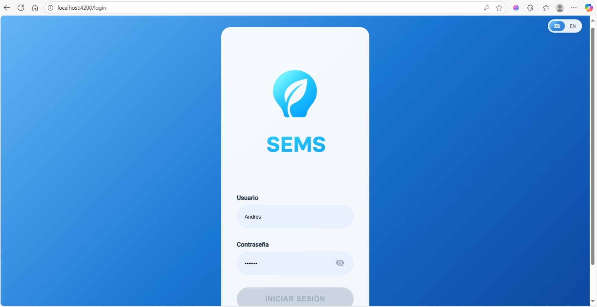

Dashboard principal

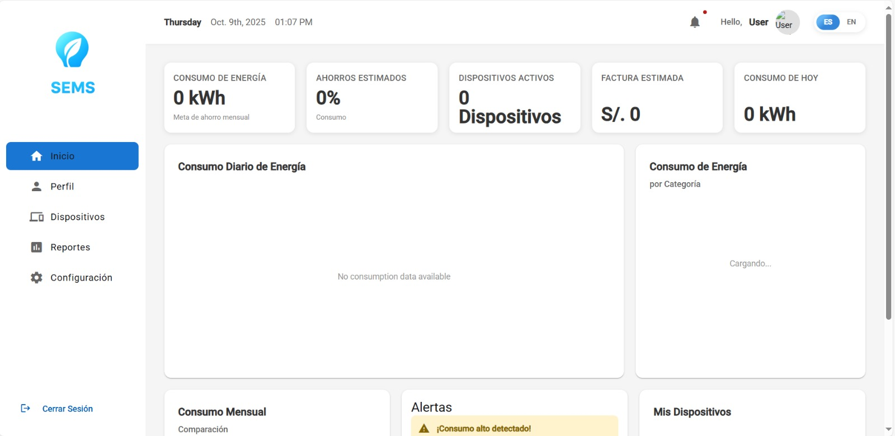

Mis dispositivos

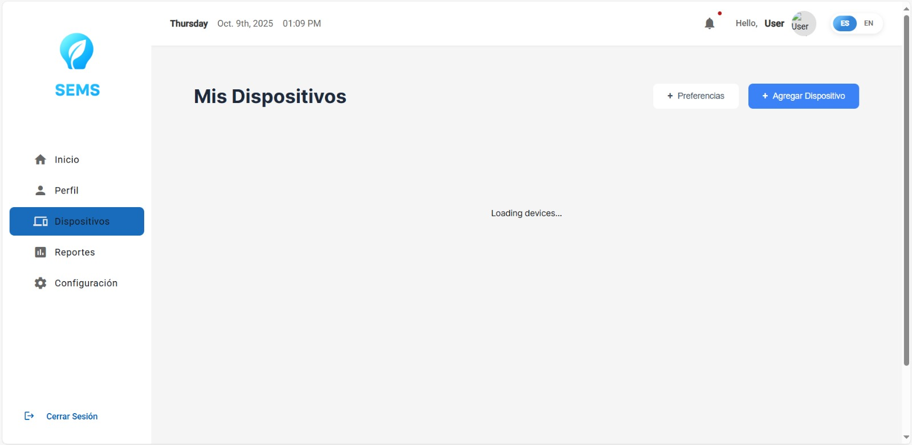

Reportes

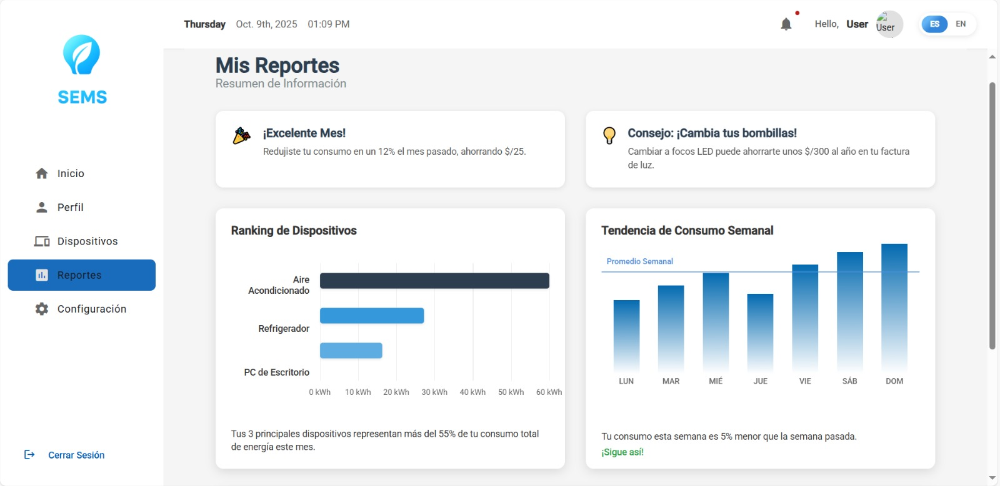

Configuración

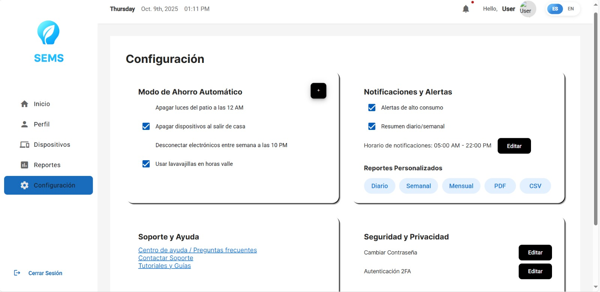


#### 5.2.2.6. Services Documentation Evidence for Sprint Review

Introducción

Durante el sprint 2, hemos implementado una estrategia de despliegue completa para el sistema de Energix, abarcando tanto el frontend como los servicios de backend que soportan la aplicación. Nuestro enfoque principal ha sido crear una infraestuctura robusta y unificada que facilite tanto el desarrollo como la experiencia del usuario final.

**Implementación de API centralizada en render**

Decidimos migrar de una arquitectura distribuida con multiples enpoints a una solución más centralizada y más robusta utilizando Render. Esta desición nos permitió superar las limitaciones al momento de llamar a la API y tener un mayor control sobre nuestra infraestructura.

La URL base para todos los recurso de nuestra API ahora es:

https://sems-fake-api.onrender.com/

Esta URL base sirve como punto de entrada principal para todos los recursos del sistema, simplificando considerablemente la configuración y mantenimiento de la aplicación.

**Configuración del servidor en Render**

El proceso de implementación en Render involucró varias etapas para asegurar un despliegue exitoso. Comenzamos creando una nueva cuenta y proyecto en la plataforma, configurándolo específicamente para trabajar con Node.js como entorno de ejecución.

Conectamos nuestro repositorio de GitHub para habilitar el despliegue automático, lo que nos permite mantener sincronizado el entorno de producción con la rama principal del proyecto. Esto ha resultado en un flujo de trabajo más eficiente, donde cada merge a la rama principal actualiza automáticamente nuestra API.

| Método HTTP | Endpoint               | Descripción                                            | Ejemplo de uso                             |
|-------------|------------------------|--------------------------------------------------------|--------------------------------------------|
| GET         | /users                 | Obtiene todos los usuarios                             | Listar supervisores o técnicos registrados |
| GET         | /users/:id             | Obtiene un usuario específico                          | Consultar datos de un usuario              |
| POST        | /users                 | Crea un nuevo usuario                                  | Registrar nuevo supervisor o técnico       |
| PUT         | /users/:id             | Actualiza datos de un usuario                          | Modificar información de contacto          |
| DELETE      | /users/:id             | Elimina un usuario existente                           | Dar de baja a un supervisor                |
| GET         | /dashboardStas         | Obtiene estadísticas del panel principal               | Visualizar métricas generales del sistema  |
| GET         | /deilyConsumption      | Obtiene consumo diario de energía o recursos           | Mostrar gráfico de consumo del día         |
| GET         | /consumptionByCategory | Obtiene consumo dividido por categorías                | Comparar consumo entre áreas o tipos       |
| GET         | /monthlyComparasion    | Obtiene comparación mensual de consumo                 | Ver evolución del consumo mes a mes        |
| GET         | /devices               | Obtiene lista de dispositivos registrados              | Listar sensores o equipos conectados       |
| POST        | /devices               | Agrega un nuevo dispositivo                            | Registrar sensor o medidor nuevo           |
| PUT         | /device/:id            | Actualiza un dispositivo existente                     | Editar nombre o estado de un dispositivo   |
| DELETE      | /device/:id            | Elimina un dispositivo                                 | Dar de baja un sensor fuera de servicio    |
| GET         | /alerts                | Obtiene lista de alertas activas                       | Mostrar alertas de consumo o fallos        |
| GET         | /notification          | Obtiene notificaciones generadas                       | Mostrar avisos al usuario                  |
| GET         | /devicePreferences     | Obtiene configuración de preferencias por dispositivo  | Mostrar ajustes personalizados             |


#### 5.2.2.7. Software Deployment Evidence for Sprint Review

Durante este Sprint, se completó el desarrollo de la aplicación web y se realizó su despliegue utilizando vercel app como plataforma de publicación gratuita. El objetivo fue contar con una primera versión accesible en línea del producto digital para revisión y retroalimentación.

Actividades realizadas: Se creó el repositorio en Git hub: https://github.com/Upc-pre-1ASI0729-2520-7401-Energix/Frontend-SEMS

Se subió el código fuente de la aplicación, incluyendo los archivos html, .Vue, CSS, ts, .json  necesarios.

Se configuró en vercel app para el deploy de la app web.

Se verificó la correcta publicación de la aplicación web en la siguiente URL: https://frontend-sems.vercel.app

#### 5.2.2.8. Team Collaboration Insights during Sprint

En esta sección se evidencia la colaboración de cada integrante en el repositorio del Frontend de la Aplicación Web.

Repositorio del Frontend de la Aplicación Web: https://github.com/Upc-pre-1ASI0729-2520-7401-Energix/Backend-SEMS

| **Integrante**                        | **Actividad**                                                                                                         |  
|---------------------------------------|-----------------------------------------------------------------------------------------------------------------------|
| **Huaman Olivos, Yeira Shari**        | Implementación de secciones del **Frontend de la Aplicación Web** y contribuciones a los **chapter 1, 2, 3, 4, 5.md** |
| **Loechle Arias, Mateo Ítalo**        | Implementación de secciones del **Frontend de la Aplicación Web** y contribuciones a los **chapter 1, 2, 3, 4, 5.md** |
| **Barturen Panez, Iker Gabriel**      | Implementación de secciones del **Frontend de la Aplicación Web** y contribuciones a los **chapter 1, 2, 3, 4, 5.md** |
| **Encalada Salazar, Alexis**          | Implementación de secciones del **Frontend de la Aplicación Web** y contribuciones a los **chapter 1, 2, 3, 4, 5.md** |
| **Torres Lavandera, Andrés Rodrigo**  | Implementación de secciones del **Frontend de la Aplicación Web** y contribuciones a los **chapter 1, 2, 3, 4, 5.md** |

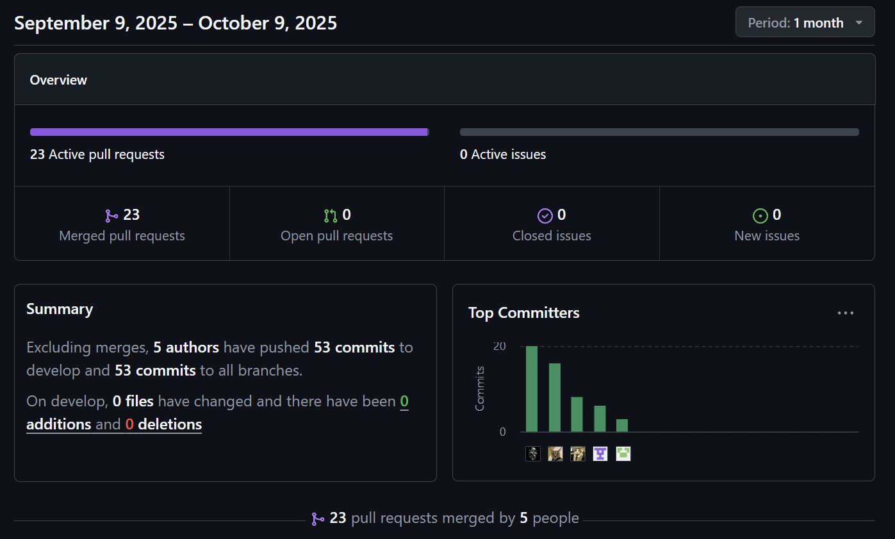

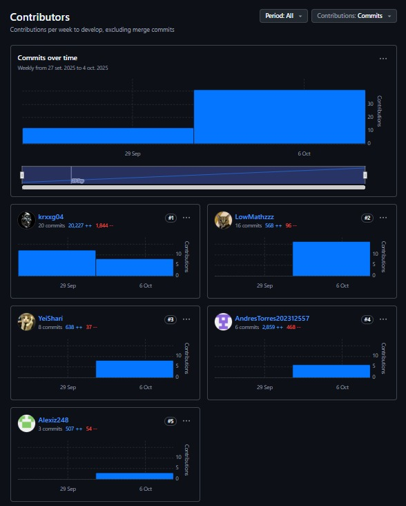

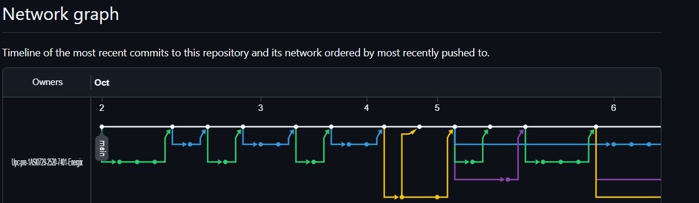

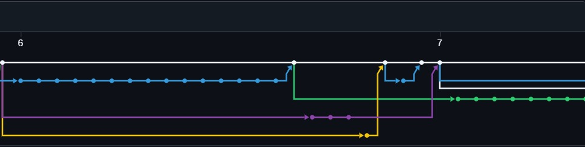

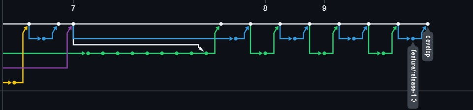

### 5.2.3. Sprint 3

#### 5.2.3.1. Sprint Planning 3

Durante el Sprint 3 se desarrolló el backend correspondiente al frontend implementado en el Sprint 2 de la plataforma SEMS, enfocándose en la implementación de las APIs principales y funcionalidades del servidor orientadas a los perfiles propietarios de viviendas y universitarios que alquilan. El trabajo incluyó la integración con la base de datos, la gestión dinámica de la información de usuario a través del backend y la consolidación de una versión funcional y estable del sistema, desplegado en Render.

<table>
<tr>
    <th colspan="5">Sprint 3</th>
    <th colspan="9">Sprint 3</th>
  </tr>
      <tr>
    <td colspan="13">Sprint Planning Background</td>
  </tr>
  <tr>
    <td colspan="5">Date</td>
    <td colspan="8">2025-11-07</td>
</tr>
  <tr>
    <td colspan="5">Time</td>
    <td colspan="8">4:30 PM</td>
  </tr>
  <tr>
    <td colspan="5">Location</td>
    <td colspan="8">Via Discord</td>
<tr>
    <td colspan="5">Prepared By</td>
    <td colspan="8">Iker Gabriel Barturen Panez</td>
</tr>
<tr>
    <td colspan="5">Attendees (to a planning meeting)</td>
    <td colspan="8">Alexis Encalada Salazar, Yeira Shari Huaman Olivos, Andrés Rodrigo Torres Lavandera, Iker Gabriel Barturen Panez, Mateo Italo Loechle Arias</td>
</tr>

<tr>
    <td colspan="13">Sprint Goal & User Stories</td>
</tr>
<tr>
    <td colspan="5">Sprint 3 Goal</td>
    <td colspan="8">Implementar y estabilizar la arquitectura fundamental del backend de la aplicación web Energix, entregando la capa de servidor funcionalmente integrada a la base de datos para las APIs centrales y la gestión de datos de los perfiles de usuario (propietarios de viviendas y universitarios que alquilan), con soporte inicial.</td>
</tr>
<tr>
    <td colspan="5">Sprint 3 Velocity</td>
    <td colspan="8">10</td>
</tr>
<tr>
    <td colspan="5">Sum of Story Points</td>
    <td colspan="8">89</td>
</tr>
</table>

#### 5.2.3.2. Aspect Leaders and Collaborators

Con la finalidad de mejorar la colaboración en equipo a cada integrante se asignó un rol de líder por cada aspecto. Los aspectos están relacionados con los entregables.

| Team member (LastName, First Name) | GitHub UserName       | Aspect 1: Backend for Dashboard, Devices & Authentication | Aspect 2: Profile View  | Aspect 3: Backend for Reports | Aspect 4: Backend for Notifications | Aspect 5: Backend for Settings |
|------------------------------------|-----------------------|-----------------------------------------------------------|-------------------------|-------------------------------|-------------------------------------|--------------------------------|
| Alexis Encalada                    | Alexiz248             | C                                                         | C                       | C                             | C                                   | L                              |
| Yeira Sharia                       | YeiShari              | C                                                         | L                       | C                             | C                                   | C                              |
| Andrés Torres                      | AndresTorres202312557 | C                                                         | C                       | L                             | C                                   | C                              |
| Iker Barturen                      | krxxg04               | L                                                         | C                       | C                             | C                                   | C                              |
| Mateo Loechle                      | LowMathzzz            | C                                                         | C                       | C                             | L                                   | C                              |

#### 5.2.3.3. Sprint Backlog 3
<table>
  <tr>
    <th colspan="7">Sprint 3 – Work Items / Tasks (Web Service SEMS)</th>
  </tr>
  <tr>
    <th>User Story ID</th>
    <th>Task ID</th>
    <th>Title</th>
    <th>Description</th>
    <th>Estimation</th>
    <th>Assigned To</th>
    <th>Status</th>
  </tr>

  <!-- EP01 -->
  <tr><td colspan="7"><b>EP01 – Autenticación y Perfil de Usuario</b></td></tr>
  <tr><td>US01</td><td>UT01</td><td>Registro de usuario</td><td>Crear endpoint POST /api/v1/auth/register con validaciones de correo y contraseña.</td><td>4h</td><td>Mateo Loechle</td><td>Done</td></tr>
  <tr><td></td><td>UT02</td><td>Validar correo duplicado en registro</td><td>Implementar verificación de que el correo no esté registrado previamente.</td><td>2h</td><td>Yeira Huamán</td><td>Done</td></tr>
  <tr><td>US02</td><td>UT03</td><td>Inicio de sesión</td><td>Crear endpoint POST /api/v1/auth/login con autenticación JWT.</td><td>3h</td><td>Iker Barturen</td><td>Done</td></tr>
  <tr><td></td><td>UT04</td><td>Manejo de errores en autenticación</td><td>Retornar mensajes de error para credenciales inválidas o usuario inexistente.</td><td>2h</td><td>Yeira Huamán</td><td>Done</td></tr>
  <tr><td>US03</td><td>UT05</td><td>Gestión de perfil</td><td>Crear endpoints GET/PUT /api/profile/{userId} para obtener y actualizar perfil.</td><td>3h</td><td>Andrés Torres</td><td>Done</td></tr>
  <tr><td></td><td>UT06</td><td>Implementar subida de foto de perfil</td><td>Crear endpoint POST /api/profile/{userId}/photo para actualizar foto.</td><td>2h</td><td>Alexis Encalada</td><td>Done</td></tr>
  <tr><td>US04</td><td>UT07</td><td>Recuperación de contraseña</td><td>Crear endpoint POST /api/v1/settings/{userId}/reset para iniciar reset.</td><td>3h</td><td>Yeira Huamán</td><td>Done</td></tr>
  <tr><td></td><td>UT08</td><td>Implementar actualización de contraseña</td><td>Crear endpoint POST /api/v1/settings/{userId}/password para cambiar contraseña.</td><td>2h</td><td>Mateo Loechle</td><td>Done</td></tr>
  <tr><td>US05</td><td>UT09</td><td>Validación de sesión</td><td>Crear endpoint GET /api/v1/auth/validate para verificar sesión activa.</td><td>3h</td><td>Iker Barturen</td><td>Done</td></tr>

  <!-- EP02 -->
  <tr><td colspan="7"><b>EP02 – Conexión y Monitoreo de Dispositivos</b></td></tr>
  <tr><td>US06</td><td>UT10</td><td>Gestión de dispositivos</td><td>Crear endpoints GET/POST /api/v1/devices y GET/PUT/DELETE /api/v1/devices/{deviceId}.</td><td>4h</td><td>Alexis Encalada</td><td>Done</td></tr>
  <tr><td></td><td>UT11</td><td>Validar compatibilidad de dispositivos</td><td>Implementar lógica para verificar si un dispositivo es compatible.</td><td>2h</td><td>Mateo Loechle</td><td>Done</td></tr>
  <tr><td>US07</td><td>UT12</td><td>Toggle de dispositivos</td><td>Crear endpoint POST /api/v1/devices/{deviceId}/toggle para encender/apagar.</td><td>3h</td><td>Yeira Huamán</td><td>Done</td></tr>
  <tr><td></td><td>UT13</td><td>Implementar preferencias de dispositivos</td><td>Crear endpoints GET/PUT /api/v1/preferences/devices.</td><td>2h</td><td>Alexis Encalada</td><td>Done</td></tr>
  <tr><td>US08</td><td>UT14</td><td>Monitoreo de dispositivos activos</td><td>Crear endpoint GET /api/v1/devices/active para listar dispositivos conectados.</td><td>4h</td><td>Iker Barturen</td><td>Done</td></tr>
  <tr><td></td><td>UT15</td><td>Manejo de desconexiones</td><td>Implementar notificaciones cuando un dispositivo se desconecta.</td><td>2h</td><td>Yeira Huamán</td><td>Done</td></tr>

  <!-- EP03 -->
  <tr><td colspan="7"><b>EP03 – Alertas y Recordatorios de Consumo</b></td></tr>
  <tr><td>US09</td><td>UT16</td><td>Gestión de alertas</td><td>Crear endpoints GET/POST /api/v1/alerts y PUT /api/v1/alerts/{alertId}/read.</td><td>3h</td><td>Mateo Loechle</td><td>Done</td></tr>
  <tr><td></td><td>UT17</td><td>Implementar conteo de alertas no leídas</td><td>Crear endpoint GET /api/v1/alerts/count/unread.</td><td>2h</td><td>Andrés Torres</td><td>Done</td></tr>
  <tr><td>US10</td><td>UT18</td><td>Gestión de notificaciones</td><td>Crear endpoints GET/POST /api/v1/notifications y PUT /api/v1/notifications/{notificationId}/read.</td><td>3h</td><td>Alexis Encalada</td><td>Done</td></tr>
  <tr><td></td><td>UT19</td><td>Implementar conteo de notificaciones no leídas</td><td>Crear endpoint GET /api/v1/notifications/count/unread.</td><td>2h</td><td>Yeira Huamán</td><td>Done</td></tr>
  <tr><td>US11</td><td>UT20</td><td>Configuración de umbrales</td><td>Permitir definir límites de consumo y restablecer a predeterminados.</td><td>4h</td><td>Iker Barturen</td><td>Done</td></tr>

  <!-- EP04 -->
  <tr><td colspan="7"><b>EP04 – Reportes y Facturación</b></td></tr>
  <tr><td>US12</td><td>UT21</td><td>Generación de reportes semanales</td><td>Crear endpoints POST /api/v1/reports/weeklyConsumption/generate-sample y GET /api/v1/reports/weeklyConsumption.</td><td>4h</td><td>Mateo Loechle</td><td>Done</td></tr>
  <tr><td>US13</td><td>UT22</td><td>Consulta de consumo diario</td><td>Crear endpoints GET /api/v1/consumption/daily y GET /api/v1/consumption/daily/{date}.</td><td>3h</td><td>Yeira Huamán</td><td>Done</td></tr>
  <tr><td>US14</td><td>UT23</td><td>Consulta de consumo mensual</td><td>Crear endpoint GET /api/v1/consumption/monthly.</td><td>3h</td><td>Andrés Torres</td><td>Done</td></tr>
  <tr><td>US15</td><td>UT24</td><td>Consulta de consumo por categorías</td><td>Crear endpoint GET /api/v1/consumption/categories.</td><td>3h</td><td>Alexis Encalada</td><td>Done</td></tr>

  <!-- EP05 -->
  <tr><td colspan="7"><b>EP05 – Metas y Ahorro Energético</b></td></tr>
  <tr><td>US16</td><td>UT25</td><td>Estadísticas del dashboard</td><td>Crear endpoints GET/PUT /api/v1/dashboard/stats.</td><td>3h</td><td>Yeira Huamán</td><td>Done</td></tr>
  <tr><td>US17</td><td>UT26</td><td>Inicialización de datos</td><td>Crear endpoint POST /api/v1/data/initialize.</td><td>4h</td><td>Iker Barturen</td><td>Done</td></tr>
  <tr><td>US18</td><td>UT27</td><td>Resumen de datos</td><td>Crear endpoint GET /api/v1/data/summary.</td><td>3h</td><td>Mateo Loechle</td><td>Done</td></tr>
  <tr><td>US19</td><td>UT28</td><td>Configuración de metas</td><td>Permitir configurar metas mensuales y seguimiento.</td><td>3h</td><td>Alexis Encalada</td><td>Done</td></tr>
  <tr><td>US20</td><td>UT29</td><td>Comparación de consumo</td><td>Mostrar comparación con otros usuarios y ranking.</td><td>3h</td><td>Andrés Torres</td><td>Done</td></tr>

  <!-- EP07 -->
  <tr><td colspan="7"><b>EP07 – Gestión de Categorías de Dispositivos</b></td></tr>
  <tr><td>US24</td><td>UT33</td><td>Consulta por categoría</td><td>Crear endpoint GET /api/v1/devices/category/{category}.</td><td>3h</td><td>Alexis Encalada</td><td>Done</td></tr>
  <tr><td>US25</td><td>UT34</td><td>Consumo por categoría</td><td>Mostrar consumo agrupado por categoría.</td><td>4h</td><td>Yeira Huamán</td><td>Done</td></tr>
  <tr><td>US26</td><td>UT35</td><td>Identificación de dispositivos de alto consumo</td><td>Implementar lógica para alertar sobre dispositivos con mayor gasto.</td><td>3h</td><td>Andrés Torres</td><td>Done</td></tr>
</table>


#### 5.2.3.4. Development Evidence for Sprint Review

En esta sección se demuestran los commits relacionados con los principales avances en la implementación.
Estos commits provienen del repositorio de la aplicación web de la organización de GitHub.

Enlace al repositorio de la aplicación web: https://github.com/Upc-pre-1ASI0729-2520-7401-Energix/Frontend-SEMS

| Repository                                        | Branch                      | Commit Id                                  | Commit Message                  | Commit Message Body | Commited on (Date) |
|---------------------------------------------------|-----------------------------|--------------------------------------------|---------------------------------|---------------------|--------------------|
| Upc-pre-1ASI0729-2520-7401-Energix/Fronten-SEMS   | feature/ddd                 | 069e2cb5286f9ad8d996f8924e67be96575b5b09   | feat: add domain driven desing. |                     | 02/10/2025         |
| Upc-pre-1ASI0729-2520-7401-Energix/Fronten-SEMS   | feature/addAunthentication  | 5ea94a4d17e60a53db5830b42eb1a989d9d38e03   | feat: add aunthentication.      |                     | 03/10/2025         |
| Upc-pre-1ASI0729-2520-7401-Energix/Fronten-SEMS   | feature/update-login        | 48d68c1ff07a03a224a3dd4b0f2603be367f48a6   | feat: add update login.         |                     | 03/10/2025         |
| Upc-pre-1ASI0729-2520-7401-Energix/Fronten-SEMS   | feature/add-dashboard       | 3dc92d1346c082774d9853a2fffa1d8f483a24fd   | feat: add dashboard.            |                     | 04/10/2025         |
| Upc-pre-1ASI0729-2520-7401-Energix/Fronten-SEMS   | feature/server              | a3bfb8dd3bf8e2192dacd74ae6eaa5e7be0d4dae   | feat: add server.               |                     | 04/10/2025         |
| Upc-pre-1ASI0729-2520-7401-Energix/Fronten-SEMS   | feature/server              | 430f5da64e6b67c5fa64716becd212675678e94e   | feat: add config server.        |                     | 05/10/2025         |
| Upc-pre-1ASI0729-2520-7401-Energix/Fronten-SEMS   | feature/reports             | 87102a704126e9ba3d7f0302ae489a3d5f3d1db1   | feat: add device chart.         |                     | 05/10/2025         |
| Upc-pre-1ASI0729-2520-7401-Energix/Fronten-SEMS   | feature/config-app-routes   | c21124db6bc7563e1421f46e6f139a6f545d5e74   | feat: add config routes.        |                     | 05/10/2025         |
| Upc-pre-1ASI0729-2520-7401-Energix/Fronten-SEMS   | feature/consumption         | d8ab0155901192167c0d100b4558ac43ff596b25   | Feature/consumption             |                     | 05/10/2025         |
| Upc-pre-1ASI0729-2520-7401-Energix/Fronten-SEMS   | feature/notification        | 86fde845c4afdd0b68dd2887bc2a0d2ec55c2be8   | Feature/notification merging.   |                     | 05/10/2025         |
| Upc-pre-1ASI0729-2520-7401-Energix/Fronten-SEMS   | feature/devices             | 38c0aea980d68cc380d86847fabf9f01d0325d97   | feat:add devices window.        |                     | 05/10/2025         |
| Upc-pre-1ASI0729-2520-7401-Energix/Fronten-SEMS   | feature/devices-preferences | 375acbac860fa2204dd7db6f6c0f42959937ff6a   | feat: add devices preferences.  |                     | 06/10/2025         |
| Upc-pre-1ASI0729-2520-7401-Energix/Fronten-SEMS   | feature/settings            | 07cb159ed1c5af5df5312a2ef30b9c950302ebe0   | Feature/settings                |                     | 06/10/2025         |
| Upc-pre-1ASI0729-2520-7401-Energix/Fronten-SEMS   | feature/profile             | 64f6e18251d73801245b50c243d8dda88fb6e3e3   | Feature/profile                 |                     | 07/10/2025         |
| Upc-pre-1ASI0729-2520-7401-Energix/Fronten-SEMS   | feature/export-report       | bbd27b1cd2ba3b987ecb1b3a3cb026053e9bb661   | feat: update export report      |                     | 07/10/2025         |
| Upc-pre-1ASI0729-2520-7401-Energix/Fronten-SEMS   | feature/db.config           | d563c430f96bdc863fb30ef0742154c4de920735   | feat: config httpclient.        |                     | 08/10/2025         |
| Upc-pre-1ASI0729-2520-7401-Energix/Fronten-SEMS   | feature/home-translation    | 15c6f68e4ced7c9c7519d43ee1074ab6b205a8b0   | feat: update home.              |                     | 08/10/2025         |
| Upc-pre-1ASI0729-2520-7401-Energix/Fronten-SEMS   | feature/-deploy-api         | 09765b5d78094dba4715ad95fb7afab260b0e3c7   | feat: update json-server.       |                     | 09/10/2025         |
| Upc-pre-1ASI0729-2520-7401-Energix/Fronten-SEMS   | feature/update-fakeapi      | 0c9d780777036f6c43edb15a8401b533fb31bf04   | feat: changed .env api url      |                     | 09/10/2025         |
| Upc-pre-1ASI0729-2520-7401-Energix/Fronten-SEMS   | feature/realese-1.0         | d56c76e06c621c06de108b7db4c78dc89c4b490f   | feat: update api_url            |                     | 09/10/2025         |

#### 5.2.3.5. Execution Evidence for Sprint Review

Durante el desarrollo del sprint se lograron completar todos los puntos para la implementación de las funcionalidades esenciales del backend para el sistema de gestión Energix, estableciendo una base sólida para la administración de energía en los hogares. Las principales características desarrolladas fueron:

1. API de autenticación completa con endpoints para registro, login y validación de sesión.

2. Gestión de perfiles a través de API, permitiendo obtener, actualizar y subir foto de perfil.

3. Generación y consulta de reportes vía API, con soporte para reportes semanales y consultas de consumo diario, mensual y por categorías.

4. CRUD de dispositivos, incluyendo monitoreo en tiempo real, toggle, preferencias y gestión por categorías.

5. Validación de sesiones y logout seguro, con manejo de errores en autenticación.

6. Arquitectura robusta del backend con integración a base de datos, manejo de alertas y notificaciones, y despliegue en Render con documentación Swagger.

**Capturas de pantalla de la documentacion en Swagger**

**Deployment en Render del Backend**

[text](chapter-05.md)

**SEMS API**

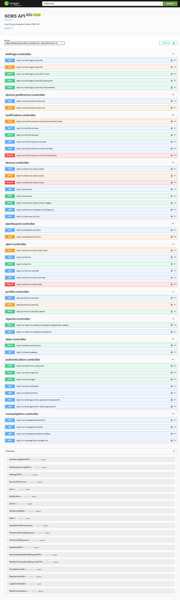

#### 5.2.3.6. Services Documentation Evidence for Sprint Review

Introducción

Durante el sprint 3, hemos implementado el despliegue del backend del sistema de Energix en Render, creando una API robusta y documentada con Swagger que soporta todas las funcionalidades esenciales para la gestión de energía en los hogares.

**Implementación de API centralizada en Render**

Decidimos utilizar Render para el despliegue del backend, asegurando una infraestructura centralizada y escalable. Esta decisión nos permitió tener un mayor control sobre la API y facilitar la integración con el frontend.

La URL base para todos los recursos de nuestra API es:

https://backend-sems-40cb.onrender.com/

La documentación interactiva de la API está disponible en Swagger UI en:

https://backend-sems-40cb.onrender.com/swagger-ui/index.html#

**Configuración del servidor en Render**

El proceso de implementación en Render involucró varias etapas para asegurar un despliegue exitoso. Comenzamos creando una nueva cuenta y proyecto en la plataforma, configurándolo específicamente para trabajar con Java/Spring Boot como entorno de ejecución.

Conectamos nuestro repositorio de GitHub para habilitar el despliegue automático, lo que nos permite mantener sincronizado el entorno de producción con la rama principal del proyecto. Esto ha resultado en un flujo de trabajo más eficiente, donde cada merge a la rama principal actualiza automáticamente nuestra API.

| Método HTTP | Endpoint                          | Descripción                                            | Ejemplo de uso                             |
|-------------|-----------------------------------|--------------------------------------------------------|--------------------------------------------|
| POST        | /api/v1/auth/register             | Registra un nuevo usuario                              | Crear cuenta de propietario o estudiante   |
| POST        | /api/v1/auth/login                | Autentica un usuario                                   | Iniciar sesión                             |
| GET         | /api/v1/auth/validate             | Valida la sesión activa                                | Verificar token JWT                        |
| GET         | /api/profile/{userId}             | Obtiene el perfil de un usuario                        | Mostrar datos del perfil                   |
| PUT         | /api/profile/{userId}             | Actualiza el perfil de un usuario                      | Modificar información personal             |
| GET         | /api/v1/devices                   | Obtiene lista de dispositivos                           | Listar dispositivos registrados            |
| POST        | /api/v1/devices                   | Crea un nuevo dispositivo                              | Agregar dispositivo                        |
| GET         | /api/v1/devices/{deviceId}        | Obtiene un dispositivo específico                       | Ver detalles de dispositivo                |
| PUT         | /api/v1/devices/{deviceId}        | Actualiza un dispositivo                               | Editar configuración                       |
| DELETE      | /api/v1/devices/{deviceId}        | Elimina un dispositivo                                 | Remover dispositivo                        |
| POST        | /api/v1/devices/{deviceId}/toggle | Cambia el estado de un dispositivo                     | Encender/apagar dispositivo                |
| GET         | /api/v1/alerts                    | Obtiene lista de alertas                               | Mostrar alertas activas                    |
| POST        | /api/v1/alerts                    | Crea una nueva alerta                                  | Generar alerta de consumo                  |
| GET         | /api/v1/notifications             | Obtiene notificaciones                                 | Listar notificaciones del usuario          |
| GET         | /api/v1/consumption/daily         | Obtiene consumo diario                                 | Mostrar gráfico de consumo diario          |
| GET         | /api/v1/consumption/monthly       | Obtiene consumo mensual                                | Ver resumen mensual                        |
| GET         | /api/v1/reports/weeklyConsumption | Obtiene reporte semanal de consumo                     | Generar y descargar reporte semanal        |
| GET         | /api/v1/dashboard/stats           | Obtiene estadísticas del dashboard                     | Mostrar métricas generales                 |


#### 5.2.3.7. Software Deployment Evidence for Sprint Review

Durante este Sprint, se completó el desarrollo del backend del Web Service y se realizó su despliegue utilizando Render como plataforma de publicación. El objetivo fue contar con una primera versión accesible en línea de la API backend para revisión y retroalimentación.

Actividades realizadas: Se creó el repositorio en GitHub: https://github.com/Upc-pre-1ASI0729-2520-7401-Energix/Backend-SEMS

Se subió el código fuente del backend, incluyendo los archivos Java, Spring Boot, configuración de base de datos y dependencias necesarias.

Se configuró en Render para el despliegue del backend API.

Se verificó la correcta publicación del backend en la siguiente URL: https://backend-sems-40cb.onrender.com/

#### 5.2.3.8. Team Collaboration Insights during Sprint

En esta sección se evidencia la colaboración de cada integrante en el repositorio del Backend de la Aplicación.

Repositorio del Backend de la Aplicación: https://github.com/Upc-pre-1ASI0729-2520-7401-Energix/Backend-SEMS

| **Integrante**                        | **Actividad**                                                                                                         |  
|---------------------------------------|-----------------------------------------------------------------------------------------------------------------------|
| **Huaman Olivos, Yeira Shari**        | Implementación de secciones del **Backend de la Aplicación** y contribuciones a los **chapter 5.md**     |
| **Loechle Arias, Mateo Ítalo**        | Implementación de secciones del **Backend de la Aplicación** y contribuciones a los **chapter 5.md**     |
| **Barturen Panez, Iker Gabriel**      | Implementación de secciones del **Backend de la Aplicación** y contribuciones a los **chapter 5.md**     |
| **Encalada Salazar, Alexis**          | Implementación de secciones del **Backend de la Aplicación** y contribuciones a los **chapter 5.md**     |
| **Torres Lavandera, Andrés Rodrigo**  | Implementación de secciones del **Backend de la Aplicación** y contribuciones a los **chapter 5.md**     |


#### 5.3. Validation Interviews

Las entrevistas de validación representan una fase crucial en el proceso de desarrollo del producto SEMS (Sistema de Monitoreo Energético Inteligente). Esta metodología nos permite evaluar la efectividad, usabilidad y aceptación de la solución implementada por parte de nuestros segmentos objetivo identificados en el capítulo anterior.

#### 5.3.1. Diseño de Entrevistas

El diseño de las entrevistas de validación se estructura en torno a la evaluación práctica del producto SEMS desarrollado. Las entrevistas están dirigidas a los mismos segmentos objetivo identificados en el capítulo 2: propietarios de vivienda y estudiantes que alquilan, con el fin de validar si la solución implementada satisface sus necesidades específicas de monitoreo energético.

#### Preguntas para Segmento #1: Propietarios de Vivienda

1. Al ingresar a la plataforma, ¿qué es lo primero que llama su atención?
2. Sin leer instrucciones, ¿puede identificar cuál es el propósito principal de esta aplicación?
3. ¿La información presentada en el dashboard le resulta clara y comprensible?
4. ¿Puede localizar fácilmente la información sobre su consumo energético actual?
5. ¿Qué opina sobre la forma en que se presentan los datos de consumo (gráficos, números, alertas)?
6. ¿Las alertas de consumo le resultan útiles y fáciles de entender?
7. ¿La función de control remoto de dispositivos le parece intuitiva de usar?
8. ¿Considera que esta herramienta podría ayudarle realmente a reducir sus gastos de electricidad?
9. ¿Qué funcionalidad le resulta más valiosa de las que ha visto?
10. ¿El diseño y colores le transmiten confianza y profesionalismo?
11. ¿Encuentra alguna dificultad para navegar entre las diferentes secciones?
12. ¿Los íconos y botones son claros en su función?
13. Basándose en lo que ha visto, ¿estaría dispuesto(a) a usar esta plataforma regularmente?
14. ¿Recomendaría esta solución a otros propietarios de vivienda?
15. ¿Qué mejoraría para que la plataforma sea perfecta para sus necesidades?

#### Preguntas para Segmento #2: Estudiantes que Alquilan

1. ¿La interfaz le parece amigable para alguien de su perfil tecnológico?
2. ¿Puede entender rápidamente cómo esta aplicación le ayudaría a gestionar sus gastos de luz?
3. ¿La información se presenta de una manera que le resulte familiar y fácil de procesar?
4. ¿Los datos de consumo le ayudan a entender mejor en qué se va su dinero de electricidad?
5. ¿Las alertas le parecen útiles para controlar mejor sus gastos mensuales?
6. ¿Puede identificar fácilmente cuánto podría ahorrar usando esta herramienta?
7. ¿La función de monitoreo en tiempo real le resulta práctica para su estilo de vida?
8. ¿Esta herramienta le ayudaría a mantenerse dentro de su presupuesto mensual?
9. ¿Qué característica considera más importante para su situación como estudiante?
10. ¿El ahorro promedio mostrado le parece realista y atractivo?
11. Al ser una aplicación responsive, ¿Puede usar la aplicación fácilmente desde su dispositivo móvil?
12. ¿Hay algo que le parezca confuso o complicado de entender?
13. ¿Con qué frecuencia cree que usaría esta plataforma?
14. ¿Se siente motivado(a) a cambiar sus hábitos de consumo después de ver esta herramienta?


#### 5.3.2. Registro de Entrevistas

Esta sección se dedica a la documentación sistemática de cada entrevista con los segmentos objetivo. Se organiza la información para presentar el perfil de cada entrevistado, junto con sus respuestas directas y los hallazgos más significativos. Este registro es crucial para comprender la perspectiva del usuario y validar nuestro proyecto.

**ENTREVISTAS SEGMENTO OBJETIVO 1: PROPIETARIOS DE VIVIENDA**

**ENTREVISTA 1**

Link de las entrevistas

Foto de la entrevista

Inicia:

Duración:

Nombre: 

Edad: 

Distrito: 

Resumen: 


**ENTREVISTA 2**

Foto de la entrevista

Inicia:

Duración:

Nombre:

Edad:

Distrito:

Resumen:

**ENTREVISTA 3**

Foto de la entrevista

Inicia:

Duración:

Nombre:

Edad:

Distrito:

Resumen:

**ENTREVISTAS SEGMENTO OBJETIVO 2: ESTUDIANTES QUE ALQUILAN**

**ENTREVISTA 1**

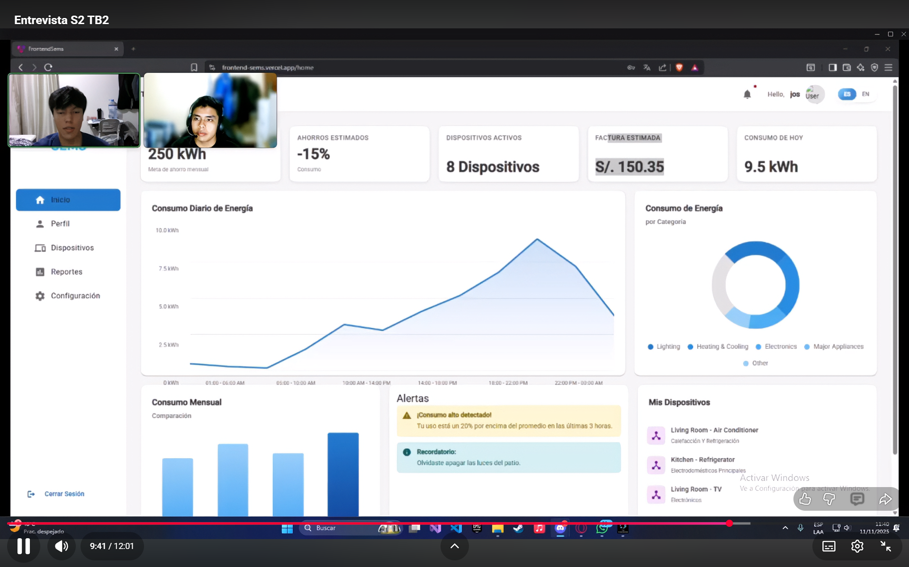

Inicia: 

Duración: 

Nombre: Johnny Ricardo Mallqui Cueva

Edad: 19

Distrito: Chorrillos

Resumen: Johnny Mallqui (19 años) estudia en la UPC y alquila un cuarto en Chorrillos, se relaciaona a menudo con la tecnología ya que estudia ingeniería de Sistemas. Al probar nuestra herramienta nos comento que fue de su agrado y qeu si la usaria, mas que nada si esta se puede usar en un dispositivo movil ya que si una herramienta que solo esta disponible para laptop o PC, nos comento que no valdria la pena, en su caso si esta dispuesto a usarla, ya que al usar tantos dispositivos, seria una herramienta que facilite el ahorro de consumo energetico, tambien nos menciono que la aplicacion es intuitiva y que es muy facil de usar. 

**ENTREVISTA 2**

Foto de la entrevista

Inicia:

Duración:

Nombre:

Edad:

Distrito:

Resumen:


**ENTREVISTA 3**

Foto de la entrevista

Inicia:

Duración:

Nombre:

Edad:

Distrito:

Resumen:

#### 5.3.3. Evaluaciones según heurísticas


#### 5.4. Video About-the-Product


### Conclusiones

El desarrollo del primer entregable del proyecto Energix ha permitido establecer una base metodológica, técnica y colaborativa sólida para la evolución del sistema SEMS. Se validaron hipótesis de diseño y se definió una visión clara de los objetivos, articulando un ecosistema funcional para la gestión inteligente de energía.

El enfoque Lean UX facilitó la identificación precisa de los principales retos de los usuarios propietarios de vivienda, estudiantes y soporte técnico, permitiendo comprender sus necesidades y expectativas mediante entrevistas, mapas de empatía, user personas y scenario mapping. Esto guió la propuesta de valor centrada en la experiencia del usuario.

La especificación y análisis de requisitos se realizó de forma rigurosa, aplicando técnicas modernas como To-Be Scenario Mapping, Impact Mapping, backlog grooming y user stories con criterios de aceptación. Esto permitió descomponer la solución en funcionalidades concretas y alineadas con los objetivos del negocio.

En cuanto al diseño visual y arquitectónico, se implementaron style guidelines, una arquitectura de información clara y una estructura modular basada en bounded contexts, siguiendo principios de Domain-Driven Design. Esto garantiza escalabilidad, mantenibilidad y separación de responsabilidades, reforzando la calidad técnica y la sostenibilidad del proyecto.

Durante el Sprint 1, se completaron las historias de usuario planificadas para la landing page, UI responsive, internacionalización y accesibilidad. El equipo demostró alta colaboración y cumplimiento de estándares técnicos, utilizando herramientas como GitHub, Figma, PlantUML y Netlify. La landing page fue desplegada y validada funcionalmente bajo criterios de usabilidad y accesibilidad.

Este primer sprint, centrado en la interfaz gráfica y experiencia inicial, sienta las bases para la futura implementación de servicios backend, APIs RESTful y microservicios modulares que conformarán el núcleo transaccional de la plataforma.

---

### Recomendaciones

- Optimizar la experiencia de usuario en las vistas principales, incorporando mejoras de navegación, internacionalización y accesibilidad conforme a los estándares actuales.
- Implementar pruebas automatizadas para los componentes clave del frontend y los endpoints del backend, garantizando la calidad y estabilidad de la plataforma.
- Documentar los procesos de despliegue y configuración de la infraestructura (Vercel, Render), facilitando la replicabilidad y el mantenimiento del entorno productivo.
- Promover la revisión cruzada de código y la actualización continua de las guías de estilo, reforzando la coherencia técnica y la colaboración entre los miembros del equipo.
- Monitorear el rendimiento de la aplicación web y los servicios, aplicando métricas y herramientas de observabilidad para anticipar posibles incidencias y escalar la solución.

# Bibliografía

**Angular**
- Versión actual: v20
- Angular. (2025). _Angular Documentation_. Recuperado de https://angular.dev

**TypeScript**
- TypeScript. (2025). _TypeScript Handbook_. Recuperado de https://www.typescriptlang.org

**CSS**
- Versión actual: CSS3
- Mozilla Foundation. (2025). _MDN CSS Reference_. Recuperado de https://developer.mozilla.org/es/docs/Web/CSS

**HTML**
- Versión actual: HTML5
- Mozilla Foundation. (2025). _MDN HTML Reference_. Recuperado de https://developer.mozilla.org/es/docs/Web/HTML

**JavaScript**
- Mozilla Foundation. (2025). _MDN JavaScript Reference_. Recuperado de https://developer.mozilla.org/es/docs/Web/JavaScript

**JSON**
- Versión actual: Estándar RFC 8259
- JSON.org. (2024). _Introducing JSON_. Recuperado de https://www.json.org/json-es.html

# Anexos

- Link de la Organización
  https://github.com/Upc-pre-1ASI0729-2520-7401-Energix
- Link del Repositorio del Reporte
  https://github.com/Upc-pre-1ASI0729-2520-7401-Energix/Proyect-Report
- Link de la Repositorio de la landing Page
  https://github.com/Upc-pre-1ASI0729-2520-7401-Energix/Energix-Landing-Page
- Link de la Repositorio del Frontend de la Aplicación Web
  https://github.com/Upc-pre-1ASI0729-2520-7401-Energix/Frontend-SEMS
- Link de la landing page
  https://energixlp.netlify.app
- Link del Frontend de la Aplicación Web
  https://frontend-sems.vercel.app
- Link del Figma
  https://www.figma.com/design/tmJAly092Cbckme5PFfA6Z/Energix?node-id=26-4210&t=4xEBZLNYgT1IM6IQ-1
- Link del video de la presentación
  https://upcedupe-my.sharepoint.com/:v:/g/personal/u20211g491_upc_edu_pe/EatERr_u0z9PsPV9zBCf2qMBBoBO00PC-Phz8dJyZh1iqw?e=RAb0qG